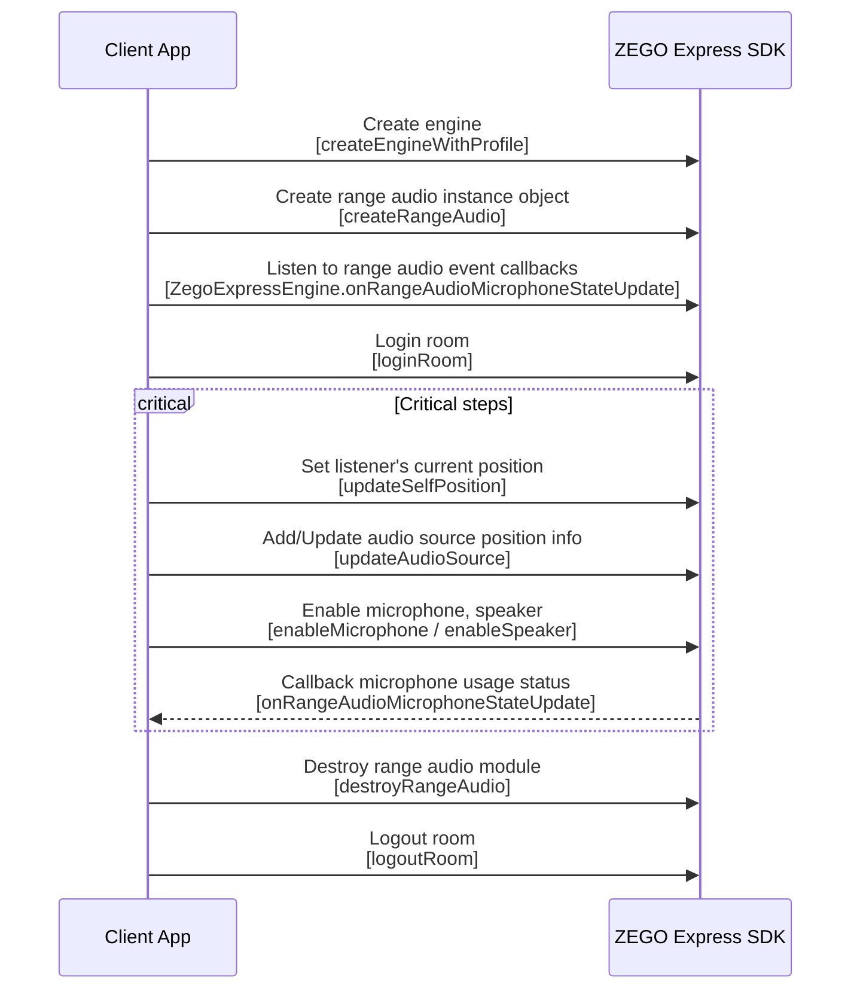

# Game Voice

- - -

## Feature overview

### Concept explanation

- Range: The range within which a listener can receive audio.
- Orientation: Refers to the position and facing direction of the listener in the game world coordinates. For details, refer to `Set the listener's current position`.
- Listener: The user in the room who receives audio.
- Speaker: The user in the room who sends audio.

### Feature description

Since version **2.11.0**, ZEGO Express SDK has added a game voice module, which mainly includes: Range voice, 3D sound effects, and Team voice.

<Warning title="Warning">
This feature does not support running in WebGL environments.
</Warning>

<table>

<tbody><tr>
<th>Feature</th>
<th>Description</th>
</tr>
<tr>
<td>
Range voice
</td>
<td>
<p>The listener in the room has a range limit for receiving audio. If the distance between a speaker and the listener exceeds this range, the sound cannot be heard. To ensure voice clarity, when more than 20 people nearby are speaking, only the voices of the 20 speakers closest to the listener can be heard.</p>
<p>Suppose the maximum range for audio reception is set to R, and the distance between the speaker and the listener is r, then:</p>
<ul><li>When r &lt; R, it means the speaker is within the normal range, and the listener can hear the sound.</li><li>When r ≥ R, it means the speaker is beyond the maximum range, and the listener cannot hear the sound.</li></ul>
<Frame width="512" height="auto" caption=""></Frame><p>The above image only takes the range voice mode as "World" as an example. For more information about sound reachability under different mode combinations, please refer to <a href="#set-voice-mode">Set voice mode</a>.</p>
</td>
</tr>
<tr>
<td>3D sound effects</td>
<td>Sound has a 3D spatial sense and attenuates with distance.</td>
</tr>
<tr>
<td>
General voice mode
</td>
<td>
<p>Players can choose to join a team and switch between "World", "Team only", and "Secret team" voice modes freely within the room.</p>
<ul><li>World: Players can talk to other players within the world range, and can also talk to teammates.</li><li>Team only: Players can only talk to teammates.</li><li>Secret team: Players can talk to teammates and can only receive voice from other players in the world range (one-way).</li></ul>

<Note title="Note">
Communication between teammates is not affected by "Range" and "3D sound effects". For details, please refer to <a href="#set-voice-mode">Set voice mode</a>.
</Note>

</td>
</tr>
</tbody></table>

### Use cases

The game voice feature is suitable for battle royale games and metaverse scenarios.

In battle royale games, team voice provides squad functionality. Teams can be changed before and after the game starts. Developers do not need to focus on stream grouping and stream publishing/playing implementation, and can directly implement team voice functionality.

In battle royale games and metaverse scenarios, 3D sound effects capability is provided. When listening to speaker sound effects, there is a sense of direction and distance, making the scene feel more realistic.

## Example source code download

Please refer to [Download example source code](/real-time-video-u3d-cs/quick-start/run-example-code) to get the source code.

For related source code, please check the "Assets/ZegoExpressExample/Examples/AdvancedAudioProcessing/RangeAudio.cs" file.

## Prerequisites

Before implementing range voice, make sure:

- You have created a project in the [ZEGOCLOUD Console](https://console.zegocloud.com) and applied for a valid AppID and AppSign. For details, please refer to [Console - Project information](/console/project-info).
- You have integrated ZEGO Express SDK into your project and implemented basic audio/video stream publishing and playing functions. For details, please refer to [Quick start - Integration](/real-time-video-u3d-cs/quick-start/integrating-sdk) and [Quick start - Implementation flow](/real-time-video-u3d-cs/quick-start/implementing-video-call).


## Precautions

<Warning title="Warning">
When using the range voice feature, please pay attention to the following precautions to avoid integration issues.
</Warning>


If you are already using the real-time audio/video feature of ZEGO Express SDK, please note the following:

- Since the range voice module is implemented based on the stream publishing and playing interfaces of ZegoExpressEngine, you do not need to focus on the concept of stream publishing and playing when using it. In the range voice scenario, the concept of publishing audio streams is transformed to "enabling microphone", and the concept of playing audio streams is transformed to "enabling speaker". It is recommended that you do not use the [StartPublishingStream](@StartPublishingStream) and [StartPlayingStream](@StartPlayingStream) interfaces for stream publishing and playing operations while integrating the range voice feature, to avoid effect conflicts.
- The related callbacks for stream publishing and playing in the range voice module ([OnPublisherStateUpdate](@OnPublisherStateUpdate), [OnPlayerStateUpdate](@OnPlayerStateUpdate), [OnPublisherQualityUpdate](@OnPublisherQualityUpdate), and [OnPlayerQualityUpdate](@OnPlayerQualityUpdate)) no longer take effect.


## Usage steps


{/*
<Frame width="512" height="auto" caption=""></Frame>
*/}

The above image only shows the core steps and interfaces for implementing the game voice feature. Developers can implement other related interfaces according to business needs, referring to the detailed introduction in the documentation below.

### 1 Create engine

Call the [CreateEngine](@CreateEngine) interface, pass the applied AppID to the appID parameter, and create an engine singleton object. The engine currently only supports creating one instance at the same time, exceeding this will return null.

```csharp
ZegoEngineProfile profile = new ZegoEngineProfile();
// AppID is assigned by ZEGO to each App
profile.appID = appID;
profile.scenario = ZegoScenario::ZEGO_SCENARIO_GENERAL;
// Create engine instance
ZegoExpressEngine engine = ZegoExpressEngine.createEngine(profile);
if (engine == null) {
    // Engine creation failed
    return;
}
```

### 2 Create range audio module

Call the [CreateRangeAudio](@CreateRangeAudio) method to create a range audio instance.

```csharp
ZegoRangeAudio rangeAudio = engine.CreateRangeAudio();
if (rangeAudio == null) {
    // Failed to create range audio instance module
}
```

### 3 Listen to range audio event callbacks

You can set the microphone event callback delegate as needed to listen for the microphone enable status [OnRangeAudioMicrophoneStateUpdate](@OnRangeAudioMicrophoneStateUpdate) notification.

```csharp
// Callback for state change when playing a sound effect
void OnRangeAudioMicrophoneStateUpdate(ZegoRangeAudio rangeAudio, ZegoRangeAudioMicrophoneState state, int errorCode){
    if(TurningOn == state)
    {
        // Microphone turning on
    }
    else if(Off == state)
    {
        // Microphone off
    }
    else if(On == state)
    {
        // Microphone successfully turned on
    }
}

rangeAudio.onRangeAudioMicrophoneStateUpdate = OnRangeAudioMicrophoneStateUpdate;
```

### 4 Login room

After creating a ZegoUser user object by passing in the userID and userName parameters, call the [LoginRoom](@LoginRoom) interface, pass in the roomID parameter and user parameter, and log in to the room.

<Warning title="Warning">
- Within the same AppID, ensure that roomID is globally unique.
- Within the same AppID, ensure that userID is globally unique. It is recommended that developers set it to a meaningful value and associate userID with their business account system.
- userID cannot be empty, otherwise it will cause room login failure.
</Warning>


```csharp
ZegoUser user = new ZegoUser();
user.userID = "test";
user.userName = "testName";

ZegoRoomConfig roomConfig = new ZegoRoomConfig();
engine.LoginRoom("123",user,roomConfig);
```

<Note title="Note">
When the user has successfully logged in to the room, if the application exits abnormally, after restarting the application, the developer needs to first call the [LogoutRoom](@LogoutRoom) interface to leave the room, and then call the [LoginRoom](@LoginRoom) interface to log in to the room again.
</Note>


### 5 Set the listener's current position

Developers can call the [UpdateSelfPosition](@UpdateSelfPosition-ZegoRangeAudio) interface to set the listener's own position and orientation, or update their position and facing direction in the world coordinate system when their own orientation changes.

<Note title="Note">
- If this interface is not called to set position information before calling [EnableSpeaker](@EnableSpeaker-ZegoRangeAudio) to turn on the speaker, you will not be able to receive sound from anyone other than teammates.
- The coordinate values of the three axes of the local coordinate system can be obtained by converting the rotation angle of a third-party 3D engine into a matrix.
</Note>


<table>

  <tbody><tr>
    <td>Parameter name</td>
    <td>Description</td>
  </tr>
  <tr>
    <td>position</td>
    <td>The coordinates of the listener in the world coordinate system. The parameter is a float array of length 3, and the three values represent the coordinate values of front, right, and up respectively.</td>
  </tr>
  <tr>
    <td>axisForward</td>
    <td>The unit vector of the front axis of the local coordinate system. The parameter is a float array of length 3, and the three values represent the coordinate values of front, right, and up respectively.</td>
  </tr>
  <tr>
    <td>axisRight</td>
    <td>The unit vector of the right axis of the local coordinate system. The parameter is a float array of length 3, and the three values represent the coordinate values of front, right, and up respectively.</td>
  </tr>
  <tr>
    <td>axisUp</td>
    <td>The unit vector of the up axis of the local coordinate system. The parameter is a float array of length 3, and the three values represent the coordinate values of front, right, and up respectively.</td>
  </tr>
</tbody></table>

<Frame width="512" height="auto" caption=""></Frame>

```csharp
// The coordinates of the listener in the world coordinate system, in the order of front, right, and up.
float position[] = new float[3]{100.0f, 100.0f, 100.0f};
// The unit vector of the front orientation of the local coordinate system.
float axisForward[] = new float[3]{1.0f,0.0f,0.0f};
// The unit vector of the right orientation of the local coordinate system.
float axisRight[] = new float[3]{0.0f,1.0f,0.0f};
// The unit vector of the up orientation of the local coordinate system.
float axisUp[] = new float[3]{0.0f,0.0f,1.0f};

rangeAudio.UpdateSelfPosition(position, axisForward, axisRight, axisUp);
```

### 6 Add or update speaker position information

After successfully logging in to the room, you can call the [UpdateAudioSource](@UpdateAudioSource-ZegoRangeAudio) interface to add or update speaker position information.

<Warning title="Warning">

- In World mode: You need to update the positions of the listener and all speakers in the room. In Secret team mode: You need to update the positions of all speakers in the room who are within the audio reception range and are in World mode. If the speaker position is not set, or the speaker is out of the listener's range, there will be a situation where sound cannot be heard.
- Here, speaker refers to other people in the room, and listener refers to yourself.
</Warning>

- userID: The ID of other speaking users in the room.
- position: The coordinates of the speaker in the world coordinate system. The parameter is a float array of length 3, and the three values represent the coordinate values of front, right, and up respectively.

```csharp
// The coordinates of the user in the world coordinate system, in the order of front, right, and up.
float position[] = new float[3]{100.0, 100.0, 100.0};
// Add/update user position
rangeAudio.UpdateAudioSource("abc",position);
```

### 7 (Optional) Set audio reception range

<Accordion title="Please choose whether to set the audio reception range according to your business needs. If not set, it means only the voices of team members can be received by default." defaultOpen="false">
Call the [SetAudioReceiveRange](@SetAudioReceiveRange-ZegoRangeAudio) interface to set the maximum range for the listener to receive audio, that is, starting from the listener, with the set distance as a three-dimensional space in 3D space. After setting this range, when 3D sound effects are enabled, the sound will attenuate as the distance increases, until it exceeds the set range, and there will be no more sound.

```csharp
// Set the maximum range for audio reception. Sound sources beyond this range will not be heard
rangeAudio.SetAudioReceiveRange(1000);
```

At the same time, you can also further control the attenuation range through the [SetAudioReceiveRange](@SetAudioReceiveRange__1) interface. When the distance is less than min, the volume will not attenuate as the distance increases; when the distance is greater than max, you will not be able to hear the other party's sound.

```cs
// Set the attenuation range of 3D sound effects [min, max]
ZegoReceiveRangeParam param = new ZegoReceiveRangeParam();
param.min = reciveRangeMin;
param.max = reciveRangeMax;
rangeAudio.SetAudioReceiveRange(param);
```

<Note title="Note">
If the audio reception range is not set, it means only the voices of team members can be received, and all sounds outside the team cannot be received. After setting, the voice within the team will not be restricted by the audio reception distance, and there will be no 3D sound effects.
</Note>
</Accordion>


### 8 (Optional) Implement 3D sound effects

<Accordion title="Please choose whether to enable 3D sound effects according to your business needs." defaultOpen="false">
Call the [EnableSpatializer](@EnableSpatializer-ZegoRangeAudio) interface to set 3D sound effects. When enable is true, it means enabling 3D sound effects. At this time, the audio of non-team members in the room will produce spatial changes with the change of the speaker's distance and direction from the listener. When it is false, it means disabling 3D sound effects. (Can be enabled or disabled at any time)

<Warning title="Warning">
This feature only takes effect for people outside the team.
</Warning>


```csharp
rangeAudio.EnableSpatializer(true);
```
</Accordion>

### 9 Enable microphone and speaker

After successfully logging in to the room:

- Call the [EnableMicrophone](@EnableMicrophone-ZegoRangeAudio) interface to set whether to enable the microphone. When enable is true, it means enabled. At this time, the SDK will automatically use the main channel to publish audio streams. When it is false, it means disabled. (Can be enabled or disabled at any time)

    Developers can listen to the [OnRangeAudioMicrophoneStateUpdate](@OnRangeAudioMicrophoneStateUpdate) event callback to get the updated status of the microphone.

- Call the [EnableSpeaker](@EnableSpeaker-ZegoRangeAudio) interface to set whether to enable the speaker. When enable is true, it means enabled. At this time, the SDK will automatically play audio streams in the room. When it is false, it means disabled. (Can be enabled or disabled at any time)

<Warning title="Warning">
After calling the [EnableSpeaker](@EnableSpeaker-ZegoRangeAudio) interface, when the maximum playing stream limit (currently 20 streams) is exceeded, the team member audio streams will be played first (team mode needs to be set), and then the audio streams closest to the own range in the world will be played.

</Warning>


```csharp
// Enable microphone
rangeAudio.EnableMicrophone(true);
// Enable speaker
rangeAudio.EnableSpeaker(true);
```

### 10 (Optional) Join team and set voice mode

<Accordion title="Please choose whether to implement game team and team voice functions according to your business needs." defaultOpen="false">
#### Set team ID

Call the [SetTeamID](@SetTeamID) interface to set the team ID you want to join as needed (the ID can be changed at any time). After setting the ID, you can join directly. After joining a team, communication between teammates in the same team is not restricted by range voice and 3D sound effects.

<p id="setRangeAudioMode"></p>

```csharp
rangeAudio.SetTeamID("123");
```

#### Set voice mode

Call the [SetRangeAudioMode](@SetRangeAudioMode-ZegoRangeAudio) interface to set the range voice mode (you can switch modes at any time). When the mode parameter is ZegoRangeAudioMode.World or ZegoRangeAudioSecret.Team, it means you can hear the voices of all people in World mode. When the value is ZegoRangeAudioMode.Team, it means you can only hear the voices of other members in the same team.

<table>

<tbody><tr>
<th>Voice mode</th>
<th>Parameter value</th>
<th>Feature description</th>
</tr>
<tr>
<td>World</td>
<td>ZegoRangeAudioMode.World</td>
<td>After setting this mode, this user can talk to team members and talk to other people in World mode within the range.</td>
</tr>
<tr>
<td>Team only</td>
<td>ZegoRangeAudioSecret.Team</td>
<td>After setting this mode, this user can only talk to team members.</td>
</tr>
<tr>
<td>Secret team</td>
<td>ZegoRangeAudioMode.SecretTeam</td>
<td>After setting this mode, this user can talk to team members and can only receive voice from other people in World mode within the range (one-way).</td>
</tr>
</tbody></table>

```csharp
rangeAudio.SetRangeAudioMode(ZegoRangeAudioMode.World);
```

Under different range voice modes, the receivability of speaker sounds varies.

- Assuming user A's mode is "World", the sound receivability of user B under different range voice modes is as follows:

<table>

  <tbody><tr>
    <th>Same team</th>
    <th>Within maximum range</th>
    <th>Range voice mode</th>
    <th>Can A hear B's sound</th>
    <th>Can B hear A's sound</th>
  </tr>
  <tr>
    <td rowspan="6">Same team</td>
    <td rowspan="3">Yes</td>
    <td>World</td>
    <td>Yes</td>
    <td>Yes</td>
  </tr>
  <tr>
    <td>Team only</td>
    <td>Yes</td>
    <td>Yes</td>
  </tr>
  <tr>
    <td>Secret team</td>
    <td>Yes</td>
    <td>Yes</td>
  </tr>
  <tr>
    <td rowspan="3">No</td>
    <td>World</td>
    <td>Yes</td>
    <td>Yes</td>
  </tr>
  <tr>
    <td>Team only</td>
    <td>Yes</td>
    <td>Yes</td>
  </tr>
  <tr>
    <td>Secret team</td>
    <td>Yes</td>
    <td>Yes</td>
  </tr>
  <tr>
    <td rowspan="6">Different teams</td>
    <td rowspan="3">Yes</td>
    <td>World</td>
    <td>Yes</td>
    <td>Yes</td>
  </tr>
  <tr>
    <td>Team only</td>
    <td>No</td>
    <td>No</td>
  </tr>
  <tr>
    <td>Secret team</td>
    <td>No</td>
    <td>Yes</td>
  </tr>
  <tr>
    <td rowspan="3">No</td>
    <td>World</td>
    <td>No</td>
    <td>No</td>
  </tr>
  <tr>
    <td>Team only</td>
    <td>No</td>
    <td>No</td>
  </tr>
  <tr>
    <td>Secret team</td>
    <td>No</td>
    <td>No</td>
  </tr>
</tbody></table>

- Assuming user A's mode is "Team only", the sound receivability of user B under different range voice modes is as follows:

<table>

  <tbody><tr>
    <th>Same team</th>
    <th>Within maximum range</th>
    <th>Range voice mode</th>
    <th>Can A hear B's sound</th>
    <th>Can B hear A's sound</th>
  </tr>
  <tr>
    <td rowspan="6">Same team</td>
    <td rowspan="3">Yes</td>
    <td>World</td>
    <td>Yes</td>
    <td>Yes</td>
  </tr>
  <tr>
    <td>Team only</td>
    <td>Yes</td>
    <td>Yes</td>
  </tr>
  <tr>
    <td>Secret team</td>
    <td>Yes</td>
    <td>Yes</td>
  </tr>
  <tr>
    <td rowspan="3">No</td>
    <td>World</td>
    <td>Yes</td>
    <td>Yes</td>
  </tr>
  <tr>
    <td>Team only</td>
    <td>Yes</td>
    <td>Yes</td>
  </tr>
  <tr>
    <td>Secret team</td>
    <td>Yes</td>
    <td>Yes</td>
  </tr>
  <tr>
    <td rowspan="6">Different teams</td>
    <td rowspan="3">Yes</td>
    <td>World</td>
    <td>No</td>
    <td>No</td>
  </tr>
  <tr>
    <td>Team only</td>
    <td>No</td>
    <td>No</td>
  </tr>
  <tr>
    <td>Secret team</td>
    <td>No</td>
    <td>No</td>
  </tr>
  <tr>
    <td rowspan="3">No</td>
    <td>World</td>
    <td>No</td>
    <td>No</td>
  </tr>
  <tr>
    <td>Team only</td>
    <td>No</td>
    <td>No</td>
  </tr>
  <tr>
    <td>Secret team</td>
    <td>No</td>
    <td>No</td>
  </tr>
</tbody></table>


- Assuming user A's mode is "Secret team", the sound receivability of user B under different range voice modes is as follows:

<table>

  <tbody><tr>
    <th>Same team</th>
    <th>Within maximum range</th>
    <th>Range voice mode</th>
    <th>Can A hear B's sound</th>
    <th>Can B hear A's sound</th>
  </tr>
  <tr>
    <td rowspan="6">Same team</td>
    <td rowspan="3">Yes</td>
    <td>World</td>
    <td>Yes</td>
    <td>Yes</td>
  </tr>
  <tr>
    <td>Team only</td>
    <td>Yes</td>
    <td>Yes</td>
  </tr>
  <tr>
    <td>Secret team</td>
    <td>Yes</td>
    <td>Yes</td>
  </tr>
  <tr>
    <td rowspan="3">No</td>
    <td>World</td>
    <td>Yes</td>
    <td>Yes</td>
  </tr>
  <tr>
    <td>Team only</td>
    <td>Yes</td>
    <td>Yes</td>
  </tr>
  <tr>
    <td>Secret team</td>
    <td>Yes</td>
    <td>Yes</td>
  </tr>
  <tr>
    <td rowspan="6">Different teams</td>
    <td rowspan="3">Yes</td>
    <td>World</td>
    <td>Yes</td>
    <td>No</td>
  </tr>
  <tr>
    <td>Team only</td>
    <td>No</td>
    <td>No</td>
  </tr>
  <tr>
    <td>Secret team</td>
    <td>No</td>
    <td>No</td>
  </tr>
  <tr>
    <td rowspan="3">No</td>
    <td>World</td>
    <td>No</td>
    <td>No</td>
  </tr>
  <tr>
    <td>Team only</td>
    <td>No</td>
    <td>No</td>
  </tr>
  <tr>
    <td>Secret team</td>
    <td>No</td>
    <td>No</td>
  </tr>
</tbody></table>
</Accordion>

### 11 Destroy range audio module

When the range audio module is no longer in use, call the [DestroyRangeAudio](@DestroyRangeAudio) interface to destroy it and release the resources occupied by the range audio module.

```csharp
engine.DestroyRangeAudio(rangeAudio);
```

### 12 Logout room

Call the [LogoutRoom](@LogoutRoom) interface to leave the room. After leaving, the microphone and speaker will be automatically turned off (that is, you cannot send your own audio or listen to other people's audio), and the speaker information list will be cleared.

```csharp
// Logout room
engine.LogoutRoom("roomID");
```


## FAQs


1. **How many streams can be played simultaneously within the listening range?**

To ensure voice clarity, when more than 20 people nearby are speaking, only the voices of the 20 speakers closest to the listener can be heard. If there are more than 20 people and the distance is the same, the order is determined by the order in which each userID is first passed when calling the [UpdateAudioSource](@UpdateAudioSource-ZegoRangeAudio) interface.

2. **Does the "range" in range voice refer to the listening range or the speaking range?**

The "range" in range voice refers to the listening range.

3. **Do members in team voice have 3D sound effects when chatting?**

The voice within the team is the effect of ordinary chatting, and there is no 3D sound effect for now.

4. **If I am already calling the stream publishing interface, will there be conflicts when using range voice at this time?**

Range voice currently uses the main channel to send audio. If the customer has already used the main channel, there will be conflicts.
