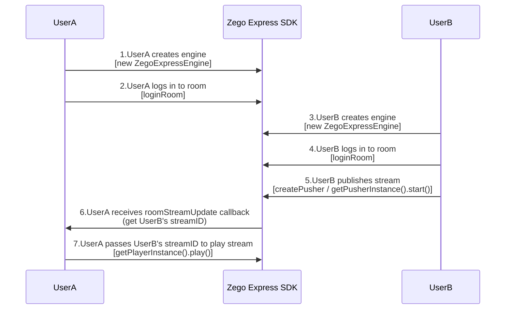
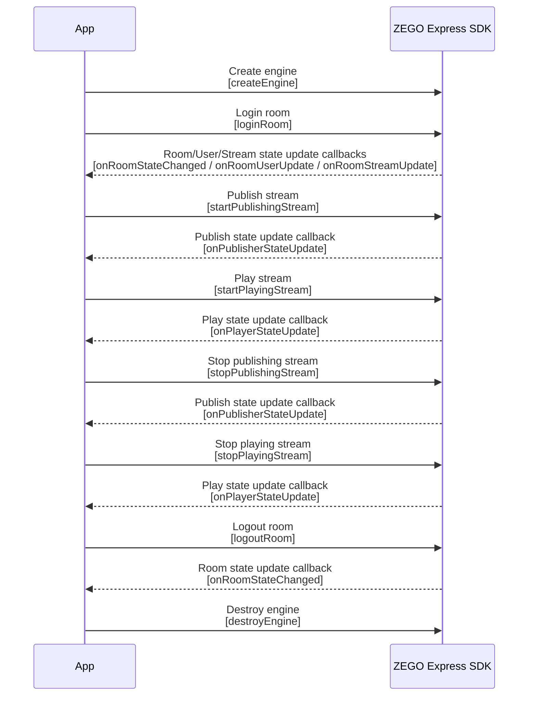

# Implementing Video Call with Angular (Web)

---
## Feature Overview

This document introduces how to quickly use Angular to implement a simple Video Call.

Explanation of related concepts:
- ZEGO Express SDK: A real-time audio/video SDK provided by ZEGO that offers developers convenient integration, high definition and smoothness, multi-platform interoperability, low latency, and high concurrency audio/video services.
- Publish stream: The process of transmitting captured and packaged audio/video data streams to the ZEGO real-time audio/video cloud.
- Play stream: The process of pulling existing audio/video data streams from the ZEGO real-time audio/video cloud.

## Prerequisites

Before implementing basic Video Call functionality, ensure that:

- A project has been created in the [ZEGOCLOUD Console](https://console.zego.im), and a valid AppID and Server address have been obtained. For details, please refer to [Console - Project Information](/console/project-info).
- ZEGO Express SDK has been integrated into the project, and basic audio/video stream publishing and playing functionality has been implemented. For details, please refer to [Quick Start - Integration](/real-time-video-web/quick-start/integrating-sdk) and [Quick Start - Implementation](/real-time-video-web/quick-start/implementing-video-call).

## Example Source Code Download

Please refer to [Download Example Source Code](/real-time-video-web/quick-start/run-example-code) to obtain the source code.

For relevant source code, please view files in the "/express-demo-web/src/Examples/Framework/Angular/angular" directory.


## Usage Steps

<Note title="Note">


The Node version used in the current project is 14.17.3, and the Angular/cli version is 12.1.4.

</Note>


Taking user A playing user B's stream as an example, the flow is as follows:


{/*
<Frame width="512" height="auto" caption=""></Frame>
*/}

The API call sequence of the entire stream publishing and playing process is as follows:


{/*
<Frame width="512" height="auto" caption=""></Frame>
*/}

### Create Engine

#### (Optional) Create UI

<Accordion title="Add UI elements" defaultOpen="false">
Before creating the engine, it is recommended for developers to add the following UI elements to facilitate the implementation of basic Video Call functionality.

- Local preview window
- Remote video window
- End button

<Frame width="512" height="auto" caption=""></Frame>
</Accordion>

#### Create Engine

Create a [ZegoExpressEngine ](https://zegocloud.com/article/api?doc=Express_Video_SDK_API~javascript_web~class~ZegoExpressEngine) engine instance, pass the obtained AppID to the "appID" parameter, and pass the access server address to the "server" parameter.

<Note title="Note">
- "server" is the access server address. For information on how to obtain it, please refer to
[Console - Project Information](/console/project-info#configuration-information).
- For SDK version 3.6.0 and above, server can be set to an empty string, null, undefined, or any arbitrary string, but cannot be left empty.
</Note>

```javascript
// Initialize instance
export class AppComponent {
    zg:any = null;

    createZegoExpressEngine() {
        this.zg = new ZegoExpressEngine(appID, server);
    }
}
```

#### (Optional) Listen to Event Callbacks

<Accordion title="Register callbacks" defaultOpen="false">
If you need to register callbacks, developers can implement certain methods in ZegoEvent (including [ZegoRTCEvent](https://zegocloud.com/article/api?doc=Express_Video_SDK_API~javascript_web~interface~ZegoRTCEvent) and [ZegoRTMEvent](https://zegocloud.com/article/api?doc=Express_Video_SDK_API~javascript_web~interface~ZegoRTMEvent)) according to actual needs. After creating the engine, you can set callbacks by calling the [on](https://zegocloud.com/article/api?doc=Express_Video_SDK_API~javascript_web~class~ZegoExpressEngine#on) interface.


```javascript
this.zg.on('roomStateChanged', (roomID, reason, errorCode, extendData) => {
        if (reason == ZegoRoomStateChangedReason.Logining) {
            // Logging in
        } else if (reason == ZegoRoomStateChangedReason.Logined) {
            // Login successful
            //Only when the room status is login successful or reconnection successful can stream publishing (startPublishingStream) and stream playing (startPlayingStream) normally send and receive audio and video
            //Publish your own audio/video stream to the ZEGO audio/video cloud
        } else if (reason == ZegoRoomStateChangedReason.LoginFailed) {
            // Login failed
        } else if (reason == ZegoRoomStateChangedReason.Reconnecting) {
            // Reconnecting
        } else if (reason == ZegoRoomStateChangedReason.Reconnected) {
            // Reconnection successful
        } else if (reason == ZegoRoomStateChangedReason.ReconnectFailed) {
            // Reconnection failed
        } else if (reason == ZegoRoomStateChangedReason.Kickout) {
            // Kicked out of the room
        } else if (reason == ZegoRoomStateChangedReason.Logout) {
            // Logout successful
        } else if (reason == ZegoRoomStateChangedReason.LogoutFailed) {
            // Logout failed
        }
});
```
</Accordion>

### (Optional) Check Compatibility

<Accordion title="Check compatibility" defaultOpen="false">
Before implementing stream publishing and playing functionality, developers can call the [checkSystemRequirements](https://zegocloud.com/article/api?doc=Express_Video_SDK_API~javascript_web~class~ZegoExpressEngine#check-system-requirements) interface to check browser compatibility.

For browser versions supported by the SDK, please refer to "Prepare Environment" in [Download Example Source Code](/real-time-video-web/quick-start/run-example-code#prepare-environment).

```js
const result = await this.zg.checkSystemRequirements();
// The returned result is the compatibility check result. When webRTC is true, it means webRTC is supported. For the meaning of other properties, please refer to the interface API documentation
console.log(result);
// {
//   webRTC: true,
//   customCapture: true,
//   camera: true,
//   microphone: true,
//   videoCodec: { H264: true, H265: false, VP8: true, VP9: true },
//   screenSharing: true,
//   errInfo: {}
// }
```

For the meaning of each parameter in the returned result, please refer to the parameter description under the [ZegoCapabilityDetection](https://zegocloud.com/article/api?doc=Express_Video_SDK_API~javascript_web~interface~ZegoCapabilityDetection) interface.
</Accordion>


### Login Room

#### Generate Token

Logging into a room requires a Token for identity verification. For information on how to obtain it, please refer to [Using Token Authentication](/real-time-video-web/communication/using-token-authentication). For quick debugging, you can use the console to generate a temporary Token.


#### Login Room

Call the [loginRoom ](https://zegocloud.com/article/api?doc=Express_Video_SDK_API~javascript_web~class~ZegoExpressEngine#login-room) interface, pass in the room ID parameter "roomID", "token", and the user parameter "user", and log in to the room by passing in the "config" parameter according to the actual situation.

<Warning title="Warning">


- Before logging into a room, please register all callbacks that need to be monitored after logging into the room. After successfully logging into the room, you can receive relevant callbacks.
- The values of the "roomID", "userID", and "userName" parameters are all customizable.
- Both "roomID" and "userID" must be unique. It is recommended for developers to set "userID" to a meaningful value and associate it with the business account system.

</Warning>


```javascript
// Login to the room, returns true if successful
// Setting userUpdate to true will enable monitoring of the roomUserUpdate callback. By default, this monitoring is not enabled
const result = await this.zg.loginRoom(roomID, token, {userID, userName}, {userUpdate: true});
```

#### Listen to Event Callbacks After Login Room

According to actual application needs, listen to event notifications of interest before logging into the room, such as room status updates, user status updates, stream status updates, etc.

- [roomStateChanged](https://zegocloud.com/article/api?doc=Express_Video_SDK_API~javascript_web~interface~ZegoRTMEvent#room-state-changed): Room status update callback. After logging into the room, when the room connection status changes (such as room disconnection, login authentication failure, etc.), the SDK will notify through this callback.
- [roomUserUpdate](https://zegocloud.com/article/api?doc=Express_Video_SDK_API~javascript_web~interface~ZegoRTMEvent#room-user-update): User status update callback. After logging into the room, when users are added to or removed from the room, the SDK will notify through this callback.

    Users can receive the [roomUserUpdate](https://zegocloud.com/article/api?doc=Express_Video_SDK_API~javascript_web~interface~ZegoRTMEvent#room-user-update) callback only when calling the [loginRoom](https://zegocloud.com/article/api?doc=Express_Video_SDK_API~javascript_web~class~ZegoExpressEngine#login-room) interface to log into the room with the [ZegoRoomConfig](https://zegocloud.com/article/api?doc=Express_Video_SDK_API~javascript_web~interface~ZegoRoomConfig) configuration passed in and the "userUpdate" parameter set to "true".

- [roomStreamUpdate](https://zegocloud.com/article/api?doc=Express_Video_SDK_API~javascript_web~interface~ZegoRTCEvent#room-stream-update): Stream status update callback. After logging into the room, when users add or delete audio/video streams in the room, the SDK will notify through this callback.

<Warning title="Warning">


Normally, if a user wants to play videos published by other users, they can call the [startPlayingStream](https://zegocloud.com/article/api?doc=Express_Video_SDK_API~javascript_web~class~ZegoExpressEngine#start-playing-stream) interface in the callback of stream status update (ADD) to play remote published audio/video streams.

</Warning>


```javascript
// Room status update callback
this.zg.on('roomStateChanged', (roomID, reason, errorCode, extendData) => {
        if (reason == ZegoRoomStateChangedReason.Logining) {
            // Logging in
        } else if (reason == ZegoRoomStateChangedReason.Logined) {
            // Login successful
            //Only when the room status is login successful or reconnection successful can stream publishing (startPublishingStream) and stream playing (startPlayingStream) normally send and receive audio and video
            //Publish your own audio/video stream to the ZEGO audio/video cloud
        } else if (reason == ZegoRoomStateChangedReason.LoginFailed) {
            // Login failed
        } else if (reason == ZegoRoomStateChangedReason.Reconnecting) {
            // Reconnecting
        } else if (reason == ZegoRoomStateChangedReason.Reconnected) {
            // Reconnection successful
        } else if (reason == ZegoRoomStateChangedReason.ReconnectFailed) {
            // Reconnection failed
        } else if (reason == ZegoRoomStateChangedReason.Kickout) {
            // Kicked out of the room
        } else if (reason == ZegoRoomStateChangedReason.Logout) {
            // Logout successful
        } else if (reason == ZegoRoomStateChangedReason.LogoutFailed) {
            // Logout failed
        }
});

// User status update callback
this.zg.on('roomUserUpdate', (roomID, updateType, userList) => {
    console.warn(
        `roomUserUpdate: room ${roomID}, user ${updateType === 'ADD' ? 'added' : 'left'} `,
        JSON.stringify(userList),
    );
});

// Stream status update callback
// For specific implementation of the callback method, please refer to the "Video Call" example source code file /src/Examples/QuickStart/VideoTalk/index.js
this.zg.on('roomStreamUpdate', async (roomID, updateType, streamList, extendedData) => {
    if (updateType == 'ADD') {
        // Stream added, start playing stream
    } else if (updateType == 'DELETE') {
        // Stream deleted, stop playing stream
    }
});
```


### Publish Stream

#### Create Stream

1. Before starting to publish a stream, you need to create a local audio/video stream. Call the [createZegoStream](https://zegocloud.com/article/api?doc=Express_Video_SDK_API~javascript_web~class~ZegoExpressEngine#create-zego-stream) interface, which by default captures camera footage and microphone sound.

<Warning title="Warning">


After calling the [createZegoStream](https://zegocloud.com/article/api?doc=Express_Video_SDK_API~javascript_web~class~ZegoExpressEngine#create-zego-stream) interface, you need to wait for the ZEGO server to return the media stream object before performing subsequent operations.

</Warning>


HTML creates a container `<div>` for the media stream player component.

```html
<div id="local-video" style="width: 320px;height: 240px;"></div>
```

Play the media stream after creating the stream.

```typescript
// After calling the createZegoStream interface, you need to wait for the ZEGO server to return the media stream object before performing subsequent operations
this.localStream = await this.zg.createZegoStream({
    camera: {
        video: {
          input: videoDeviceID
        },
        audio: {
          input: audioDeviceID
        },
    }
});

```

2. (Optional) Set audio/video capture parameters

<Accordion title="Set related capture parameters through properties" defaultOpen="false">
You can set audio/video related capture parameters through the following properties in the [createZegoStream](https://zegocloud.com/article/api?doc=Express_Video_SDK_API~javascript_web~class~ZegoExpressEngine#create-zego-stream) interface as needed. For details, please refer to [Custom Video Capture](/real-time-video-web/video/custom-video-capture):

- [camera](https://zegocloud.com/article/api?doc=Express_Video_SDK_API~javascript_web~interface~ZegoStreamOptions#camera): Configuration for camera and microphone capture streams.

- [screen](https://zegocloud.com/article/api?doc=Express_Video_SDK_API~javascript_web~interface~ZegoStreamOptions#screen): Configuration for screen capture streams.

- [custom](https://zegocloud.com/article/api?doc=Express_Video_SDK_API~javascript_web~interface~ZegoStreamOptions#custom): Configuration for third-party stream capture.
</Accordion>


#### Start Publishing Stream

Call the [startPublishingStream](https://zegocloud.com/article/api?doc=Express_Video_SDK_API~javascript_web~class~ZegoExpressEngine#start-publishing-stream) interface, pass in the stream ID parameter "streamID" and the stream object "localStream" obtained from creating the stream, and send the local audio/video stream to remote users.

<Warning title="Warning">


- The value of the "streamID" parameter is customizable and must be globally unique within the entire AppID.
- If you need to publish multiple streams, call the [startPublishingStream](https://zegocloud.com/article/api?doc=Express_Video_SDK_API~javascript_web~class~ZegoExpressEngine#start-publishing-stream) interface multiple times, ensuring that the "streamID" of each stream is different.

</Warning>


```javascript
// localStream is the MediaStream object obtained by creating the stream
this.zg.startPublishingStream(streamID, localStream)
```


#### Listen to Event Callbacks After Publishing Stream

According to actual application needs, listen to event notifications of interest after publishing streams, such as publishing status updates, publishing quality, etc.

- [publisherStateUpdate](https://zegocloud.com/article/api?doc=Express_Video_SDK_API~javascript_web~interface~ZegoRTCEvent#publisher-state-update): Publishing status update callback. After the publishing interface is called successfully, when the publishing status changes (such as network interruption causing publishing exceptions, etc.), the SDK will notify through this callback while retrying publishing.
- [publishQualityUpdate](https://zegocloud.com/article/api?doc=Express_Video_SDK_API~javascript_web~interface~ZegoRTCEvent#publish-quality-update): Publishing quality callback. After the publishing interface is called successfully, audio/video stream quality data (such as resolution, frame rate, bitrate, etc.) is periodically called back.

```javascript
// Register the publisherStateUpdate publishing status update event callback.
this.zg.on('publisherStateUpdate',({streamID, state}) => {
    // streamID is the stream ID of the published stream, state is the publishing status. You can perform some logical processing based on these statuses.
})
// Register the publishQualityUpdate publishing quality update event callback.
this.zg.on('publishQualityUpdate', (streamID, stats) => {
    // The stats object can obtain stream quality related information such as resolution, frame rate, bitrate, etc. for data display.
})
```


### Play Stream

#### Start Playing Stream

Call the [startPlayingStream](https://zegocloud.com/article/api?doc=Express_Video_SDK_API~javascript_web~class~ZegoExpressEngine#start-playing-stream) interface, and based on the passed stream ID parameter "streamID", play the audio/video footage that has been published to the ZEGO server by remote users.

<Note title="Note">


The "streamID" published by remote users can be obtained from the [roomStreamUpdate](https://zegocloud.com/article/api?doc=Express_Video_SDK_API~javascript_web~interface~ZegoRTCEvent#room-stream-update) callback.

</Note>


HTML creates a container `<div>` for the media stream player component.

```html
<div id="remote-video" style="width: 320px;height: 240px;"></div>
```
After playing the remote stream, render it to the tag.

```javascript
this.remoteStream = await this.zg.startPlayingStream(streamID,options);

// Create a media stream player component
const remoteView = this.zg.createRemoteStreamView(this.remoteStream);
remoteView.play("remote-video", {enableAutoplayDialog:true});
```

<Warning title="Warning">


"streamID" must be globally unique within the entire AppID.

</Warning>


#### Listen to Event Callbacks After Playing Stream

According to actual application needs, listen to event notifications of interest after playing streams, such as playing status changes, playing quality, etc.

- [playerStateUpdate](https://zegocloud.com/article/api?doc=Express_Video_SDK_API~javascript_web~interface~ZegoRTCEvent#player-state-update): Playing status update callback. After the playing interface is called successfully, when the playing status changes (such as network interruption causing publishing exceptions, etc.), the SDK will notify through this callback while retrying publishing.
- [playQualityUpdate](https://zegocloud.com/article/api?doc=Express_Video_SDK_API~javascript_web~interface~ZegoRTCEvent#play-quality-update): Playing quality callback. After the playing interface is called successfully, audio/video stream quality data (such as resolution, frame rate, bitrate, etc.) is periodically called back.

```javascript
// Register the playerStateUpdate playing status update event callback.
this.zg.on('playerStateUpdate',({streamID, state}) => {
    // streamID is the stream ID of the played stream, state is the playing status. You can perform some logical processing based on these statuses.
})
// Register the playQualityUpdate playing quality update event callback.
this.zg.on('playQualityUpdate', (streamID, stats) => {
    // The stats object can obtain stream quality related information such as resolution, frame rate, bitrate, etc. for data display.
})
```

### Experience Video Call

Run the project on a real device. After running successfully, you can see the local video footage.

To facilitate the experience, ZEGO provides a [Web platform for debugging](https://zegoim.github.io/express-demo-web/src/Examples/QuickStart/VideoTalk/index.html?lang=en). On this page, enter the same AppID and RoomID, enter different UserIDs and corresponding [Token](/console/development-assistance/temporary-token), and you can join the same room to communicate with real devices. When the Video Call starts successfully, you can hear remote audio and see remote video footage.


### Stop Publishing and Playing Streams

#### Stop Publishing Stream

Call the [stopPublishingStream](https://zegocloud.com/article/api?doc=Express_Video_SDK_API~javascript_web~class~ZegoExpressEngine#stop-publishing-stream) interface to stop sending local audio/video streams to remote users.

```javascript
this.zg.stopPublishingStream(streamID)
```

#### Destroy Stream

Call the [destroyStream](https://zegocloud.com/article/api?doc=Express_Video_SDK_API~javascript_web~class~ZegoExpressEngine#destroy-stream) interface to destroy the created stream data. After destroying the stream, developers need to destroy the video themselves (stop capturing).

```javascript
// localStream is the MediaStream object obtained by calling the createZegoStream interface
this.zg.destroyStream(localStream)
```

#### Stop Playing Stream

Call the [stopPlayingStream](https://zegocloud.com/article/api?doc=Express_Video_SDK_API~javascript_web~class~ZegoExpressEngine#stop-playing-stream) interface to stop playing remote published audio/video streams.

```javascript
this.zg.stopPlayingStream(streamID)
```

### Logout Room

Call the [logoutRoom](https://zegocloud.com/article/api?doc=Express_Video_SDK_API~javascript_web~class~ZegoExpressEngine#logout-room) interface to log out of the room.

```javascript
this.zg.logoutRoom(roomID)
```

