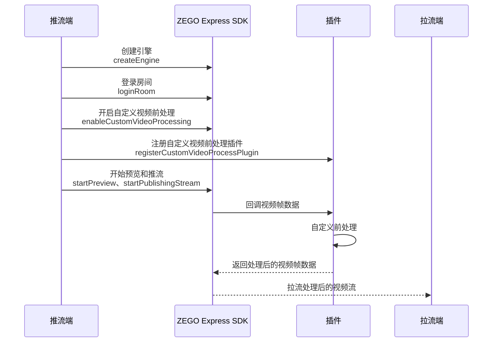

# 自定义视频前处理

- - -

## 功能简介

视频前处理是介于采集和编码之间的一个流程。开发者自行采集视频数据或获取到 SDK 采集的视频数据后，若 ZEGO Express SDK 自带的基础美颜和水印功能无法满足开发者需求时（例如美颜效果无法达到预期），可以通过其他视频处理类型的 SDK（例如 ZegoEffects SDK）对视频进行一些特殊处理，例如美颜、添加水印或挂件等，该过程即为自定义视频前处理。

自定义视频前处理与自定义视频采集相比，优势在于无需开发者管理设备输入源，仅需对 ZEGO Express SDK 抛出来的原始数据进行操作，然后发回 ZEGO Express SDK 即可。

## 使用场景

- **自定义美颜效果**：开发者需要使用第三方美颜 SDK 实现更高级的美颜功能。
- **视频滤镜**：开发者需要对视频画面添加滤镜、贴纸、特效等。
- **视频水印**：开发者需要在视频画面中添加自定义水印。
- **视频裁剪或旋转**：开发者需要在推流前对视频画面进行裁剪或旋转操作。

## 前提条件

在进行自定义视频前处理前，请确保：

- 已在 [ZEGO 控制台](https://console.zego.im) 创建项目，并申请有效的 AppID 和 AppSign，详情请参考 [控制台 - 项目信息](/console/project-info)。
- 已在项目中集成 ZEGO Express SDK，并实现了基本的音视频推拉流功能，详情请参考 [快速开始 - 集成](/real-time-video-electron-js/quick-start/integrating-sdk) 和 [快速开始 - 实现流程](/real-time-video-electron-js/quick-start/implementing-video-call)。

## 实现流程

自定义视频前处理的流程与接口调用，如下所示：



<Steps>
  <Step title="初始化 SDK">
    请参考 [快速开始 - 实现流程](/real-time-video-electron-js/quick-start/implementing-video-call) 的 "创建引擎" 和 "登录房间"。
  </Step>
  <Step title="开启自定义视频前处理">
    在开始预览和推流前，调用 [enableCustomVideoProcessing](@enableCustomVideoProcessing) 接口，开启自定义视频前处理功能。

    ```js
    // 开启自定义视频前处理
    zgEngine.enableCustomVideoProcessing(true, ZegoPublishChannel.Main);
    ```
  </Step>
  <Step title="注册自定义视频前处理插件">
    调用 [registerCustomVideoProcessPlugin](@registerCustomVideoProcessPlugin) 接口，将编译好的自定义视频前处理插件注册到 SDK 中。

    ```js
    // 引入自定义视频前处理插件
    var ZegoVideoPreProcess = require("./ZegoExpressVideoPreProcess.node");

    // 注册自定义视频前处理插件
    zgEngine.registerCustomVideoProcessPlugin(ZegoVideoPreProcess.getEffectsHandler(), ZegoPublishChannel.Main);
    ```
  </Step>
  <Step title="开始预览和推流">
    开启自定义视频前处理并注册插件后，即可开始预览和推流。

    ```js
    zgEngine.startPreview();
    zgEngine.startPublishingStream(streamID);
    ```
  </Step>
  <Step title="拉流端拉取处理后的视频流">
    拉流端通过 [startPlayingStream](@startPlayingStream) 接口，拉取经过自定义前处理的视频流。

    ```js
    zgEngine.startPlayingStream(streamID, {
        canvas: remoteCanvas
    });
    ```
  </Step>
</Steps>

## 自定义视频前处理插件开发

ZEGO 提供了自定义视频前处理插件的工程模板，开发者可以基于该模板开发自己的视频前处理插件。

### 插件工作原理

SDK 在采集到视频数据后，会调用开发者注册的插件中的 `processImageData` 方法，将视频帧数据传递给开发者。开发者在该方法中对视频数据进行自定义处理（如美颜、滤镜等），然后 SDK 会将处理后的数据进行编码并发送。

### 插件开发步骤

1. **获取插件模板**

   <Card title="zego-express-electron-customio-plugin" href="https://artifact-demo.zego.im/core_products/real-time-voice-video/zh/electron-js/video/zego-express-electron-customio-plugin.zip" target="_blank" >
   下载插件工程模板
   </Card>

   开发者可参考其中的 `zego-express-video-process-plugin` 工程结构，创建自己的视频前处理插件工程。

2. **实现 ZegoEffectsHandler 接口**

   在 C++ 源文件中实现 `ZegoEffectsHandler` 接口，SDK 会通过该接口的 `processImageData` 方法传递原始视频帧数据：

   ```cpp
   #pragma once

   #include <node_api.h>
   #include "ZegoEffectsHandler.h"
   #include <iostream>

   // 实现 ZegoEffectsHandler 接口
   class MyEffectsHandler : public ZegoEffectsHandler
   {
   public:
       void processImageData(unsigned char *data, unsigned int data_length, int width, int height) override
       {
           // 在此处对视频帧数据进行自定义前处理
           // 例如：美颜、滤镜、水印等操作
           printf("processImageData-> data_length: %d\n", data_length);
           printf("processImageData-> width: %d, height: %d\n", width, height);
       }
   };

   // 创建全局实例
   MyEffectsHandler g_effects_handler;
   ```

3. **暴露特效处理器实例**

   通过 Node API 将特效处理器实例暴露给 JavaScript 层调用：

   ```cpp
   // 定义native方法 GetEffectsHandler 获取特效处理器实例
   napi_value GetEffectsHandler(napi_env env, napi_callback_info info)
   {
       napi_status status;
       napi_value result;
       status = napi_create_int64(env, (int64_t)&g_effects_handler, &result);
       if(status != napi_ok )
       {
           printf("napi_create_int64 error --- \r\n");
           return nullptr;
       }
       return result;
   }

   // env :当前javascript的上下文文件
   // exports : 即可看做当前文件的model.exports，初始化之前是一个空对象。
   napi_value Init(napi_env env, napi_value exports)
   {
       napi_status status;
       napi_property_descriptor desc ={ "getEffectsHandler", 0, GetEffectsHandler, 0, 0, 0, napi_default, 0 };
       status = napi_define_properties(env, exports, 1, &desc);
       return exports;
   }

   // 注册当前module
   NAPI_MODULE(NODE_GYP_MODULE_NAME, Init)
   ```

4. **编译插件**

   使用 `node-gyp` 编译生成 `.node` 文件：

   ```bash
   # 安装依赖
   npm install nan
   npm install -g node-gyp

   # Windows 平台编译（64位）
   set x64=true & set plugin_version="1.0.0" & node-gyp rebuild --target=<Electron版本号> --arch=x64 --dist-url=https://atom.io/download/electron

   # macOS 平台编译
   export plugin_version="1.0.0" && node-gyp rebuild --target=<Electron版本号> --arch=x64 --dist-url=https://atom.io/download/electron
   ```

   编译成功后，将生成的 `.node` 文件拷贝到工程目录下，在 JavaScript 中通过 `require` 引入即可使用。

## 注意事项

1. 调用 [enableCustomVideoProcessing](@enableCustomVideoProcessing) 的时机必须在 [startPreview](@startPreview) 或 [startPublishingStream](@startPublishingStream) 之前。如果需要修改配置，请先调用 [logoutRoom](@logoutRoom) 登出房间，否则不会生效。
2. 回调函数应尽量高效，避免耗时操作导致视频帧堆积，影响推流质量。
3. 开发者不应在回调中修改视频帧的宽高参数，否则可能导致推流异常。

## 相关 API

| API | 说明 |
|-----|------|
| [enableCustomVideoProcessing](@enableCustomVideoProcessing) | 开启或关闭自定义视频前处理 |
| [registerCustomVideoProcessPlugin](@registerCustomVideoProcessPlugin) | 注册自定义视频前处理插件 |
