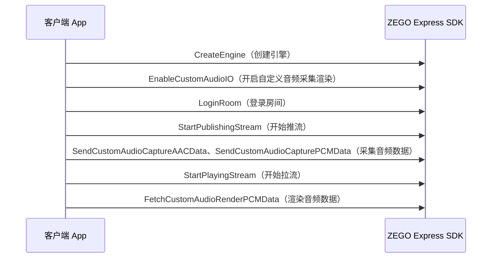

# 自定义音频采集与渲染
- - -
  
## 功能简介

### 自定义音频采集

以下场景中，建议使用自定义音频采集功能：

- 开发者需要从现有音频流、音频文件、或者定制的采集系统中获得采集后输入，交给 SDK 传输。
- 开发者有自己对 PCM 输入源做特殊的音效处理的需求，在音效处理后输入，交给 SDK 传输。

### 自定义音频渲染

当开发者有自己渲染的需求，例如对拉取到的原始 PCM 数据做特殊应用或者处理后再渲染，建议使用 SDK 的自定义音频渲染功能。

<Warning title="注意">


音频的采集和渲染分为 3 种情况：

- 内部采集、内部渲染
- 自定义采集、自定义渲染
- 自定义采集、内部渲染

开发者请根据自己的业务场景，选择合适的音频采集和渲染方式。

</Warning>


## 前提条件

在实现自定义音频采集与渲染之前，请确保：

- 已在 [ZEGO 控制台](https://console.zego.im) 创建项目，并申请有效的 AppID 和 AppSign，详情请参考 [控制台 - 项目信息](https://doc-zh.zego.im/article/12107)。
- 已在项目中集成 ZEGO Express SDK，并实现了基本的音视频推拉流功能，详情请参考 [快速开始 - 集成](!Integration/SDK_Integration) 和 [快速开始 - 实现流程](!Integration/Solution_Implementation)。


## 使用步骤

下图为 API 接口调用时序图：



### 初始化 SDK

请参考 [快速开始 - 实现流程](!Integration/Solution_Implementation#CreateEngine) 的 “创建引擎”。

### 开启自定义音频采集渲染

<Warning title="注意">


[EnableCustomAudioIO](@EnableCustomAudioIO) 需要在 [StartPublishingStream](@StartPublishingStream)、[StartPlayingStream](@StartPlayingStream)、[StartPreview](@StartPreview)、[CreateMediaPlayer](@CreateMediaPlayer)、[CreateAudioEffectPlayer](@CreateAudioEffectPlayer) 和 [CreateRealTimeSequentialDataManager](@CreateRealTimeSequentialDataManager) 之前调用才有效。 

</Warning>


可调用 [ZegoCustomAudioConfig](@-ZegoCustomAudioConfig) 设置 `sourceType = ZegoAudioSourceType.Custom`，再调用 [EnableCustomAudioIO](@EnableCustomAudioIO) 接口开启自定义音频 IO 功能。

```cs
// 设置音频源为自定义采集和渲染
ZegoCustomAudioConfig config = new ZegoCustomAudioConfig();
config.sourceType = ZegoAudioSourceType.Custom;
engine.EnableCustomAudioIO(true, config);
```

### 登录房间后推/拉流

请参考 [快速开始 - 实现流程](!Integration/Solution_Implementation#createroom) 的 “登录房间”、“推流”和“拉流”。

### 采集音频数据

打开音频采集设备，将采集到的音频数据通过 [SendCustomAudioCaptureAACData](@SendCustomAudioCaptureAACData) 或 [SendCustomAudioCapturePCMData](@SendCustomAudioCapturePCMData) 传递给引擎。

<Note title="说明">


在使用 [SendCustomAudioCaptureAACData](@SendCustomAudioCaptureAACData) 或 [SendCustomAudioCapturePCMData](@SendCustomAudioCapturePCMData) 接口采集音频时，最终给到的 ByteBuffer 类型必须是 directBuffer（默认不是该类型），即需要通过 `allocateDirect` 方法初始化，否则无法正常使用。

</Note>


### 渲染音频数据

使用 [FetchCustomAudioRenderPCMData](@FetchCustomAudioRenderPCMData) 从引擎中获取音频数据，拿到音频数据后再通渲染设备播放。

## 常见问题

1. **调用自定义音频采集渲染相关接口的时机？**

    - [EnableCustomAudioIO](@EnableCustomAudioIO)：应该在引擎启动前开始调用，即开始预览、推拉流之前。
    - [SendCustomAudioCaptureAACData](@SendCustomAudioCaptureAACData)/[SendCustomAudioCapturePCMData](@SendCustomAudioCapturePCMData)：应该在开始预览和推流后调用。如果在开始预览、推流前调用，SDK 内部会直接丢弃收到的数据。
    - [FetchCustomAudioRenderPCMData](@FetchCustomAudioRenderPCMData)：应该在调用了开始拉流后调用，在开始拉流前获取到的都是无效的静音数据。

2. **调用自定义音频采集渲染相关接口的频率？**

    最优的方式是按照物理音频设备的时钟驱动，在物理采集设备采集到数据的时候调用 [SendCustomAudioCaptureAACData](@SendCustomAudioCaptureAACData) 和 [SendCustomAudioCapturePCMData](@SendCustomAudioCapturePCMData)；在物理渲染设备需要数据时调用 [FetchCustomAudioRenderPCMData](@FetchCustomAudioRenderPCMData)。

    如果开发者的实际场景中没有具体的物理设备来驱动，建议每 10 ms ～ 20 ms 调用一次上述接口。

3. **调用 [FetchCustomAudioRenderPCMData](@FetchCustomAudioRenderPCMData)，如果 SDK 内部数据不足 “dataLength” 时， SDK 如何处理？**

    在保证 “param” 填写正常的情况下，当 SDK 内部的数据不足 “dataLength” 时，不足的剩余长度按照静音数据补齐。
