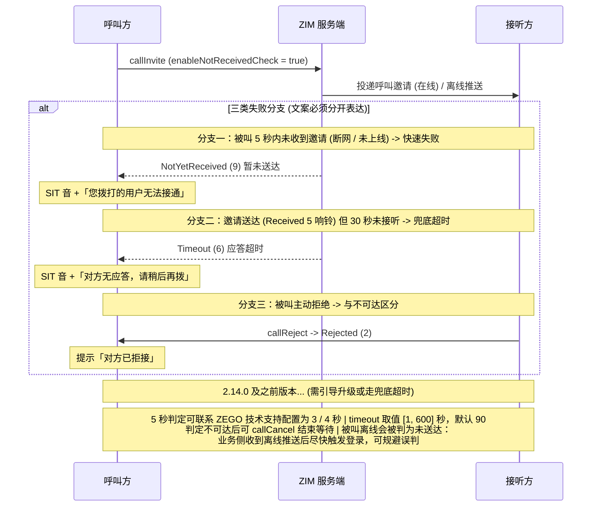

# 处理呼叫失败
---

## 功能简介

实时音视频呼叫场景中，当接听方网络不可用、设备离线或长时间无应答时，若呼叫方一直静默等待，会严重损害用户体验。
对齐系统电话的呼叫交互体验：当接听方不可达或呼叫超时时，及时、明确地向呼叫方给出失败提示。

处理呼叫失败效果展示：
- 接听方不在线（未登录、无法收到呼叫邀请）时，呼叫方快速收到"无法接通"提示。
- 接听方已登录但在设定时长内未接听时，呼叫方收到"对方无应答"提示。两类失败分开表达，均伴随系统提示音。

<Video src="https://doc-media.zego.im/core_products/zim/zh/docs_zim_android_zh/best-practice/call-fail-demo.mp4" />

## 前提条件

- 呼叫方与接听方均已集成 ZIM SDK 并完成登录，呼叫邀请功能可用。
- SDK 版本 ≥ 2.9.0（[callUserStateChanged](@callUserStateChanged) 回调的最低支持版本）。
- 启用呼叫连通性检查需 SDK 版本 ≥ 2.15.0（[enableNotReceivedCheck](@enableNotReceivedCheck) 生效版本）。

## 实现方案

### 设计原则与提示策略

- **快速失败反馈**：开启 [enableNotReceivedCheck](@enableNotReceivedCheck) 主动确认接听方可达性，而非单纯依赖接听方回包。
- **可区分的反馈信息**：不可达、无应答、已拒接三类失败信息，避免语义混同（见下方“呼叫方关键状态与处理”）。
- 状态机驱动体验：以 [ZIMCallUserState](@ZIMCallUserState) 的流转统一驱动 UI 与提示，避免接收、呼叫状态混乱。
- 提示音对齐原生体验：SIT 音（Special Information Tone，特殊信息音）+ 语音播报组合，贴近用户对系统电话失败反馈的预期。
- 超时分级设计，覆盖"不可达"与"不接听"两类失败场景：
    - 快速失败：**5 秒快速失败**在呼叫发起阶段即确认接听方是否正常收到邀请，避免无意义的等待。
    - 兜底超时：“接听方已收到邀请但长时间不接听”的场景。

<Accordion title="呼叫方关键状态与处理" defaultOpen="true">

| 关键状态 | 触发时间 | 呼叫方表现 |
|-|-|-|
| NotYetReceived（9） | 5 秒快速失败（可配置为 3 / 4 秒） | 播放 SIT 音 + 语音提示"无法接通"，结束等待态 |
| Received（5） | 接听方收到邀请时 | UI 切换为"响铃中"，继续等待接听 |
| Timeout（6） | timeout 设定的兜底时长到期 | 播放 SIT 音 + 语音提示"对方无应答" |
| Rejected（2） | 接听方主动拒绝时 | 提示"对方已拒接"，与不可达区分开 |


<center>**呼叫失败判定链路图**</center>

</Accordion>

### 呼叫连通性检查

呼叫连通性检查通过 [callInvite](@callInvite) 的 enableNotReceivedCheck 参数开启（属于 [ZIMCallInviteConfig](@-ZIMCallInviteConfig)，默认值为 false）。
传入 true 时，本次呼叫邀请以及后续呼叫都会检测邀请是否送达。接听方因断网、未上线等原因未收到邀请时，判定为未送达，状态变为 notYetReceived（暂未送达）；若接听方在呼叫超时前上线，状态会流转为 received（已送达）。

版本兼容：2.15.0 及以后版本向低版本客户端（2.14.0 及之前）发送开启送达检测的呼叫邀请时，低版本将继续展示 inviting 状态而非 notYetReceived。若业务要求全量用户体验一致，需在发版时引导升级。

<Warning title="注意">
**离线边界**：接听方处于离线状态时，离线推送通知本身也会返回 NotYetReceived 状态，造成"接听方实为离线、却被判定为不可达"的边界情况。呼叫方可能在呼叫离线用户时直接失败，此时业务侧在收到离线推送通知后尽快触发一次登录（重新完成注册），即可规避该误判。
</Warning>

## 接入示例

:::if{props.platform=undefined}
```java
// 发起呼叫并开启呼叫连通性检查
List<String> invitees = new ArrayList<>();
invitees.add("user02");

ZIMCallInviteConfig config = new ZIMCallInviteConfig();
config.mode = ZIMCallInvitationMode.GENERAL;   // 普通模式
config.timeout = 30;                            // 兜底无应答超时，单位秒，取值范围 [1, 600]，默认 90
config.enableNotReceivedCheck = true;           // 开启未送达检测

zim.callInvite(invitees, config, new ZIMCallInvitationSentCallback() {
    @Override
    public void onCallInvitationSent(String callID, ZIMCallInvitationSentInfo info, ZIMError errorInfo) {
        // callID 用于唯一标识本次呼叫，后续取消 / 接受 / 拒绝均使用该 ID
    }
});

// 监听接听方状态并驱动 UI
zim.setEventHandler(new ZIMEventHandler() {
    @Override
    public void onCallUserStateChanged(ZIM zim, ZIMCallUserStateChangeInfo info, String callID) {
        for (ZIMCallUserInfo userInfo : info.callUserList) {
            switch (userInfo.state) {
                case NOT_YET_RECEIVED:   // 接听方 5 秒内未收到邀请，快速失败
                    playSIT();
                    showTip("您拨打的用户无法接通");
                    break;
                case RECEIVED:           // 接听方已收到邀请，进入响铃等待
                    setCallStatus("ringing");
                    break;
                case TIMEOUT:            // 接听方收到但超时未接听
                    playSIT();
                    showTip("对方无应答，请稍后再拨");
                    break;
                case REJECTED:           // 接听方主动拒绝
                    playSIT();
                    showTip("对方已拒接");
                    break;
            }
        }
    }
});
```

:::


:::if{props.platform="ios|mac"}
```objective-c
// 发起呼叫并开启呼叫连通性检查
NSMutableArray<NSString *> *invitees = [NSMutableArray arrayWithObject:@"user02"];
ZIMCallInviteConfig *config = [[ZIMCallInviteConfig alloc] init];
config.mode = ZIMCallInvitationModeGeneral;    // 普通模式
config.timeout = 30;                            // 兜底无应答超时，单位秒，取值范围 [1, 600]，默认 90
config.enableNotReceivedCheck = true;           // 开启未送达检测

[[ZIM getInstance] callInvite:invitees config:config callback:^(NSString * _Nonnull callID,
        ZIMCallInvitationSentInfo * _Nonnull info, ZIMError * _Nonnull errorInfo) {
    // callID 用于唯一标识本次呼叫
}];

// 监听接听方状态并驱动 UI
- (void)zim:(ZIM *)zim callUserStateChanged:(ZIMCallUserStateChangeInfo *)info callID:(NSString *)callID {
    for (ZIMCallUserInfo *userInfo in info.callUserList) {
        switch (userInfo.state) {
            case ZIMCallUserStateNotYetReceived:   // 接听方 5 秒内未收到邀请，快速失败
                [self playSIT];
                [self showTip:@"您拨打的用户无法接通"];
                break;
            case ZIMCallUserStateReceived:         // 接听方已收到邀请，进入响铃等待
                [self setCallStatus:@"ringing"];
                break;
            case ZIMCallUserStateTimeout:          // 接听方收到但超时未接听
                [self playSIT];
                [self showTip:@"对方无应答，请稍后再拨"];
                break;
            case ZIMCallUserStateRejected:         // 接听方主动拒绝
                [self playSIT];
                [self showTip:@"对方已拒接"];
                break;
            default:
                break;
        }
    }
}
```

:::


:::if{props.platform="web"}

```typescript
// 发起呼叫并开启呼叫连通性检查
const invitees = ['user02'];
const config: ZIMCallInviteConfig = {
  mode: 0,                        // 普通模式
  timeout: 30,                    // 兜底无应答超时，单位秒，取值范围 [1, 600]，默认 90
  enableNotReceivedCheck: true,   // 开启未送达检测，2.15.0 及以上生效
  extendedData: '',
};
zim.callInvite(invitees, config)
  .then((res: ZIMCallInvitationSentResult) => {
    const callID = res.callID;    // 后续取消 / 接受 / 拒绝均使用该 ID
  })
  .catch((err: ZIMError) => { /* 发起失败处理 */ });

// 监听接听方状态并驱动 UI
zim.on('callUserStateChanged', (zim: ZIM, data: ZIMCallUserStateChangedEventResult) => {
  if (data.callID !== currentCallID) return;
  data.callUserList.forEach((userInfo) => {
    switch (userInfo.state) {
      case 9: // NotYetReceived：接听方 5 秒内未收到邀请，快速失败
        playSIT();
        showTip('您拨打的用户无法接通');
        break;
      case 5: // Received：接听方已收到邀请，进入响铃等待
        setCallStatus('ringing');
        break;
      case 6: // Timeout：接听方收到但超时未接听
        playSIT();
        showTip('对方无应答，请稍后再拨');
        break;
      case 2: // Rejected：接听方主动拒绝
        playSIT();
        showTip('对方已拒接');
        break;
    }
  });
});
```

:::

:::if{props.platform="windows"}
```cpp
// 发起呼叫并开启未接检查
using namespace zim;   // ZIM C++ 接口位于 zim 命名空间

std::vector<std::string> invitees = {"user02"};

ZIMCallInviteConfig config;
config.mode = ZIM_CALL_INVITATION_MODE_GENERAL;   // 普通模式
config.timeout = 30;                               // 兜底无应答超时，单位秒，取值范围 [1, 600]，默认 90
config.enableNotReceivedCheck = true;              // 开启未送达检测

ZIM::getInstance()->callInvite(invitees, config,
    [](const std::string &callID, const ZIMCallInvitationSentInfo &info, const ZIMError &errorInfo) {
        // callID 用于唯一标识本次呼叫，后续取消 / 接受 / 拒绝均使用该 ID
    });

// 监听被叫状态并驱动 UI：继承 ZIMEventHandler 重写回调，再注册到 ZIM 实例
class CallStateHandler : public ZIMEventHandler {
public:
    void onCallUserStateChanged(ZIM *zim, const ZIMCallUserStateChangeInfo &info,
                                const std::string &callID) override {
        for (const auto &userInfo : info.callUserList) {
            switch (userInfo.state) {
                case ZIM_CALL_USER_STATE_NOT_YET_RECEIVED:  // 被叫 5 秒内未收到邀请，快速失败
                    PlaySIT();
                    ShowTip(L"您拨打的用户无法接通");
                    break;
                case ZIM_CALL_USER_STATE_RECEIVED:          // 被叫已收到邀请，进入响铃等待
                    SetCallStatus(L"ringing");
                    break;
                case ZIM_CALL_USER_STATE_TIMEOUT:           // 被叫收到但超时未接听
                    PlaySIT();
                    ShowTip(L"对方无应答，请稍后再拨");
                    break;
                case ZIM_CALL_USER_STATE_REJECTED:          // 被叫主动拒绝
                    PlaySIT();
                    ShowTip(L"对方已拒接");
                    break;
                default:
                    break;
            }
        }
    }
};

ZIM::getInstance()->setEventHandler(std::make_shared<CallStateHandler>());
```
:::

:::if{props.platform="flutter"}
```dart
// 发起呼叫并开启未接检查
final invitees = ['user02'];
final config = ZIMCallInviteConfig()
  ..mode = ZIMCallInvitationMode.general   // 普通模式
  ..timeout = 30                           // 兜底无应答超时，单位秒，取值范围 [1, 600]，默认 90
  ..enableNotReceivedCheck = true;         // 开启未送达检测

ZIM.getInstance()!.callInvite(invitees, config).then((ZIMCallInvitationSentResult result) {
  final callID = result.callID;  // 后续取消 / 接受 / 拒绝均使用该 ID
}).catchError((onError) {
  // 发起失败处理
});

// 监听被叫状态并驱动 UI
ZIMEventHandler.onCallUserStateChanged = (ZIM zim, ZIMCallUserStateChangeInfo info, String callID) {
  if (callID != currentCallID) return;
  for (final userInfo in info.callUserList) {
    switch (userInfo.state) {
      case ZIMCallUserState.notYetReceived:  // 被叫 5 秒内未收到邀请，快速失败
        playSIT();
        showTip('您拨打的用户无法接通');
        break;
      case ZIMCallUserState.received:        // 被叫已收到邀请，进入响铃等待
        setCallStatus('ringing');
        break;
      case ZIMCallUserState.timeout:         // 被叫收到但超时未接听
        playSIT();
        showTip('对方无应答，请稍后再拨');
        break;
      case ZIMCallUserState.rejected:        // 被叫主动拒绝
        playSIT();
        showTip('对方已拒接');
        break;
      default:
        break;
    }
  }
};
```
:::

## 常见问题

<Accordion title="为什么接听方明明在线，却收到了 notYetReceived？" defaultOpen="false">
最常见的原因是推送通道与实时通道的差异——接听方 App 处于离线 / 被系统回收状态时，送达检测在判定窗口内拿不到回包。请按「呼叫连通性检查」小节中离线边界的规避方案做重登兜底，并确认接听方端的推送注册状态正常。

</Accordion>
<Accordion title="5 秒的快速失败判定时长可以改吗？" defaultOpen="false">
可以。默认 5 秒，可联系 ZEGO 技术支持配置为 3 秒或 4 秒。建议不要设得过短，否则弱网下的正常呼叫也会被误判。

</Accordion>
<Accordion title="timeout 设多少合适？" defaultOpen="false">
取值范围为 [1, 600] 秒，默认 90 秒。对齐系统电话体验建议设为 30 - 60 秒；若业务偏"留言 / 异步"形态可适当拉长。

</Accordion>
<Accordion title="低版本客户端看不到 notYetReceived 怎么办？" defaultOpen="false">
2.14.0 及之前版本的接听方会持续展示 inviting。需要在发版时升级，或者在低版本走兜底超时逻辑。

</Accordion>
<Accordion title="多人呼叫场景是否适用？" defaultOpen="false">
适用。callUserStateChanged 会返回本呼叫中所有状态发生变化的成员列表，呼叫方需按成员逐个判定，多人场景请按成员状态分别处理。

</Accordion>