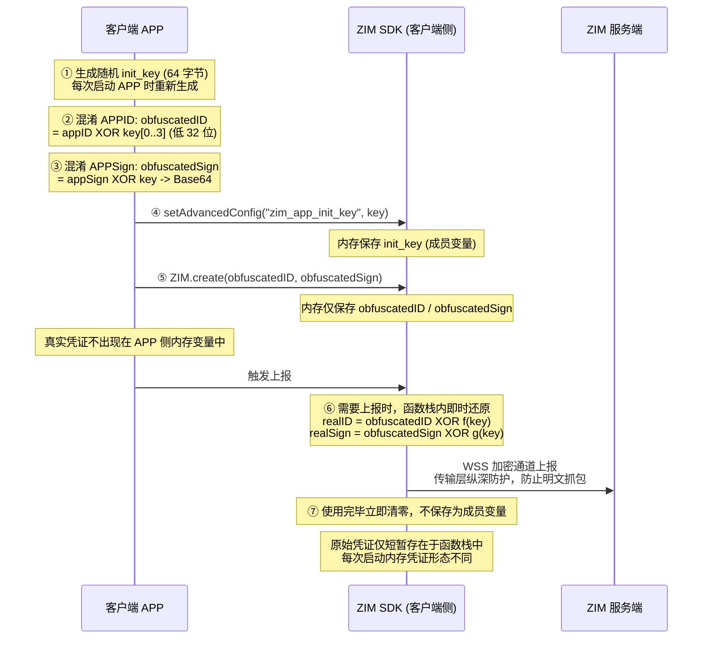

# 身份凭证混淆解决方案
---

## 解决方案概述

### 方案定义

ZIM SDK 端上内存凭证混淆能力：在客户端侧对 APPID、APPSign 进行运行时随机因子驱动的混淆处理，使凭证在内存中始终以混淆态呈现；SDK 内部仅在需要上报的瞬时还原原始值，即算即用、用完即清。

### 方案适用场景

本方案适用于对安全水位有较高要求、且使用 ZIM SDK 的全部移动/桌面应用场景。

### 关键收益

| 收益维度-20% | 现状（无本方案） | 采用本方案后 |
|-|-|-|
| **内存安全** | APPID/APPSign 明文驻留，可被内存扫描工具定位 | 仅混淆态驻留，原始凭证不出现在成员变量 |
| **动态分析** | Frida/Hook 可稳定读到调用栈中的明文凭证 | 原始值仅瞬时存在于函数栈，且随启动变化 |
| **接入成本** | 需自行实现加密、密钥轮换、内存擦除等机制 | 仅需在 create 前调用一次 setAdvancedConfig，无需改造业务逻辑 |
| **合规支撑** | 缺乏可在客户端侧展示的『凭证受控』证据 | 提供端侧混淆机制说明与最佳实践，可作为合规材料附件 |

## 方案原理与架构设计

### 总体方案流程

下图为方案的整体交互流程，展示了从客户端生成随机 key、对凭证进行混淆，到 ZIM SDK 内部保存混淆值、按需即时还原、上报完成清零的全过程。



### 混淆算法设计

本方案采用基于随机因子的对称混淆算法（XOR），通过对 APPID 与 APPSign 分别采用不同的混淆策略，可以保证：

1. APPID 仅对其低 32 位进行 XOR（避免部分运行环境 number 精度问题）；
2. APPSign 与 key 等长（64 字节）循环 XOR，并在 SDK 接口处使用 Base64 字符串表示（防止 XOR 后产生的不可见字符被日志或工具链截断）。

#### APPID 混淆（低 32 位）

取 init_key 前 4 个字节，组成一个 32 位掩码 maskLo，对 APPID 的低 32 位做 XOR：

```js
obfuscatedID = (appID ^ maskLo) & 0xFFFFFFFF
```

**设计要点**：仅对低 32 位进行 XOR，可避免 TypeScript/JavaScript 等环境中 number 类型仅能精确表示 2⁵³ 范围内的整数而引发的精度丢失；同时不影响 APPID 作为 64 位唯一性的判定。

#### APPSign 混淆（64 字节循环 XOR + Base64）

APPSign 的标准长度为 64 字节，与 init_key 等长，逐字节 XOR 后通过 Base64 编码后传入 SDK：

```js
obfuscatedSign = base64(appSign[i] XOR key[i])   for i in 0..63
```

**设计要点**：Base64 编码是为了保证 XOR 后的任意字节序列都能以可见字符串形式安全地跨 SDK 接口、跨序列化层传递，避免出现截断或编码异常。

#### init_key 生成规范

init_key 由客户 APP 在每次启动时随机生成，长度必须为 64 字节；推荐字符集为大小写字母 + 数字 + 可打印范围内的特殊字符（约 70+ 候选）。

推荐字符集示例：`ABCDEFGHIJKLMNOPQRSTUVWXYZabcdefghijklmnopqrstuvwxyz0123456789!@#$%^&*`

### SDK 内部处理机制

ZIM SDK 在客户端侧的工作流如下：

1. 接收：SDK 通过隐藏接口 setAdvancedConfig("zim_app_init_key", key) 接收客户 APP 生成的随机 key，并将其保存在 settings 成员变量中。
2. 创建：ZIM.create() 调用时，SDK 仅接收客户传入的 obfuscatedID 与 obfuscatedSign，并将其保存在成员变量中。
3. 还原：当 SDK 内部需要将凭证上报给后端服务时，进入还原函数栈，根据 init_key 在栈中临时计算：realID = obfuscatedID XOR maskLo、realSign = obfuscatedSign XOR key。
4. 清理：原始凭证使用完毕后，立即在栈中清零，不落地为任何成员变量。

安全保证：原始 APPID 与 APPSign 自始至终不进入任何成员变量、不持久化，仅在还原函数瞬时存在于栈帧中，且每次启动因 key 不同而呈现不同形态。

### 传输层纵深防护

即使 AppID 在私有协议 header 中未被单独 AES 加密，ZIM SDK 默认使用 WSS（WebSocket over TLS）通道与后端通信，凭证始终处于 TLS 加密通道中传输，有效防止明文抓包。

由此形成『客户端混淆 + 链路 TLS 加密』的双层防护：在客户端内存侧降低凭证可见性，在传输侧防止网络中间人攻击。

## 快速接入指南

### 接入前置条件

已集成 ZIM SDK 的客户 APP；SDK 版本支持 zim_app_init_key 高级配置；客户端运行平台支持 64 字节随机字符串生成。

### 接入步骤

#### Step 1：APP 端生成 init_key

建议在每次打开 APP 时生成一个全新的 64 字节随机字符串作为 init_key。

:::if{props.platform=undefined}
```java
private static String generateKey() {
    final String charset =
            "ABCDEFGHIJKLMNOPQRSTUVWXYZabcdefghijklmnopqrstuvwxyz0123456789!@#$%^&*";
    SecureRandom random = new SecureRandom(); // 密码学安全随机源
    StringBuilder sb = new StringBuilder(64);
    for (int i = 0; i < 64; i++) {
        sb.append(charset.charAt(random.nextInt(charset.length())));
    }
    return sb.toString();
}
```
:::

:::if{props.platform="ios|mac"}
```oc
static NSString ZIMGenerateInitKey(void) {
    static const char kCharset[] =
        "ABCDEFGHIJKLMNOPQRSTUVWXYZabcdefghijklmnopqrstuvwxyz0123456789!@#$%^&";
    const NSUInteger kKeyLength = 64;
    uint8_t randomBytes[kKeyLength];
    SecRandomCopyBytes(kSecRandomDefault, kKeyLength, randomBytes); // 密码学安全随机源
    NSMutableString *key = [NSMutableString stringWithCapacity:kKeyLength];
    for (NSUInteger i = 0; i < kKeyLength; i++) {
        [key appendFormat:@"%c", kCharset[randomBytes[i] % (sizeof(kCharset) - 1)]];
    }
    return key;
}
```
:::

:::if{props.platform="windows"}
```cpp
static std::string GenerateInitKey() {
    static const char kCharset[] =
        "ABCDEFGHIJKLMNOPQRSTUVWXYZabcdefghijklmnopqrstuvwxyz0123456789!@#$%^&*";
    const size_t kKeyLength = 64;
    std::random_device rd; // 密码学安全随机源（Windows 建议改用 BCryptGenRandom）
    std::string key;
    key.reserve(kKeyLength);
    for (size_t i = 0; i < kKeyLength; i++) {
        key.push_back(kCharset[rd() % (sizeof(kCharset) - 1)]);
    }
    return key;
}
```
:::

:::if{props.platform="flutter"}
```dart
String _generateKey() {
  const charset =
    'ABCDEFGHIJKLMNOPQRSTUVWXYZabcdefghijklmnopqrstuvwxyz0123456789!@#\$%^&*';
  final random = Random.secure();
  return List.generate(64, (_) => charset[random.nextInt(charset.length)]).join();
}
```
:::

:::if{props.platform="web"}
```typescript
function generateKey(): string {
  const charset =
    'ABCDEFGHIJKLMNOPQRSTUVWXYZabcdefghijklmnopqrstuvwxyz0123456789!@#\$%^&*';
  const randomBytes = new Uint8Array(64);
  crypto.getRandomValues(randomBytes);
  return Array.from(randomBytes)
    .map(b => charset[b % charset.length])
    .join('');
}
```
:::


#### Step 2：APP 端执行混淆

使用 init_key 分别对 APPID 的低 32 位、APPSign 整串进行 XOR，并将 APPSign 的混淆结果进行 Base64 编码。

:::if{props.platform=undefined}

**APPID 混淆**：

```java

private static long obfuscateAppId(long appId, String key) {
    byte[] keyBytes = key.getBytes(StandardCharsets.UTF_8);
    int maskLo = 0;
    for (int i = 0; i < 4; i++) {
        maskLo |= (keyBytes[i] & 0xFF) << (i * 8); // byte 有符号，需 & 0xFF
    }
    return (appId ^ maskLo) & 0xFFFFFFFFL; // 截回无符号 32 位
}
```

**APPSign 混淆 + Base64**：
```java
private static String obfuscateAppSign(String appSign, String key) {
    byte[] signBytes = appSign.getBytes(StandardCharsets.UTF_8);
    byte[] keyBytes = key.getBytes(StandardCharsets.UTF_8);
    byte[] obfuscated = new byte[signBytes.length];
    for (int i = 0; i < signBytes.length; i++) {
        obfuscated[i] = (byte) (signBytes[i] ^ keyBytes[i]);
    }
    return Base64.encodeToString(obfuscated, Base64.NO_WRAP);
}
```
:::
:::if{props.platform="ios|mac"}

**APPID 混淆**：

```oc
static unsigned int ZIMObfuscateAppID(unsigned int appID, NSString *key) {
    NSData *keyData = [key dataUsingEncoding:NSUTF8StringEncoding];
    const uint8_t *keyBytes = (const uint8_t *)keyData.bytes;
    uint32_t maskLo = 0;
    for (int i = 0; i < 4; i++) {
        maskLo |= (uint32_t)keyBytes[i] << (i * 8);
    }
    return (appID ^ maskLo) & 0xFFFFFFFF; // 截回 32 位
}
```


**APPSign 混淆 + Base64**：
```oc
static NSString *ZIMObfuscateAppSign(NSString *appSign, NSString *key) {
    NSData *signData = [appSign dataUsingEncoding:NSUTF8StringEncoding];
    NSData *keyData = [key dataUsingEncoding:NSUTF8StringEncoding];
    NSMutableData *obfuscated = [NSMutableData dataWithLength:signData.length];
    const uint8_t *signBytes = (const uint8_t *)signData.bytes;
    const uint8_t *keyBytes = (const uint8_t *)keyData.bytes;
    uint8_t *outBytes = (uint8_t *)obfuscated.mutableBytes;
    for (NSUInteger i = 0; i < signData.length; i++) {
        outBytes[i] = signBytes[i] ^ keyBytes[i];
    }
    return [obfuscated base64EncodedStringWithOptions:0];
}
```
:::
:::if{props.platform="flutter"}

**APPID 混淆**：

```dart
int _obfuscateAppId(int appId, String key) {
  final keyBytes = utf8.encode(key);
  int maskLo = 0;
  for (int i = 0; i < 4; i++) {
    maskLo |= keyBytes[i] << (i * 8);
  }
  return (appId ^ maskLo) & 0xFFFFFFFF; // 截回 32 位
}
```

**APPSign 混淆 + Base64**：

```dart
String _obfuscateAppSign(String appSign, String key) {
  final signBytes = utf8.encode(appSign);
  final keyBytes = utf8.encode(key);
  final obfuscated = Uint8List(signBytes.length);
  for (int i = 0; i < keyBytes.length; i++) {
    obfuscated[i] = signBytes[i] ^ keyBytes[i];
  }
  return base64.encode(obfuscated);
}
```
:::
:::if{props.platform="windows"}
**APPID 混淆**：

```cpp
static unsigned int ObfuscateAppID(unsigned int appID, const std::string &key) {
    uint32_t maskLo = 0;
    for (int i = 0; i < 4; i++) {
        maskLo |= static_cast<uint32_t>(static_cast<uint8_t>(key[i])) << (i * 8);
    }
    return (appID ^ maskLo) & 0xFFFFFFFFu; // 截回 32 位
}
```

**APPSign 混淆 + Base64**：
```cpp
/// Base64 编码（标准库无内置实现，可替换为项目已有的 Base64 工具）
static std::string Base64Encode(const uint8_t *data, size_t len) {
    static const char kTable[] =
        "ABCDEFGHIJKLMNOPQRSTUVWXYZabcdefghijklmnopqrstuvwxyz0123456789+/";
    std::string out;
    out.reserve((len + 2) / 3 * 4);
    for (size_t i = 0; i < len; i += 3) {
        uint32_t n = static_cast<uint32_t>(data[i]) << 16;
        if (i + 1 < len) n |= static_cast<uint32_t>(data[i + 1]) << 8;
        if (i + 2 < len) n |= static_cast<uint32_t>(data[i + 2]);
        out.push_back(kTable[(n >> 18) & 63]);
        out.push_back(kTable[(n >> 12) & 63]);
        out.push_back(i + 1 < len ? kTable[(n >> 6) & 63] : '=');
        out.push_back(i + 2 < len ? kTable[n & 63] : '=');
    }
    return out;
}
```
:::
:::if{props.platform="web"}

**APPID 混淆**：
```typescript
function obfuscateAppId(appId: number, key: string): number {
  const keyBytes = new TextEncoder().encode(key);
  let maskLo = 0;
  for (let i = 0; i < 4; i++) {
    maskLo = (maskLo | (keyBytes[i] << (i * 8))) >>> 0;
  }
  return (appId ^ maskLo) >>> 0; // >>> 0 保证结果为无符号 32 位
}
```

**APPSign 混淆 + Base64**：
```typescript
function obfuscateAppSign(appSign: string, key: string): string {
  const signBytes = new TextEncoder().encode(appSign);
  const keyBytes = new TextEncoder().encode(key);
  const obfuscated = new Uint8Array(signBytes.length);
  for (let i = 0; i < signBytes.length; i++) {
    obfuscated[i] = signBytes[i] ^ keyBytes[i];
  }
  return btoa(String.fromCharCode(...obfuscated));
}
```
:::

#### Step 3：传入 init_key

在 [create](@create) 之前，调用 [setAdvancedConfig](@setAdvancedConfig) 将 key 注入 SDK。

#### Step 4：使用混淆后的凭证创建 ZIM 实例

Step 2 产生的 obfuscatedId 与 obfuscatedSign 传给 [create](@create)，SDK 内部即开始按上述『即算即用』机制处理后续所有网络上报。

**完整接入示例**：

:::if{props.platform=undefined}
```java

String key = generateKey();
long obfuscatedId = obfuscateAppId(appID, key);
String obfuscatedSign = obfuscateAppSign(appSign, key);

// 必须在 create 之前调用
ZIM.setAdvancedConfig("zim_app_init_key", key);

ZIMAppConfig appConfig = new ZIMAppConfig();
appConfig.appID = obfuscatedId;
appConfig.appSign = obfuscatedSign;
ZIM.create(appConfig, application); // application 为 Application 类对象
```

:::
:::if{props.platform="ios|mac"}
```oc
unsigned int appID = <#your appID#>;
NSString *appSign = @"<#your appSign#>";

NSString *key = ZIMGenerateInitKey();
unsigned int obfuscatedID = ZIMObfuscateAppID(appID, key);
NSString *obfuscatedSign = ZIMObfuscateAppSign(appSign, key);

// 必须在 create 之前调用
[ZIM setAdvancedConfigWithKey:@"zim_app_init_key" value:key];

ZIMAppConfig *appConfig = [[ZIMAppConfig alloc] init];
appConfig.appID = obfuscatedID;
appConfig.appSign = obfuscatedSign;
[ZIM createWithAppConfig:appConfig];

```
:::
:::if{props.platform="flutter"}
```dart
final key = _generateKey();
final obfuscatedId = _obfuscateAppId(appId, key);
final obfuscatedSign = _obfuscateAppSign(appSign, key);

// 必须在 create 之前调用
ZIM.setAdvancedConfig("zim_app_init_key", key);

ZIMAppConfig appConfig = ZIMAppConfig(
  appID: obfuscatedId,
  appSign: obfuscatedSign,
);
ZIM.create(appConfig);
```
:::
:::if{props.platform="windows"}
```cpp

std::string key = GenerateInitKey();
unsigned int obfuscatedID = ObfuscateAppID(appID, key);
std::string obfuscatedSign = ObfuscateAppSign(appSign, key);

// 必须在 create 之前调用
ZIM::setAdvancedConfig("zim_app_init_key", key);

ZIMAppConfig appConfig;
appConfig.appID = obfuscatedID;
appConfig.appSign = obfuscatedSign;
ZIM *zim = ZIM::create(appConfig);
```
:::
:::if{props.platform="web"}
```typescript
const key = generateKey();
const obfuscatedId = obfuscateAppId(appId, key);
const obfuscatedSign = obfuscateAppSign(appSign, key);

// 必须在 create 之前调用
ZIM.setAdvancedConfig("zim_app_init_key", key);

ZIM.create({ appID: obfuscatedId, appSign: obfuscatedSign });
```
:::


### 注意事项

1. init_key 长度必须严格为 64 字节；非 64 字节的 key 会导致 SDK 拒绝登录。
2. zim_app_init_key 必须先于 ZIM.create() 调用，否则本次创建不生效；如需更换 key，需先 destroy 再重新 create。
3. APPID 仅对其低 32 位进行 XOR，避免在 TypeScript 等环境中触发 number 精度问题。
4. APPSign 混淆结果必须以 Base64 字符串形式传入 SDK，防止 XOR 后不可见字符被截断。
5. 未启用该能力（key 传空）时，SDK 行为与既有版本完全一致；支持平滑灰度上线。

## 使用约束与最佳实践

### 使用约束

1. key 长度：init_key 必须严格为 64 字节，非 64 字节将被拒绝登录。
2. 调用顺序：setAdvancedConfig("zim_app_init_key", ...) 必须在每次 ZIM.create() 之前调用，create 之后设置无效。
3. 凭证混淆：APPID 仅低 32 位参与 XOR；APPSign 必须经 Base64 编码后传入。
4. 生效时机：本能力只在当前 ZIM 实例生命周期内有效；切换 key 需要先 destroy 再重新 create。
5. 向后兼容：当 zim_app_init_key 传空字符串或未设置时，SDK 行为与既有版本完全一致。

### 最佳实践

1. 每次启动 APP 重新生成 init_key。建议在 APP 启动早期、ZIM.create() 之前生成；为提升安全水位，可结合 APP 内敏感场景（如鉴权）触发临时轮换。
2. 使用平台提供的密码学安全随机源，如 Dart 的 Random.secure()、Web 的 crypto.getRandomValues()、iOS 的 SecRandomCopyBytes() 等，避免使用线性同余等非密码学随机源。
3. key 不要写入本地持久化存储（UserDefaults、SharedPreferences 等），其本身就是每次启动重新生成的临时因子。
4. 配合 SDK 提供的鉴权与 Token 能力共同使用，构成『应用凭证混淆 + 用户鉴权 Token』的双层防御。
5. 灰度上线建议：先在内部灰度或小流量开启该能力，观察关键指标（登录成功率、消息到达率、错误码分布），稳定后放量。

## 附录 A：术语表

| 术语 | 含义 |
|-|-|
| **APPID** | ZIM SDK 接入用的应用唯一编号，用于区分不同客户应用，类比于 IM 系统中的 AppId。 |
| **APPSign** | ZIM SDK 接入用的应用签名密钥，与 APPID 配对使用，类比于 Secret/Token。 |
| **init_key** | 本方案中由客户 APP 生成的 64 字节随机字符串，作为凭证混淆因子，每次启动重新生成。 |
| **obfuscatedID** | APPID 经 init_key 混淆后的形态，仅对低 32 位进行 XOR。 |
| **obfuscatedSign** | APPSign 经 init_key 循环 XOR 后再 Base64 编码的字符串形式。 |
| **setAdvancedConfig** | ZIM SDK 提供的隐藏高级配置接口，用于传入 init_key 等高级参数。 |
| **WSS** | WebSocket over TLS，ZIM SDK 默认的传输层加密通道，防止明文抓包。 |
