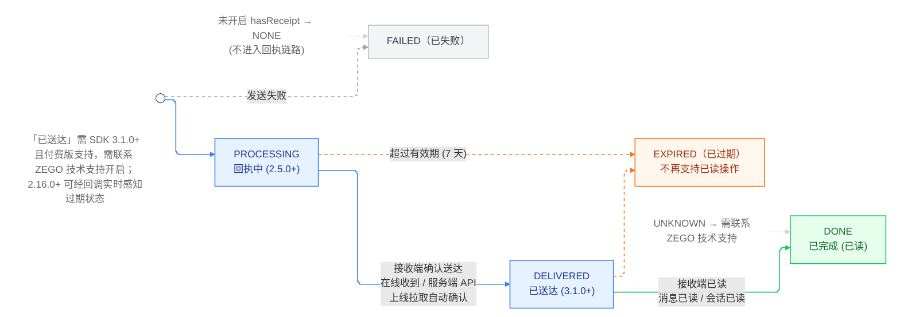
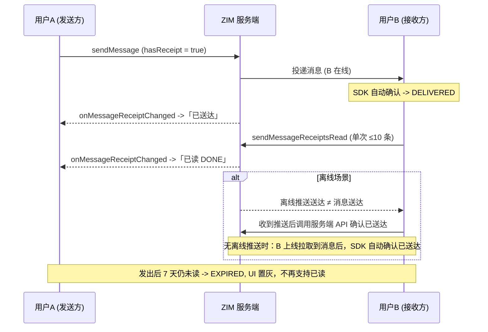

# 实现消息送达状态与回执
---

## 功能简介

ZIM 消息回执覆盖 “回执中 → 已送达 → 已完成（已读）” 的完整流转，也包含“已失败”、“已过期”等异常状态，适用于企业办公、客服工单、交易确认等需要明确消息触达状态的场景。

核心设计约束：回执状态是**会话类型 + 消息类型 + 时间**三重约束下实现的能力，不支持房间会话、7 天后流转为 “已过期” 且不再支持已读操作的消息。

## 前提条件

- 消息回执：ZIM SDK 版本 ≥ 2.5.0；消息已送达状态：SDK ≥ 3.1.0。
- 消息回执为付费版功能，如需使用需要开通专业版及以上版本。

<Note title="说明">
“已送达”状态回执需联系 ZEGO 技术支持开启；3.1.0 之前的版本如需该能力，请联系 ZEGO 技术支持评估。
</Note>

## 实现方案

### 回执状态与支持范围

发送消息时需将 [ZIMMessageSendConfig](@-ZIMMessageSendConfig) 的 hasReceipt 设置为 true，消息才会进入回执链路（未开启时状态为 NONE）。

2.16.0 及以上版本可通过回执变更回调实时感知过期状态变化。

<Accordion title="回执状态（ZIMMessageReceiptStatus）" defaultOpen="true">

| 取值 | 版本 | 含义 |
|-|-|-|
| NONE | — | 非回执消息。发送时未开启 hasReceipt |
| PROCESSING | 2.5.0+ | 回执中。接收端据此判断"这条消息需要回执"，可执行已读操作 |
| DELIVERED | 3.1.0+ | 已送达。表示回执消息已送达接收端，单聊与群聊均支持 |
| DONE | 2.5.0+ | 已完成，即已被已读 |
| FAILED | — | 已失败 |
| EXPIRED | 2.16.0+ 可实时感知 | 已过期。回执有效期为 7 天，过期后不再支持已读操作 |
| UNKNOWN | — | 未知状态，请联系 ZEGO 技术支持 |

---



<center>**回执状态流转示意图**</center>

</Accordion>

<Accordion title="会话与消息类型" defaultOpen="true">
| 消息、会话类型 | 是否支持 | 说明 |
|-|-|-|
| 单聊会话 | ✅ | 支持消息已读与会话已读两种方式 |
| 群组会话 | ✅ | 支持消息已读；会话已读不支持群聊；群聊可查询已读 / 未读 / 已送达成员列表 |
| 房间会话 | ❌ | 暂不支持发送房间会话的消息回执 |
| 普通消息 / 富媒体消息 / 自定义消息 / 合并消息 | ✅ | 均可携带回执 |
| 信令消息 / 弹幕消息等 | ❌ | 不在回执支持的消息类型范围内，需业务侧另行实现"已读"语义 |
</Accordion>


### 已读方式与查询

对已接收的回执消息，可通过以下两种方式标记已读：

| 方式 | 接口 | 语义与限制 |
|-|-|-|
| 消息已读 | [sendMessageReceiptsRead](@sendMessageReceiptsRead) | 把一批指定消息置为已读。单次消息列表不超过 10 条；仅支持回执状态为 PROCESSING 的已接收消息；不允许跨会话 |
| 会话已读 | [sendConversationMessageReceiptRead](@sendConversationMessageReceiptRead) | 把指定会话内所有已接收的对方消息置为已读。仅单聊支持；只作用于"设置已读之前"获取的消息；建议在从会话列表进入会话时使用 |

不建议在同一会话中混用两种已读接口。接入前先确定已读方式：按会话进入时机整体清未读 → 会话已读（单聊）；按消息粒度精确控制 → 消息已读。会话已读无需在会话内反复调用。

此外，SDK 提供以下回执查询能力：

| 接口 | 用途与注意事项 |
|-|-|
| [queryMessageReceiptsInfo](@queryMessageReceiptsInfo) | 批量查询消息的回执状态、已读用户数、未读用户数。查询他人发送的消息时，已读与未读用户数均为 0 |
| [queryGroupMessageReceiptMemberList](@queryGroupMessageReceiptMemberList) | 查询群消息的已读、未读（未送达）、或已送达状态的成员列表（3.1.0+，通过 filterType 区分；count 每页最多 100 且必须大于 0） |
| [queryGroupMessageReceiptReadMemberList](@queryGroupMessageReceiptReadMemberList) / [queryGroupMessageReceiptUnreadMemberList](@queryGroupMessageReceiptUnreadMemberList) | 3.1.0 起废弃，请改用 queryGroupMessageReceiptMemberList |
| [ZIMMessageReceiptInfo](@-ZIMMessageReceiptInfo).readTime | 获取回执已读时间（2.22.0+），可用于阅后即焚等密聊场景。发送者侧需会话内成员全部已读才有值；接收者侧为调用消息已读成功时的服务端时间戳；不支持"会话已读" |

如需对会话的历史消息进行回执相关操作，需先完成查询历史消息、判断历史消息的回执状态后再处理。

### 已送达状态

<Warning title="注意">
需要已送达状态功能，请使用 3.1.0 及以上版本的 SDK 。
</Warning>

| 场景 | 流转为"已送达"的触发条件 |
|-|-|
| 单聊 | ① 接收端在线收到消息后，SDK 自动确认；② 接收端收到离线推送后调用服务端 API 确认；③ 无离线推送时，本端上线拉取到消息后 SDK 自动确认 |
| 群聊 | 当所有群成员都已送达且仍有成员未读时，回执状态流转为"已送达" |

**离线推送送达 ≠ 消息送达**。必须 ZIM message 实际送达到接收端，或通过服务端 API 确认，才会流转为"已送达"。若需在接收方收到离线推送后即让发送端看到"已送达"（iOS 可开启推送拦截，Android FCM 可使用 DataMessage 推送类型，国内 Android 厂商暂不支持），可在收到推送后调用服务端 API 进行确认。




<center>**单聊回执三态链路（含离线场景）**</center>
## 接入示例


:::if{props.platform=undefined}
```java
// 用户 A 发送一条带回执的消息（以单聊文本消息为例）
String conversationID = "xxx";
ZIMTextMessage message = new ZIMTextMessage("test");
ZIMMessageSendConfig sendConfig = new ZIMMessageSendConfig();
sendConfig.hasReceipt = true;    // 必须为 true，否则该消息不进入回执链路
zim.sendMessage(message, conversationID, ZIMConversationType.PEER, sendConfig, new ZIMMessageSentFullCallback() {
    @Override public void onMessageAttached(ZIMMessage message) {}
    @Override public void onMessageSent(ZIMMessage message, ZIMError errorInfo) {}
    @Override public void onMediaUploadingProgress(ZIMMediaMessage message,
        long currentFileSize, long totalFileSize) {}
    @Override public void onMultipleMediaUploadingProgress(ZIMMultipleMessage message,
        long currentFileSize, long totalFileSize, int messageInfoIndex,
        long currentIndexFileSize, long totalIndexFileSize) {}
});

// 发送端监听回执变化（含已送达 / 已读 / 已过期）
zim.setEventHandler(new ZIMEventHandler() {
    @Override
    public void onMessageReceiptChanged(ZIM zim, ArrayList<ZIMMessageReceiptInfo> infos) {
        // 遍历 infos，按 info.status 更新 UI：DELIVERED 已送达 / DONE 已读 / EXPIRED 已过期置灰
    }
    @Override
    public void onConversationMessageReceiptChanged(ZIM zim, ArrayList<ZIMMessageReceiptInfo> infos) {
        // 对方设置了会话的已读回执（仅单聊）
    }
});

// 用户 B 执行已读——方式一：消息已读（单次不超过 10 条，仅对 PROCESSING 状态消息有效）
List<ZIMMessage> messages = new ArrayList<>();
messages.add(message);
zim.sendMessageReceiptsRead(messages, conversationID, ZIMConversationType.PEER,
    new ZIMMessageReceiptsReadSentCallback() {
        @Override
        public void onMessageReceiptsReadSent(String conversationID, ZIMConversationType conversationType,
            ArrayList<Long> errorMessageIDs, ZIMError errorInfo) {}
    });

// 方式二：会话已读（仅单聊，建议在从会话列表进入会话时调用；不推荐与消息已读混用）
zim.sendConversationMessageReceiptRead(conversationID, ZIMConversationType.PEER,
    new ZIMConversationMessageReceiptReadSentCallback() {
        @Override
        public void onConversationMessageReceiptReadSent(String conversationID,
            ZIMConversationType conversationType, ZIMError errorInfo) {}
    });

// （可选）查询一批消息的回执状态、已读用户数和未读用户数
zim.queryMessageReceiptsInfo(messages, conversationID, ZIMConversationType.PEER,
    new ZIMMessageReceiptsInfoQueriedCallback() {
        @Override
        public void onMessageReceiptsInfoQueried(ArrayList<ZIMMessageReceiptInfo> infos,
            ArrayList<Long> errorMessageIDs, ZIMError errorInfo) {}
    });

// （可选）查询群消息的已读 / 未读（未送达）/ 已送达成员列表（仅自己发送的消息，需 3.1.0+）
ZIMGroupMessageReceiptMemberListQueryConfig queryConfig = new ZIMGroupMessageReceiptMemberListQueryConfig();
queryConfig.nextFlag = 0;                                  // 初始填 0，后续填回调返回的 nextFlag
queryConfig.filterType = ZIMMessageReceiptFilterType.READ; // READ / UNREAD（未送达）/ DELIVERED
zim.queryGroupMessageReceiptMemberList(message, groupID, 100, queryConfig, // count 每页最多 100 且必须大于 0
    new ZIMGroupMessageReceiptMemberListQueriedCallback() {
        @Override
        public void onGroupMessageReceiptMemberListQueried(String groupID,
            ArrayList<ZIMGroupMemberInfo> userList, int nextFlag, ZIMError errorInfo) {
            // userList：本页成员列表；nextFlag 为 0 表示已拉完
        }
    });
```

:::


:::if{props.platform="ios|mac"}
```objective-c
// 用户 A 发送一条带回执的消息（以单聊文本消息为例）
NSString *conversationID = @"xxx";
ZIMTextMessage *message = [[ZIMTextMessage alloc] init];
message.message = @"test";
ZIMMessageSendConfig *sendConfig = [[ZIMMessageSendConfig alloc] init];
sendConfig.hasReceipt = true;    // 必须为 true，否则该消息不进入回执链路
[self.zim sendMessage:message toConversationID:conversationID conversationType:ZIMConversationTypePeer
    config:sendConfig notification:nil callback:^(ZIMMessage * _Nonnull message, ZIMError * _Nonnull errorInfo) {}];

// 发送端监听回执变化（含已送达 / 已读 / 已过期）
- (void)zim:(ZIM *)zim messageReceiptChanged:(NSArray<ZIMMessageReceiptInfo *> *)infos {
    // 遍历 infos，按 receiptStatus 更新 UI：DELIVERED 已送达 / DONE 已读 / EXPIRED 已过期置灰
}
- (void)zim:(ZIM *)zim conversationMessageReceiptChanged:(NSArray<ZIMMessageReceiptInfo *> *)infos {
    // 对方设置了会话的已读回执（仅单聊）
}

// 用户 B 执行已读——方式一：消息已读（单次不超过 10 条，仅对 PROCESSING 状态消息有效）
NSMutableArray<ZIMMessage *> *messageList = [[NSMutableArray alloc] init];
[messageList addObject:message];
[[ZIM getInstance] sendMessageReceiptsRead:messageList conversationID:conversationID
    conversationType:conversationType callback:^(NSString * _Nonnull conversationID,
    ZIMConversationType conversationType, NSArray<NSNumber *> * _Nonnull errorMessageIDs, ZIMError * _Nonnull errorInfo) {}];

// 方式二：会话已读（仅单聊，建议在从会话列表进入会话时调用；不推荐与消息已读混用）
[[ZIM getInstance] sendConversationMessageReceiptRead:conversationID conversationType:conversationType
    callback:^(NSString * _Nonnull conversationID, ZIMConversationType conversationType, ZIMError * _Nonnull errorInfo) {}];

// （可选）查询一批消息的回执状态、已读用户数和未读用户数
[[ZIM getInstance] queryMessageReceiptsInfoByMessageList:messageList conversationID:conversationID
    conversationType:conversationType callback:^(NSArray<ZIMMessageReceiptInfo *> * _Nonnull infos,
    NSArray<NSNumber *> * _Nonnull errorMessageIDs, ZIMError * _Nonnull errorInfo) {}];

// （可选）查询群消息的已读成员列表（仅自己发送的消息）
ZIMGroupMessageReceiptMemberQueryConfig *queryConfig = [[ZIMGroupMessageReceiptMemberQueryConfig alloc] init];
queryConfig.nextFlag = 0;
queryConfig.count = 10;
[[ZIM getInstance] queryGroupMessageReceiptReadMemberListByMessage:message groupID:groupID config:queryConfig
    callback:^(NSString * _Nonnull groupID, NSArray<ZIMGroupMemberInfo *> * _Nonnull userList,
    unsigned int nextFlag, ZIMError * _Nonnull errorInfo) {}];
```
:::


:::if{props.platform="web"}
```typescript
// 发送带回执的消息
const messageObj: ZIMMessage = { type: 1, message: '文本回执消息' };
const config: ZIMMessageSendConfig = {
  priority: 1,
  hasReceipt: true,     // 必须为 true，否则该消息不进入回执链路
};
zim.sendMessage(messageObj, toConversationID, conversationType, config, {
  onMessageAttached: () => { /* UI 展示"发送中" */ },
}).then((res: ZIMMessageSentResult) => { /* 发送成功 */ });

// 发送端监听回执变化
zim.on('messageReceiptChanged', (zim: ZIM, data: ZIMMessageReceiptChangedEventResult) => {
  data.infos.forEach((info) => {
    switch (info.receiptStatus) {
      case ZIMMessageReceiptStatus.Delivered: renderDelivered(info.messageID); break;   // 已送达（3.1.0+）
      case ZIMMessageReceiptStatus.Done:      renderRead(info.messageID); break;        // 已读
      case ZIMMessageReceiptStatus.Expired:   renderExpired(info.messageID); break;     // 已过期，回执标识置灰
      default: break;
    }
  });
});
// 对方设置了会话的已读回执（仅单聊）
zim.on('conversationMessageReceiptChanged', (zim: ZIM, data: ZIMMessageReceiptChangedEventResult) => {
  refreshConversationReceipt(data);
});

// 接收端执行已读——方式一：消息已读
const pendingList = receivedList.filter((m) => m.receiptStatus === ZIMMessageReceiptStatus.Processing).slice(0, 10);
zim.sendMessageReceiptsRead(pendingList, conversationID, conversationType);
// 方式二：会话已读（仅单聊，建议在从会话列表进入会话时调用）
zim.sendConversationMessageReceiptRead(conversationID, conversationType);
```

:::

:::if{props.platform="windows"}
```cpp
// 用户 A 发送一条带回执的消息（以单聊文本消息为例）
using namespace zim;   // ZIM C++ 接口位于 zim 命名空间

auto message = std::make_shared<ZIMTextMessage>("test");
ZIMMessageSendConfig sendConfig;
sendConfig.hasReceipt = true;    // 必须为 true，否则该消息不进入回执链路
ZIM::getInstance()->sendMessage(message, conversationID, ZIM_CONVERSATION_TYPE_PEER, sendConfig,
    nullptr, [](std::shared_ptr<ZIMMessage> message, const ZIMError &errorInfo) {});

// 发送端监听回执变化（含已送达 / 已读 / 已过期）
class ReceiptHandler : public ZIMEventHandler {
  public:
    void onMessageReceiptChanged(ZIM *zim, const std::vector<ZIMMessageReceiptInfo> &infos) override {
        // 遍历 infos，按 receiptStatus 更新 UI：DELIVERED 已送达 / DONE 已读 / EXPIRED 已过期置灰
    }
    void onConversationMessageReceiptChanged(ZIM *zim, const std::vector<ZIMMessageReceiptInfo> &infos) override {
        // 对方设置了会话的已读回执（仅单聊）
    }
};

// 用户 B 执行已读——方式一：消息已读（单次不超过 10 条，仅对 PROCESSING 状态消息有效）
std::vector<std::shared_ptr<ZIMMessage>> messages = {message};
ZIM::getInstance()->sendMessageReceiptsRead(messages, conversationID, ZIM_CONVERSATION_TYPE_PEER,
    [](const std::string &conversationID, ZIMConversationType conversationType,
       const std::vector<long long> &errorMessageIDs, const ZIMError &errorInfo) {});

// 方式二：会话已读（仅单聊，建议在从会话列表进入会话时调用；不推荐与消息已读混用）
ZIM::getInstance()->sendConversationMessageReceiptRead(conversationID, ZIM_CONVERSATION_TYPE_PEER,
    [](const std::string &conversationID, ZIMConversationType conversationType,
       const ZIMError &errorInfo) {});

// （可选）查询一批消息的回执状态、已读用户数和未读用户数
ZIM::getInstance()->queryMessageReceiptsInfo(messages, conversationID, ZIM_CONVERSATION_TYPE_PEER,
    [](const std::vector<ZIMMessageReceiptInfo> &infos, const std::vector<long long> &errorMessageIDs,
       const ZIMError &errorInfo) {});

// （可选）查询群消息的已读 / 未读成员列表（仅自己发送的消息）
ZIMGroupMessageReceiptMemberQueryConfig queryConfig;
queryConfig.nextFlag = 0;   // 初始填 0，后续填回调返回的 flag
queryConfig.count = 10;
ZIM::getInstance()->queryGroupMessageReceiptReadMemberList(message, groupID, queryConfig,
    [](const std::string &groupID, const std::vector<ZIMGroupMemberInfo> &userList,
       unsigned int nextFlag, const ZIMError &errorInfo) {});
       
```
:::

:::if{props.platform="flutter"}
```dart
// 用户 A 发送一条带回执的消息（以单聊文本消息为例）
final message = ZIMTextMessage(message: 'test');
final sendConfig = ZIMMessageSendConfig()..hasReceipt = true;   // 必须为 true，否则该消息不进入回执链路
ZIM.getInstance()!.sendMessage(message, conversationID, ZIMConversationType.peer, sendConfig);

// 发送端监听回执变化（含已送达 / 已读 / 已过期）
ZIMEventHandler.onMessageReceiptChanged = (zim, infos) {
  for (final info in infos) {
    switch (info.status) {
      case ZIMMessageReceiptStatus.delivered: renderDelivered(info.messageID); break;   // 已送达（3.1.0+）
      case ZIMMessageReceiptStatus.done:      renderRead(info.messageID); break;        // 已读
      case ZIMMessageReceiptStatus.expired:   renderExpired(info.messageID); break;     // 已过期，回执标识置灰
      default: break;
    }
  }
};
ZIMEventHandler.onConversationMessageReceiptChanged = (zim, infos) {
  // 对方设置了会话的已读回执（仅单聊）
};

// 用户 B 执行已读——方式一：消息已读（单次不超过 10 条，仅对 PROCESSING 状态消息有效）
final pendingList = receivedList
    .where((m) => m.receiptStatus == ZIMMessageReceiptStatus.processing)
    .take(10)
    .toList();
ZIM.getInstance()!.sendMessageReceiptsRead(pendingList, conversationID, ZIMConversationType.peer);

// 方式二：会话已读（仅单聊，建议在从会话列表进入会话时调用）
ZIM.getInstance()!.sendConversationMessageReceiptRead(conversationID, ZIMConversationType.peer);

// （可选）查询一批消息的回执状态、已读用户数和未读用户数
ZIM.getInstance()!.queryMessageReceiptsInfo(messages, conversationID, ZIMConversationType.peer)
    .then((res) {
  // res.infos：回执信息列表；res.errorMessageIDs：查询失败的消息 ID 列表
});

// （可选）查询群消息的已读 / 未读成员列表（仅自己发送的消息）
final queryConfig = ZIMGroupMessageReceiptMemberQueryConfig()
  ..nextFlag = 0   // 初始填 0，后续填回调返回的 flag
  ..count = 10;
ZIM.getInstance()!.queryGroupMessageReceiptReadMemberList(message, groupID, queryConfig)
    .then((res) {
  // res.userList：已读成员列表；res.nextFlag：下一页 flag
});
```
:::

## 常见问题

<Accordion title="为什么我做了已读操作，发送端没反应？" defaultOpen="false">
先查三件事——消息发送时 hasReceipt 是否为 true；消息的 receiptStatus 是否为 PROCESSING（只有该状态才能被设为已读）；发送端与接收端是否在同一会话内（不允许跨会话）。

</Accordion>
<Accordion title="单聊里“已送达”一直不亮是什么原因？" defaultOpen="false">
常见原因有两个——SDK 版本低于 3.1.0 或"已送达"能力未开通（需联系 ZEGO 技术支持开启）；接收端处于离线且未接入服务端上报。注意离线推送送达本身不等于消息送达。

</Accordion>
<Accordion title="群聊能不能做“会话已读”？" defaultOpen="false">
不能。会话已读仅支持单聊。群聊只能走消息已读，或通过群成员列表能力展示"谁已读"。群聊里"已送达"的流转条件是所有群成员都已送达且仍有成员未读。

</Accordion>
<Accordion title="消息放久了回执状态变了是什么原因？" defaultOpen="false">
回执有效期为 7 天，超期会流转为"已过期"，且不再支持已读操作。建议 UI 层对过期回执做置灰或移除处理。

</Accordion>
<Accordion title="自定义消息能做已读回执吗？" defaultOpen="false">
可以。自定义消息与文本、图片、文件、音频、视频等消息一样可携带回执，合并消息同样支持；只有信令消息、弹幕消息不支持（需业务侧另行实现"已读"语义）。
</Accordion>
<Accordion title="readTime 什么时候才有值？" defaultOpen="false">
发送者侧需会话内成员全部已读才有值，为最后一个成员已读时的服务端时间戳；接收者侧为调用消息已读成功时的服务端时间戳；两条都为 0 表示尚未满足条件。readTime 不支持"会话已读"，自 2.22.0 起支持。

</Accordion>