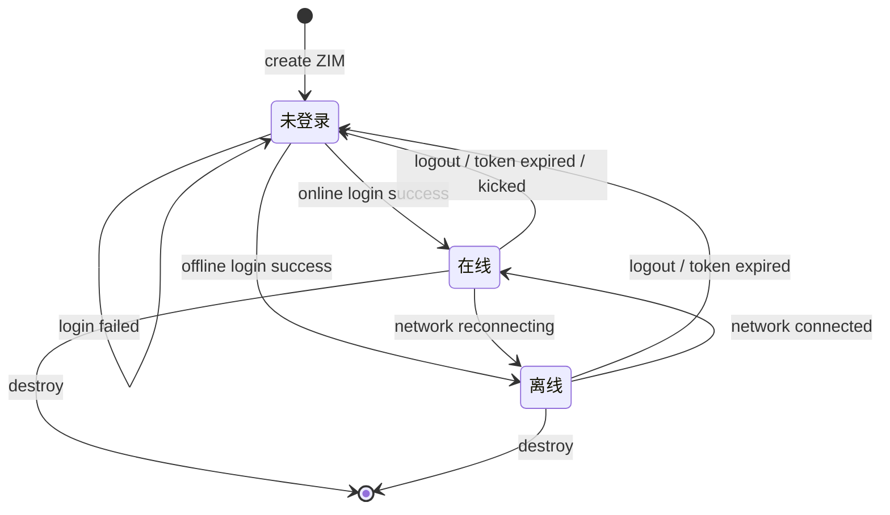

# 管理用户登录
---

本文介绍了如何使用 ZIM SDK 实现用户登录，判断用户登录状态，和处理登录状态异常。

## 实现用户登录

### 用户首次登录

`ZIMLoginConfig` 中 `isOffline` 设为 `false`

```

```

### 应用启动时自动登录

此前用户已主动登录且尚未主动登出，应用启动时可根据业务需求选择以下方式：

- **自动登录上次用户**

在启动页中创建 ZIM 实例并调用 `login` 设置 `isOffline` 为 `true`。

```

```


- **不自动登录**

跳转到登录页，参考[用户首次登录](#用户首次登录)的处理方式。

### 收到离线推送时登录

收到 iOS VoIP 或 Android CallStyle 类型的离线推送时：

1. 创建 ZIM 实例并调用 `login`，`isOffline` 为 `false`。
2. `onConnectionStateChanged` 的 state 变更为 `CONNECTED`（用户登录状态已变为 Online）后，再调用 `callAccept`、`callReject`、`callEnd` 等接口。

```

```

## 判断用户登录状态

ZIM 未在 `ZIMEventHandler` 中提供用户登录状态变化的回调，可通过 `onConnectionStateChanged` 网络状态变更回调判断当前用户的登录状态。

当用户状态变化时，通过以下条件判断当前用户登录状态：
| 用户状态 | 判断条件 |
| --- | --- |
| Online | `onConnectionStateChanged` 被触发，且 connection state 为 `CONNECTED` |
| Offline | `onConnectionStateChanged` 被触发，且 connection state 为 `RECONNECTING` |
| Not Logged In | `onConnectionStateChanged` 从未被触发过（未调用过 `login`），或 connection state 为 `DISCONNECTED` |

```

```

<Accordion title="ZIM 用户登录状态机" defaultOpen="false">

</Accordion>

## 处理用户登录异常情况

### 网络异常

用户设备出现弱网或断网时，SDK 内部会自动触发重连，通过 `onConnectionStateChanged` 回调 `RECONNECTING` 的 state 及 `LOGIN_INTERRUPTED` 的 event。

<Warning>
从 2.9.0 版本开始，SDK 会以合适的频率自动重连，开发者无需在业务层调用 `login` 接口进行重连。
</Warning>

重连结果：
- **重连成功**：回调 `CONNECTED` 的 state 及 `SUCCESS` 的 event。
- **重连失败**：回调 `DISCONNECTED` 的 state 及相应 event，此时调用其他接口会报错，错误码为 `6000121`（未登录）。

开发者应在监听到断网状态事件时给用户 UI 提示。若 SDK 无法重连，做好异常兜底逻辑（如退出到登录页面），不要在应用层代码中进行重连。


### 账号被踢出

未开启多端登录时，其他端登录了本端已登录的账号（`userID`），本端会被挤下线，SDK 不会自动重连。

此时通过 `onConnectionStateChanged` 回调 `DISCONNECTED` 的 state 及 `KICKED_OUT` 的 event，调用其他接口报错，错误码为 `6000121`（未登录）。

给用户提示并做异常兜底逻辑（如退出到登录页面），不要在应用层代码中进行重连。

### Token 过期

AppID 配置了 Token 鉴权时，Token 快过期会通过 `onTokenWillExpire` 回调。

- 获取新的 Token 后，通过 `renewToken` 接口向 SDK 传入。
- 未传入新 Token 时，SDK 会在 Token 过期后断开与服务器的连接，通过 `onConnectionStateChanged` 回调 `DISCONNECTED` 的 state 及 `TokenExpired` 的 event，调用其他接口报错，错误码为 `6000121`（未登录）。

给用户提示并做异常兜底逻辑（如退出到登录页面），不要在应用层代码中进行重连。

### 重连机制说明

更多重连机制说明请参考 [ZIM SDK 是否支持断线重连机制](https://doc-zh.zego.im/faq/zim-reconnect-support)。

