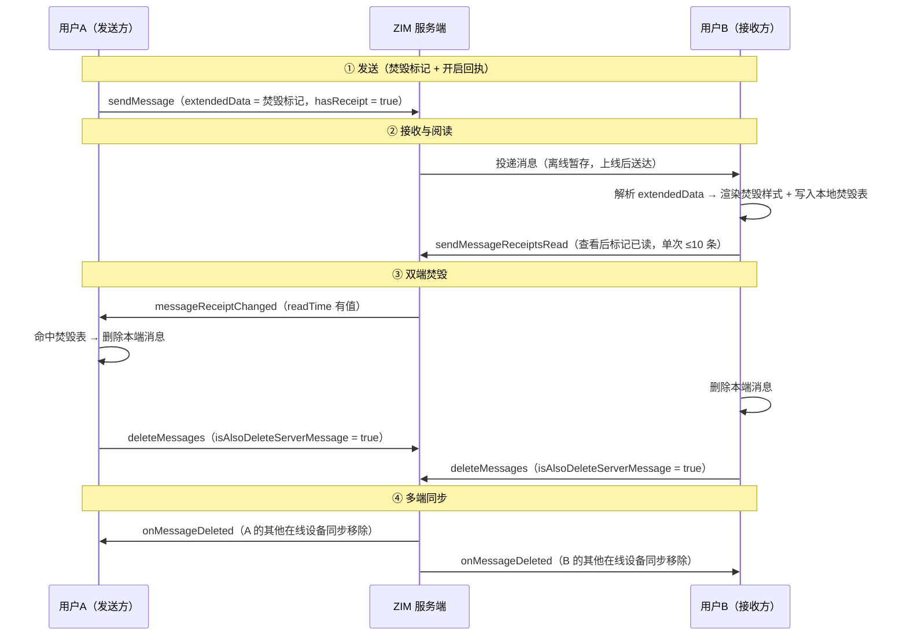

# ZIM 阅后即焚与定时销毁最佳实践

## 1. 功能简介

阅后即焚是密聊、隐私沟通场景的标志性能力：敏感内容不永久停留在聊天记录里，到期或阅读后自动从双方消失。实现前需先纠正一个常见误解：ZIM 原生的「会话级消息定时销毁」**不等于阅后即焚**——它的计时起点是消息发出，与是否已读无关，语义上是「限时消息」；而「读完才消失」的阅后即焚，官方没有原生开关，需用「消息回执已读时间 + 删除消息」组合实现（官方在《消息回执》文档中明确该组合可用于实现阅后即焚等密聊业务场景）。

| 需求语义 | 主路径 | 建议叠加 | 关键提醒 |
|---|---|---|---|
| 对方读完才消失（严格阅后即焚） | 读后即焚（组合实现） | 定时销毁（兜底未读场景） | 定时销毁没有"读完才消失"语义，单独使用会造成"未读也被销毁" |
| 发出后固定时长消失（未读也消失） | 定时销毁（原生） | — | 实现成本最低；产品侧应在 UI 给出"定时销毁"提示 |
| 两种语义都要（密聊常见形态） | 读后即焚为主 | 定时销毁兜底 | 两个能力可同时开启、互不冲突 |

## 2. 路径一：会话级消息定时销毁（原生能力）

| 机制点 | 说明 |
|---|---|
| 能力名称 | 会话级消息定时销毁（3.1.0 新增，需旗舰版，官方建议场景：限时消息、保密通信） |
| 设置接口 | setConversationMessageDestructDuration(duration, conversationID, conversationType) |
| 时长取值 | 0 或 30 \~ 604800 秒（最长 7 天）；最小 30 秒，0 表示取消 |
| 生效范围 | 单聊对本端和对端同时生效；群聊对群内所有成员同时生效 |
| 调用条件 | 登录后可调用。单聊要求 conversationID 对应用户已注册；群聊要求群组已创建且当前用户已入群 |
| 权限 | 群聊默认所有群成员均可配置；支持修改为仅群主和管理员可配置（需联系 ZEGO 技术支持） |
| 会话时长同步 | 变化经 onConversationChanged 感知；ZIMConversation.messageDestructDuration 表示当前时长（未设置为 0） |
| 消息过期时间戳 | 设置后，会话内此后发送的消息携带 destructTime（毫秒，0 表示非限时消息） |
| 销毁通知 | 到期触发 onMessageDeleted，删除类型为 MessagesDestructed，客户端据此从消息列表移除 |
| 精确倒计时 | callExperimentalAPI 传 `{"method":"getSDKTimestamp"}` 获取 SDK 当前时间戳（毫秒） |

**关键语义**：计时从消息发出开始，对方一直不打开会话，到期后消息照样销毁（可能没看到内容）。设置时长只对此后发送的消息生效，历史消息不受影响。完整能力说明参见官网《设置会话消息定时销毁》文档。

**低版本客户端表现**：3.1.0 以下客户端在消息过期前能正常收到并展示；过期后若消息已在客户端本地，客户端不会自动删除（本地残留）；若此前未拉取到该消息，过期后从服务端也查不到。因此建议对使用定时销毁的会话做最低版本门禁（3.1.0+），不满足时拦截开启并引导升级。

## 3. 路径二：严格"读后即焚"（组合实现）

若产品定义必须是"对方读完才消失"，按官方推荐路径组合三个公开能力实现：

| 官方能力 | 在本方案中的角色 |
|---|---|
| 消息拓展字段（extendedData，对端可见） | 携带"焚毁标记"，让接收端知道该消息需要阅后即焚 |
| 消息回执（hasReceipt + sendMessageReceiptsRead） | 已读通知链路 |
| 删除消息（deleteMessages + isAlsoDeleteServerMessage） | 双端删除本地与服务端消息记录 |

### 3.1 能力边界

- **仅单聊先行**：消息回执支持单聊与群组、不支持房间；群聊"全员已读才焚毁"语义复杂（发送方 readTime 需全部已读才有值），建议单聊先行。
- **消息类型**：焚毁消息可用普通 / 富媒体 / 自定义消息承载；仅信令消息、弹幕消息不支持回执。
- **焚毁非绝对保密**：删除动作发生在双端本地 + 服务端记录；无法防范对方截屏、拍照，需在产品协议层面约定。
- **离线消息**：接收方离线期间作为普通离线消息送达，上线查看后才触发焚毁，符合"阅后"语义。

### 3.2 机制流程



- **① 发送**：发送方 sendMessage（extendedData 携带焚毁标记，hasReceipt = true），并将 messageID 写入本地焚毁消息表；
- **② 接收与阅读**：接收方解析 extendedData，渲染焚毁样式并写入本地焚毁表；查看后调用 sendMessageReceiptsRead（单次 ≤10 条，不能用会话已读）标记已读；
- **③ 双端焚毁**：接收方 deleteMessages（isAlsoDeleteServerMessage = true）删除本地与服务端记录；发送方收到 messageReceiptChanged（readTime 有值，2.22.0+）后同样删除；
- **④ 多端同步**：双端其他在线设备经 onMessageDeleted 同步移除。

四个关键设计点：

- 焚毁标记放 extendedData（对端可见，上限 1KB、可联系技术支持上调），不放正文，不影响搜索与渲染；如同一消息还需承载其他业务标记（如回执开关 readReceipt），统一放入同一 JSON 对象、按 key 读取，互不冲突；
- 双端各维护一张"焚毁消息表"（本地存储，以 messageID 为键），是"是否需要焚毁"的唯一判定依据；
- 已读触发必须用消息已读（sendMessageReceiptsRead），不能用会话已读——官方明确获取回执已读时间暂不支持会话已读，且会话已读会误焚会话内其他焚毁消息；
- 删除必须 isAlsoDeleteServerMessage = true——否则换设备 / 重装后消息从服务端历史"复活"，焚毁承诺失效；通过删除接口与定时销毁能力清理后，服务端不再保留该消息。

## 4. 接入示例

### 4.1 Android

```java
// 设置该会话此后发送的消息 5 分钟后自动销毁（最短 60 秒）
int duration = 300;
zim.setConversationMessageDestructDuration(duration, conversationID, ZIMConversationType.PEER,
    new ZIMConversationMessageDestructDurationSetCallback() {
        @Override
        public void onConversationMessageDestructDurationSet(String conversationID,
            ZIMConversationType conversationType, ZIMError errorInfo) {
            // 设置成功后，单聊对本端和对端同时生效
        }
    });

// 对端通过会话变更回调感知并更新 UI（如聊天页顶部"焚毁时长"标识）
zim.setEventHandler(new ZIMEventHandler() {
    @Override
    public void onConversationChanged(ZIM zim, ArrayList<ZIMConversationChangeInfo> infoList) {
        for (ZIMConversationChangeInfo info : infoList) {
            int duration = info.conversation.messageDestructDuration; // 秒，0 = 未开启
        }
    }
    @Override
    public void onMessageDeleted(ZIM zim, ZIMMessageDeletedInfo deletedInfo) {
        if (deletedInfo.deleteType == ZIMMessageDeleteType.MessagesDestructed) {
            // 到期销毁：业务侧无需自行删除，从消息列表移除即可
        }
    }
});

// 倒计时展示：用 SDK 时间戳校准，避免本机时钟偏差
zim.callExperimentalAPI("{\"method\":\"getSDKTimestamp\"}",
    new ZIMExperimentalAPICalledCallback() {
        @Override
        public void onExperimentalAPICalled(String result, ZIMError errorInfo) {
            // result 为 {"timestamp":123456}（毫秒）；倒计时 = destructTime - timestamp
        }
    });
```

```java
// 发送方：发送阅后即焚消息（焚毁标记放 extendedData，与其他业务标记共用同一 JSON）
ZIMTextMessage message = new ZIMTextMessage("这是一条阅后即焚消息");
message.extendedData = "{\"burnAfterRead\":true}";
ZIMMessageSendConfig config = new ZIMMessageSendConfig();
config.hasReceipt = true;
zim.sendMessage(message, toUserID, ZIMConversationType.PEER, config, new ZIMMessageSentCallback() {
    @Override public void onMessageAttached(ZIMMessage message) {}
    @Override public void onMessageSent(ZIMMessage message, ZIMError errorInfo) {
        // 发送成功后将 messageID 写入本地"焚毁消息表"
    }
});

// 接收方：登记焚毁标记（仅 PROCESSING 状态的回执消息）
// 查看后触发已读并焚毁："已读"建议定义为"会话页渲染完成"
zim.sendMessageReceiptsRead(messageList, conversationID, ZIMConversationType.PEER,
    new ZIMMessageReceiptsReadSentCallback() {
        @Override
        public void onMessageReceiptsReadSent(String conversationID,
            ZIMConversationType conversationType, ArrayList<Long> errorMessageIDs, ZIMError errorInfo) {}
    });
ZIMMessageDeleteConfig deleteConfig = new ZIMMessageDeleteConfig();
deleteConfig.isAlsoDeleteServerMessage = true;   // 必须删除服务端记录，否则换设备后消息"复活"
zim.deleteMessages(messageList, conversationID, ZIMConversationType.PEER, deleteConfig,
    new ZIMMessageDeletedCallback() {
        @Override
        public void onMessageDeleted(String conversationID, ZIMConversationType conversationType,
            ZIMError errorInfo) {}
    });

// 发送方：收到已读回执（readTime 有值，2.22.0+）后焚毁；失败进重试队列
zim.setEventHandler(new ZIMEventHandler() {
    @Override
    public void onMessageReceiptChanged(ZIM zim, ArrayList<ZIMMessageReceiptInfo> infos) {
        for (ZIMMessageReceiptInfo info : infos) {
            if (info.readTime > 0 && burnTable.containsKey(info.messageID)) {
                // deleteMessages（isAlsoDeleteServerMessage = true）；双端其他设备经 onMessageDeleted 同步
            }
        }
    }
});
```

### 4.2 iOS

```objective-c
// 设置该会话此后发送的消息 5 分钟后自动销毁（最短 60 秒）
[zim setConversationMessageDestructDuration:300
                             conversationID:conversationID
                           conversationType:ZIMConversationTypePeer
                                   callback:^(NSString *conversationID,
        ZIMConversationType conversationType, ZIMError *errorInfo) {}];

// 对端通过会话变更回调感知；到期销毁触发 messageDeleted（类型 MessagesDestructed）
- (void)zim:(ZIM *)zim conversationChanged:(NSArray<ZIMConversationChangeInfo *> *)infoList {
    for (ZIMConversationChangeInfo *info in infoList) {
        int duration = info.conversation.messageDestructDuration;   // 秒，0 = 未开启
    }
}
- (void)zim:(ZIM *)zim messageDeleted:(ZIMMessageDeletedInfo *)deletedInfo {
    if (deletedInfo.deleteType == ZIMMessageDeleteTypeMessagesDestructed) {
        // 从消息列表中移除对应消息
    }
}

// 倒计时校准：callExperimentalAPI 传 {"method":"getSDKTimestamp"} 获取 SDK 当前时间戳（毫秒）
```

```objective-c
// 发送方：发送阅后即焚消息
ZIMTextMessage *message = [[ZIMTextMessage alloc] init];
message.message = @"这是一条阅后即焚消息";
message.extendedData = @"{\"burnAfterRead\":true}";
ZIMMessageSendConfig *config = [[ZIMMessageSendConfig alloc] init];
config.hasReceipt = true;
[self.zim sendMessage:message toConversationID:toUserID conversationType:ZIMConversationTypePeer
    config:config notification:nil callback:^(ZIMMessage * _Nonnull message, ZIMError * _Nonnull errorInfo) {}];

// 接收方：查看后触发已读并焚毁
[[ZIM getInstance] sendMessageReceiptsRead:messageList conversationID:conversationID
    conversationType:conversationType callback:^(NSString * _Nonnull conversationID,
    ZIMConversationType conversationType, NSArray<NSNumber *> * _Nonnull errorMessageIDs,
    ZIMError * _Nonnull errorInfo) {}];

ZIMMessageDeleteConfig *deleteConfig = [[ZIMMessageDeleteConfig alloc] init];
deleteConfig.isAlsoDeleteServerMessage = true;   // 必须删除服务端记录，否则换设备后消息"复活"
[self.zim deleteMessages:messageList conversationID:conversationID conversationType:conversationType
    config:deleteConfig callback:^(NSString * _Nonnull conversationID,
    ZIMConversationType conversationType, ZIMError * _Nonnull errorInfo) {}];

// 发送方：收到已读回执（readTime 有值，2.22.0+）后焚毁；多端经 messageDeleted 同步
- (void)zim:(ZIM *)zim messageReceiptChanged:(NSArray<ZIMMessageReceiptInfo *> *)infos {}
- (void)zim:(ZIM *)zim messageDeleted:(ZIMMessageDeletedInfo *)deletedInfo {}
```

### 4.3 Web

```typescript
// 发送方：发送阅后即焚消息
const message: ZIMMessage = {
  type: 1,
  message: '这是一条阅后即焚消息',
  extendedData: JSON.stringify({ burnAfterRead: true }),
};
const config: ZIMMessageSendConfig = { hasReceipt: true, priority: 1 };
zim.sendMessage(message, toUserID, 0, config)
  .then(({ message: sent }) => burnTable.set(sent.messageID, true));

// 接收方：登记焚毁标记 → 查看后触发已读并焚毁（"已读"建议定义为"会话页渲染完成"）
zim.on('messageReceived', (zim, { messageList }) => {
  for (const msg of messageList) {
    if (msg.receiptStatus !== 1 /* PROCESSING */) continue;
    const ext = JSON.parse(msg.extendedData || '{}');
    if (ext.burnAfterRead) burnTable.set(msg.messageID, true);
  }
});
async function burnAfterRead(message: ZIMMessage) {
  await zim.sendMessageReceiptsRead([message], conversationID, 0);
  const deleteConfig: ZIMMessageDeleteConfig = { isAlsoDeleteServerMessage: true };
  await zim.deleteMessages([message], conversationID, 0, deleteConfig);
}

// 发送方：收到已读回执后焚毁（readTime 2.22.0+）；失败进重试队列
zim.on('messageReceiptChanged', (zim, { infos }) => {
  for (const info of infos) {
    if (!burnTable.get(info.messageID)) continue;
    const msg = messageTable.get(info.messageID);
    if (!msg) continue;
    const deleteConfig: ZIMMessageDeleteConfig = { isAlsoDeleteServerMessage: true };
    zim.deleteMessages([msg], conversationID, 0, deleteConfig)
      .catch(() => enqueueRetry(msg));   // 焚毁是强承诺，失败进重试队列
  }
});

// 双端均注册：多端同步删除
zim.on('messageDeleted', (zim, { messageList }) => removeFromMessageList(messageList.map(m => m.messageID)));
```

## 5. 接入最佳实践

- **先对齐产品语义再定路径**：需求里含"读完才消失"，必须走读后即焚（组合实现）；定时销毁只解决"限时消失"，且未读也会被销毁。两者可组合使用。
- **版本 / 套餐前置检查**：定时销毁调用前检测 3.1.0+ 与旗舰版开通状态；失败时 UI 明确引导而非吞错，并对低版本客户端做强制更新。
- **倒计时用 SDK 时间戳**（定时销毁）：以 getSDKTimestamp 校准，防止用户改本机时钟造成提前 / 延后销毁的观感问题。
- **删除必带 isAlsoDeleteServerMessage = true**（读后即焚）：否则换设备后消息"复活"。
- **删除失败重试**（读后即焚）：焚毁是强承诺，失败进入重试队列直至成功，对用户隐藏重试过程。
- **离线焚毁对账**（读后即焚）：若接收方焚毁时发送方所有设备均离线，发送方本地消息会残留（onMessageDeleted 仅同步本账号在线设备）。双端应在登录成功后对焚毁表做对账：服务端已不存在的消息直接本地清除（富媒体一并清理本地媒体缓存）；对账逻辑需同时兼容"回执回调离线补发"与"不补发"两种情况，且不得误清尚未焚毁的消息。
- **多端登录必须处理 onMessageDeleted**：两条路径都依赖此回调保持多端一致。
- **富媒体焚毁要彻底**（读后即焚）：图片 / 视频焚毁时本地媒体缓存文件一并清理。
- **群聊权限收紧**（定时销毁）：管理类群组联系技术支持改为仅群主 / 管理员可配置。
- **UI 预期管理**：聊天页展示焚毁标识与倒计时 / 焚毁样式；产品协议说明焚毁时机与边界（截屏无法防范）。

## 6. 常见问题

**Q1：ZIM 有内置阅后即焚吗？**  
A：官方没有严格意义的"读后销毁"开关。原生能力是会话级消息定时销毁（3.1.0+，旗舰版），但计时起点是消息发出、与是否已读无关，只能满足"限时消失"语义；需求是"读完才消失"时，必须用"回执已读时间 + 删除消息"组合实现，也可叠加定时销毁兜底未读场景。

**Q2：对方一直不打开会话，定时销毁的消息也会消失吗？**  
A：会。计时从消息发出开始，与是否已读无关——需提前向产品对齐这一预期，严格"必已读才焚毁"请选读后即焚组合实现。

**Q3：定时销毁的最短时长是多少？**  
A：60 秒（取值 0 或 60\~604800 秒，0 为取消）。因此"发出后几十秒内消失"的最短实现即 1 分钟。

**Q4：读后即焚里可以用删除消息接口单方面删吗？**  
A：deleteMessages 删除的影响仅限本账号（单边删除），删不掉对方设备上的记录，不能单独作为焚毁手段；必须配合"接收方也删除 + isAlsoDeleteServerMessage"的双端约定。

**Q5：群聊能做吗？**  
A：定时销毁原生支持群聊（全员生效，默认全员可配置）；读后即焚群聊要求"全员已读才焚毁"（发送方 readTime 需全部已读才有值），"任一成员已读即焚毁"与回执机制不一致，需业务侧另行设计，建议群聊场景选定时销毁。

**Q6：焚毁后服务端还有这条消息吗？**  
A：没有。通过删除接口（isAlsoDeleteServerMessage）与定时销毁能力清理后，服务端不再保留该消息。

**Q7：定时销毁和撤回有什么区别？**  
A：撤回（revokeMessage）是对具体某条消息的人工 / 管理操作，有默认时间窗；定时销毁是会话级自动化策略，对开启后的所有新消息按固定时长生效。两者可并存。