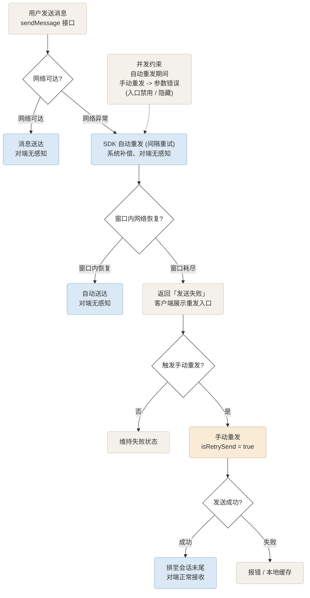

# 消息重发
---

## 功能简介

用户所处的网络环境复杂多变，弱网、断网、网络切换等情况难以完全避免。当一条消息因网络异常而发送失败时，若直接判定失败并交由用户处理，将降低消息可达率与沟通体验。

ZIM SDK 支持**自动重发 + 手动重发**的双层重试机制：在瞬断等短暂网络异常下由 SDK 自动补偿，在长时间网络不可达时则交由用户主动决策。

<Warning title="注意">
此功能需要集成 2.20.0 及以上版本的 SDK 。
</Warning>

## 实现方案

### ZIM 消息重发机制


### 自动重发

- 用户发送单聊 / 群聊消息并遭遇网络中断时，SDK 在“网络恢复等待时间”窗口内以固定间隔进行多次自动重试；
- 默认等待窗口为 **30 秒**：窗口内网络恢复，消息自动送达，对端用户无感知；
- 窗口内重试耗尽仍未成功，则返回“消息发送失败”状态，交由上层业务处理；
- 默认重试机制：间隔重试，其中重试间隔约 10 秒、最大重试 3 次、累计等待约 30 秒。

重试间隔、重试次数及网络恢复等待时间（重试超时）均由 ZEGO 云控配置统一管理，业务方无需发版即可调整；如需调整重试策略，请联系 ZEGO 技术支持进行配置。

### 手动重发

- 手动重发针对**发送流程中的“发送失败”消息对象**：消息发送失败时，原消息仍由业务侧保存（或存在于业务本地消息列表中），无需重新查询；
- 再次调用 sendMessage，将该失败消息对象填入；
- 将 config.isRetrySend 设置为 true；
- 监听发送回调，获取最终发送结果。

手动重发成功后，该消息将排序至会话的最后位置（以真实送达时间为序）。例如：当前顺序为 A（成功）、B（失败）、C（成功），B 重发成功后顺序变为 A、C、B。

### 并发约束

当 SDK 正处于自动重发过程中时，若用户同时发起手动重发，sendMessage 接口将调用失败并返回参数错误。客户端应在自动重发期间禁用或隐藏手动重发入口，待自动重发结束（成功或失败）后再开放用户操作。
## 接入最佳实践

- **统一 SDK 版本**：确保所有终端集成 ZIM SDK ≥ 2.20.0，旧版本不支持 isRetrySend。
- **复用原失败消息对象**：重发时直接使用发送流程中失败的那条消息对象；禁止业务侧重建消息对象，否则将改变消息 ID、破坏排序与已读链路。
- **重发带回执的消息必须同时设置 hasReceipt = true**：重发时消息的回执状态取自本次传入的 config、不看原消息，漏设会让该消息脱离回执链路（receiptStatus 置回 NONE），已读状态从此不再更新。
- **明确 UI 状态机**：发送中 → 自动重发中（禁用 / 隐藏手动按钮）→ 失败（展示"重发"入口）→ 再次失败（报错或本地缓存）。
- **规避并发冲突**：SDK 自动重发期间禁用手动重发入口或提示"重发中"，避免触发参数错误。
- **重试策略云端化**：重试间隔、次数、超时统一由 ZEGO 技术支持云端配置，业务侧按场景申请调整。
- **建立质量度量**：统计自动重发成功率、手动重发成功率、平均首次送达时长等指标，支撑策略持续优化。
- **面向用户透明**：在"发送失败"与"重发中"等状态下给予清晰、可理解的提示。

## 接入示例

:::if{props.platform=undefined}
```java
// 重发单聊消息：复用发送流程中持有的"发送失败"消息对象
String toConversationID = "xxxx";
ZIMConversationType conversationType = ZIMConversationType.PEER; // 单聊:PEER 群组:GROUP 房间:ROOM

ZIMMessageSendConfig config = new ZIMMessageSendConfig();
config.priority = ZIMMessagePriority.LOW; // 低(默认)/中/高
config.isRetrySend = true;                // 必须设置为 true，表示重发此消息

config.hasReceipt = true; // 关键：重发的回执状态取自本次传入的 config，原消息带回执时必须同时设置，否则该消息脱离回执链路

zim.sendMessage(failedMessage, toConversationID, conversationType, config, new ZIMMessageSentFullCallback() {
    @Override
    public void onMessageAttached(ZIMMessage message) {}

    @Override
    public void onMessageSent(ZIMMessage message, ZIMError errorInfo) {
        // 监听发送回调，获取最终发送结果
    }

    @Override
    public void onMediaUploadingProgress(ZIMMediaMessage message, long currentFileSize, long totalFileSize) {}

    @Override
    public void onMultipleMediaUploadingProgress(ZIMMultipleMessage message, long currentFileSize,
        long totalFileSize, int messageInfoIndex, long currentIndexFileSize, long totalIndexFileSize) {}
});
```

:::


:::if{props.platform="ios|mac"}
```objective-c
// 重发单聊消息：复用发送流程中持有的"发送失败"消息对象
NSString *toConversationID = @"xxxx";
ZIMConversationType conversationType = ZIMConversationTypePeer;

ZIMMessageSendConfig *config = [[ZIMMessageSendConfig alloc] init];
config.priority = ZIMMessagePriorityLow;
config.isRetrySend = true;   // 必须设置为 true，表示重发此消息

[self.zim sendMessage:failedMessage
     toConversationID:toConversationID
     conversationType:conversationType
               config:config
         notification:nil
             callback:^(ZIMMessage * _Nonnull message, ZIMError * _Nonnull errorInfo) {
    // 监听发送回调，获取最终发送结果
}];
```

:::


:::if{props.platform="web"}

```typescript
// 重发单聊 Text 消息：复用发送流程中持有的失败消息对象
const toConversationID = '';                    // 对端 userID
const conversationType = 0;                     // 单聊:0 群组:2 房间:1

const config: ZIMMessageSendConfig = {
  priority: 1,                                  // 低(默认):1 中:2 高:3
  isRetrySend: true,                            // 必须设置为 true，表示重发此消息
};

const notification: ZIMMessageSendNotification = {
  onMessageAttached: (message: ZIMMessage) => {},
};

const failedMessage: ZIMMessage = getFailedMessageFromSendFlow();   // 发送失败时业务侧持有的原消息对象（来自本次发送流程）

zim.sendMessage(failedMessage, toConversationID, conversationType, config, notification)
  .then((res: ZIMMessageSentResult) => { /* 发送成功 */ })
  .catch((err: ZIMError) => { /* 发送失败 */ });
```

:::

:::if{props.platform="windows"}
```cpp
// 重发单聊消息：复用发送流程中持有的"发送失败"消息对象
using namespace zim;   // ZIM C++ 接口位于 zim 命名空间

std::string toConversationID = "xxxx";
ZIMConversationType conversationType = ZIM_CONVERSATION_TYPE_PEER; // 单聊:PEER 群组:GROUP 房间:ROOM

ZIMMessageSendConfig config;
config.priority = ZIM_MESSAGE_PRIORITY_LOW; // 低(默认)/中/高
config.isRetrySend = true;                  // 必须设置为 true，表示重发此消息

ZIM::getInstance()->sendMessage(failedMessage, toConversationID, conversationType, config,
    nullptr, [](std::shared_ptr<ZIMMessage> message, const ZIMError &errorInfo) {
        // 监听发送回调，获取最终发送结果
    });
```
:::

:::if{props.platform="flutter"}
```dart
// 重发单聊 Text 消息：复用发送流程中持有的失败消息对象
const toConversationID = '';                    // 对端 userID
const conversationType = 0;                     // 单聊:0 群组:2 房间:1

const config: ZIMMessageSendConfig = {
  priority: 1,                                  // 低(默认):1 中:2 高:3
  isRetrySend: true,                            // 必须设置为 true，表示重发此消息
};

const notification: ZIMMessageSendNotification = {
  onMessageAttached: (message: ZIMMessage) => {},
};

const failedMessage: ZIMMessage = getFailedMessageFromSendFlow();   // 发送失败时业务侧持有的原消息对象（来自本次发送流程）

zim.sendMessage(failedMessage, toConversationID, conversationType, config, notification)
  .then((res: ZIMMessageSentResult) => { /* 发送成功 */ })
  .catch((err: ZIMError) => { /* 发送失败 */ });
```
:::

## 常见问题

<Accordion title="手动重发成功后消息顺序发生变化，是否影响对端理解？" defaultOpen="false">
消息按真实送达时间排序，手动重发的成功消息时间戳更新后自然排至末尾，符合用户对"后发送的消息在下面"的直觉。

</Accordion>
<Accordion title="能否对原失败消息修改内容后再重发？" defaultOpen="false">
若需发送新内容，应使用普通 sendMessage 流程（isRetrySend 保持默认），而非走"重发"语义；原失败消息建议在 UI 上标记为"已撤回"或不再重发。

</Accordion>
<Accordion title="用户在网络恢复前已离开会话 / 杀掉进程，未送达消息如何处理？" defaultOpen="false">
应用重新激活且网络恢复后，从业务侧本地消息列表（本地会话数据）中恢复该失败消息对象并引导用户手动重发；无需通过历史消息查询重建发送对象。

</Accordion>
