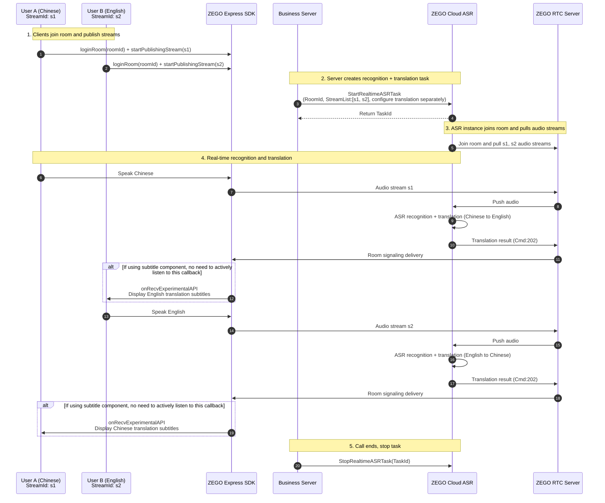

# 1v1 Real-time Translation Subtitles

## Scenario Overview

In cross-language 1v1 voice call scenarios, two users communicate using different languages. To achieve barrier-free communication, each user's speech needs to be translated into their own language in real-time and displayed as subtitles.

This document uses a **Mandarin Chinese** and **English** 1v1 voice call as an example to demonstrate how to implement bidirectional language translation using ZEGO real-time audio/video products combined with cloud real-time speech recognition and translation features, and display only the other party's translated subtitles on the client side.

<Frame width="150px" height="auto" caption="">
  
</Frame>

## Core Flow

### Sequence Diagram

The following diagram shows the core interaction flow for 1v1 real-time translation subtitles:



### Flow Description

| Step | Description |
| --- | --- |
| 1 | Both users use ZEGO Express SDK to join the same real-time audio/video (RTC) room and publish streams with `s1` and `s2` as stream IDs respectively. |
| 2 | Business server calls [StartRealtimeASRTask](/cloud-realtime-asr/api-reference/start) to create a recognition task, using `StreamList` to configure ASR and translation parameters for both streams separately. |
| 3 | ZEGO cloud ASR service joins the RTC room and pulls both audio streams. |
| 4 | Real-time recognition of user speech and translation, translation results are delivered to clients via room signaling. |
| 5 | After the call ends, the server calls [StopRealtimeASRTask](/cloud-realtime-asr/api-reference/stop) to stop the task. |

## Prerequisites

1. Cloud real-time speech recognition service has been enabled in [ZEGOCLOUD Console](https://console.zego.im/).
2. Translation vendor (such as Doubao, Qwen Machine Translation) API Key has been purchased and obtained.
3. Latest [ZEGO Express SDK](/cloud-realtime-asr/quick-start#integrate-zego-express-sdk) has been downloaded and integrated.
4. Client has implemented room joining and stream publishing functionality. This example assumes:
    - User A (Chinese user): `userId` is `u1`, `streamId` is `s1`
    - User B (English user): `userId` is `u2`, `streamId` is `s2`

## Implementation Steps

### Step 1: Server Creates Recognition and Translation Task

The server calls the [StartRealtimeASRTask](/cloud-realtime-asr/api-reference/start) interface, uses `RecognitionRange: 1` to enable stream-level recognition, and configures ASR and translation parameters for both streams in `StreamList`:

- Stream `s1` (Chinese user): Chinese recognition to English translation (for English user to view)
- Stream `s2` (English user): English recognition to Chinese translation (for Chinese user to view)


```json Request Example
{
    "RoomId": "your_room_id",
    "RecognitionRange": 1,
    "SubtitleType": 2,
    "StreamList": [
        {
            "StreamId": "s1",
            "ASR": {
                "Vendor": "Tencent",
                "Params": {
                    "EngineModelType": "16k_zh"
                }
            },
            "EnableTranslation": true,
            "Translation": {
                "Vendor": "DoubaoSeedTranslation",
                "SourceLanguage": "zh",
                "TargetLanguage": "en",
                "LLM": {
                    "Url": "https://ark.cn-beijing.volces.com/api/v3/responses",
                    "ApiKey": "your_doubao_api_key",
                    "Model": "doubao-seed-translation-250915"
                }
            }
        },
        {
            "StreamId": "s2",
            "ASR": {
                "Vendor": "Tencent",
                "Params": {
                    "EngineModelType": "16k_en"
                }
            },
            "EnableTranslation": true,
            "Translation": {
                "Vendor": "DoubaoSeedTranslation",
                "SourceLanguage": "en",
                "TargetLanguage": "zh",
                "LLM": {
                    "Url": "https://ark.cn-beijing.volces.com/api/v3/responses",
                    "ApiKey": "your_doubao_api_key",
                    "Model": "doubao-seed-translation-250915"
                }
            }
        }
    ]
}
```

#### Parameter Description

| Parameter | Description |
| --- | --- |
| `RoomId` | Real-time audio/video (RTC) room ID, must match the room ID that clients join. |
| `RecognitionRange` | Set to `1` to recognize streams specified in `StreamList`. |
| `SubtitleType` | Set to `2` to deliver only translation results. |
| `StreamList` | Stream configuration list, each stream can have independent ASR and translation parameters. |
| `StreamList[].ASR.Params.EngineModelType` | ASR engine model, `16k_zh` for Chinese, `16k_en` for English. For more languages, refer to [Configure ASR](/cloud-realtime-asr/configuring-asr). |
| `StreamList[].Translation.SourceLanguage` | Source language, the language spoken by the current stream user. |
| `StreamList[].Translation.TargetLanguage` | Target language, the language after translation. |

<Note title="Note">
- This example uses Doubao translation model `doubao-seed-translation-250915`. You can also use Qwen Machine Translation (`QwenMT`), for details refer to [Configure Translation](/cloud-realtime-asr/guides/enable-translation).
- In production environments, please make sure to fill in the correct `ApiKey`.
</Note>

### Step 2: Client Displays Other Party's Translation Subtitles

The client receives and displays translation subtitles through the ZEGO subtitle component. To implement "display only the other party's translation subtitles", you need to filter out your own messages in the subtitle processing logic.

#### Integrate Subtitle Component

Please refer to the [Display Subtitles](/cloud-realtime-asr/guides/display-subtitles#use-subtitle-component) document to download and integrate the subtitle component.

#### Filter to Display Only Other Party's Subtitles

In the subtitle message processing logic, compare the `UserId` field in the message with the local user ID to display only the other user's subtitles:

<Tabs>
<Tab title="iOS">
```oc ZegoCloudAsrSubtitlesMessageDispatcher.m {7-11,15-19}
- (void)handleMessageContent:(NSString *)msgContent userID:(NSString *)userID userName:(NSString *)userName {
  ......

  if (cmd == ZegoCloudAsrMessageCmdAsrText && messageProtocol.asrTextData) {
    ......

    // Compare the UserId field in the custom message with your own UserId
    if (NO == [userId isEqualToString:[[ZegoCloudAsrServiceAPI sharedInstance] getUserId]]) {
      [ZegoCloudAsrLogUtil write:[NSString stringWithFormat:@"dispatchAsrChatMsg, seqId=%llu, round=%llu, message_id=%@", seqId, round, message_id]];
      [self dispatchAsrChatMsg:cmdMsg];
    }
  } else if (cmd == ZegoCloudAsrMessageCmdLlmText && messageProtocol.llmTextData) {
    ......

    // Compare the UserId field in the custom message with your own UserId
    if (NO == [userId isEqualToString:[[ZegoCloudAsrServiceAPI sharedInstance] getUserId]]) {
        [ZegoCloudAsrLogUtil write:[NSString stringWithFormat:@"dispatchLLMChatMsg, seqId=%llu, round=%llu, message_id=%@", seqId, round, message_id]];
        [self dispatchLLMChatMsg:cmdMsg];
    }
  }
}
```
</Tab>

<Tab title="Android">
In the `onMessageListUpdated` callback of the `AudioChatMessageParser` class, compare the `UserId` field in the message with your own `UserId`.

```java
audioChatMessageParser.setAudioChatMessageListListener(new AudioChatMessageListListener() {
    @Override
    public void onMessageListUpdated(List<AudioChatMessage> messagesList) {
      String localUserId = "u1"; // Replace with actual local user ID
      List<AudioChatMessage> otherUserMessages = new ArrayList<>();
      for (AudioChatMessage message : messagesList) {
          // Compare the UserId field in the custom message with your own UserId
          if (!message.data.userId.equals(localUserId)) {
              otherUserMessages.add(message);
          }
      }
      // Update UI list
      binding.messageList.onMessageListUpdated(otherUserMessages);
    }
});
```
</Tab>

<Tab title="Web">
```javascript
// Add filter conditions in the handleMessage method in the example code hooks/useChat.ts file
function handleMessage() {
  // Get the local logged-in userId
  const userId = sessionStorage.getItem('userId');
  // If the UserId in the received message matches userId, do not process this message
  if (data.UserId === userId) return;
  // ...rest of the code remains unchanged
}
```
</Tab>
</Tabs>

### Step 3: (Optional) Stop Recognition Task

After the call ends, the server calls the [StopRealtimeASRTask](/cloud-realtime-asr/api-reference/stop) interface to stop the task:

```json
{
    "TaskId": "your_task_id"
}
```

<Note title="Note">
If the stop interface is not called proactively, the backend will automatically stop the recognition task when there are no real users in the RTC room for more than `MaxIdleTime` (default 120 seconds).
</Note>

## Notes

1. **SDK Version Requirement**: You must use the Express SDK version optimized for Cloud ASR, otherwise you cannot properly receive subtitle signaling.
2. **Stream ID Consistency**: The `StreamId` in the server `StreamList` must match exactly the stream ID used when the client publishes streams.
3. **Translation Direction Configuration**: Please configure the correct `SourceLanguage` and `TargetLanguage` based on the actual user language to ensure translation results meet expectations.
4. **API Key Security**: In production environments, the translation service's `ApiKey` should be managed securely by the server to avoid leakage.
5. **Message Ordering**: Translation text received via room signaling may arrive out of order, the subtitle component has built-in processing logic to sort by `SeqId`.

## Related Documentation

- [Quick Start](/cloud-realtime-asr/quick-start)
- [Configure ASR](/cloud-realtime-asr/configuring-asr)
- [Configure Translation](/cloud-realtime-asr/guides/enable-translation)
- [Display Subtitles](/cloud-realtime-asr/guides/display-subtitles)
- [StartRealtimeASRTask API](/cloud-realtime-asr/api-reference/start)
