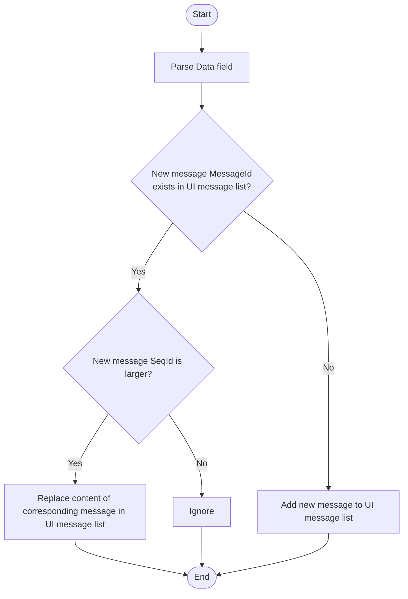
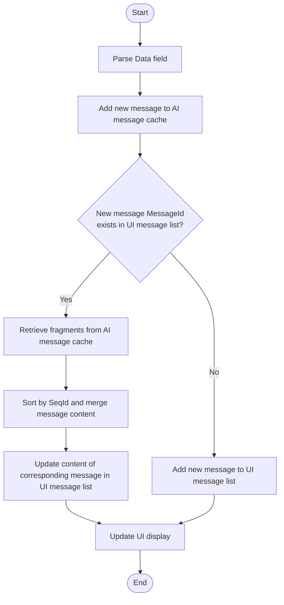

# Display Subtitles

---
## Feature Overview

This document introduces how to use ZEGO's client subtitle component to display subtitles for corresponding users/audio streams in a streaming (typewriter-style) manner during voice or video calls.

- Types of content that the subtitle component can display:
    - User speech subtitles: Streaming display of user speech text content, with support for forward error correction.
    - Translation subtitles: Display of translation text results.
- Scope of subtitle component display:
    - Room-level subtitles for all users/audio streams
    - User/stream-level subtitles

<Frame width="auto" height="512" caption="">
  
</Frame>

## Core Concepts

The core fields involved in the subtitle component are described as follows:

| Field | Type | Description |
| --- | --- | --- |
| Timestamp | Number | Timestamp, in seconds |
| SeqId | Number | Packet sequence number, may be out of order, please sort messages by sequence number. In extreme cases, IDs may not be consecutive. |
| Round | Number | Conversation round, increases each time the user actively speaks |
| Cmd | Number | 201: ASR speech recognition text<br/>202: LLM translated text |
| Data | Object | Specific content, different Cmd corresponds to different Data |

Different Cmd values correspond to different Data, as follows:

<Tabs>
<Tab title="Cmd is 201, ASR Recognition Text">

| Field | Type | Description |
| --- | --- | --- |
| UserId | string | Speaker's user ID |
| Text | string | User speech recognition (ASR) text<br/>Each delivery is full text, supporting text correction |
| MessageId | string | Message ID, unique for each round of ASR text messages |
| EndFlag | bool | End flag, true indicates that this round of ASR text processing is complete |

</Tab>
<Tab title="Cmd is 202, LLM Translation Text">

| Field | Type | Description |
| --- | --- | --- |
| UserId | string | Speaker's user ID |
| Text | string | LLM translated text<br/>Each delivery is incremental text |
| MessageId | string | Message ID, unique for each round of LLM translation text messages |
| EndFlag | bool | End flag, true indicates that this round of LLM translation text processing is complete |

</Tab>
</Tabs>

## Subtitle Component Usage Guide

### Prerequisites

- Basic functionality has been implemented according to the [Quick Start](./../quick-start.mdx) documentation:
    - Integrated ZEGO Express SDK to implement basic voice call functionality.
    - Enabled cloud real-time speech recognition and configured `SubtitleType` to `1`, `2`, or `3` to deliver subtitles via room signaling.
<Warning title="Note">
You must use the ZEGO Express SDK version optimized for Cloud ASR from the [Download SDK and Demo](/aiagent-ios/introduction/download) page, otherwise subtitles will not display properly.
</Warning>

### Using the Subtitle Component <a id="use-subtitle-component" />
<Tabs>
<Tab title="iOS">
You can directly download the [subtitle component source code](https://github.com/ZEGOCLOUD/cloud_asr_quick_start/tree/master/ios/CloudAsrQuickStart/subtitles) to your project for immediate use.

<Accordion title="Subtitle Component Usage Example" defaultOpen="true">
<CodeGroup>
```oc YourView.m {5-6,10-11,20-23,25-26,34-35,56-57,61-62,67-69,73-75,77-79}
#import "YourView.h"

#import <Masonry/Masonry.h>

#import "ZegoCloudAsrSubtitlesTableView.h"
#import "ZegoCloudAsrSubtitlesMessageDispatcher.h"

@interface YourView() <ZegoAIAgentAudioEventHandler, ZegoAIAgentSubtitlesEventHandler>

// Agent subtitles
@property (nonatomic, strong, readwrite) ZegoCloudAsrSubtitlesTableView *subtitlesTableView;

@end

@implementation YourView

- (instancetype)initWithFrame:(CGRect)frame {
    self = [super initWithFrame:frame];
    if (self) {
        // Set your own user ID
        ZegoCloudAsrServiceAPI.sharedInstance().setUserId(userID)
        // Preset room ID (if not set, a random room ID will be used)
        ZegoCloudAsrServiceAPI.sharedInstance().setRoomId(roomID)

        // Register events
        [self registerEventHandler];

        [self setupSubtitles];
    }
    return self;
}

- (void)dealloc {
    // Unregister events
    [self unregisterEventHandler];
}

- (void)setupSubtitles {
    // Add chat view - occupying the lower half of the screen
    CGRect chatFrame = CGRectMake(0,
                                 self.bounds.size.height / 2,
                                 self.bounds.size.width,
                                 self.bounds.size.height / 2);
    self.subtitlesTableView = [[ZegoCloudAsrSubtitlesTableView alloc] initWithFrame:chatFrame style:UITableViewStylePlain];

    [self addSubview:self.subtitlesTableView];

    // Add constraints using Masonry
    [self.subtitlesTableView mas_makeConstraints:^(MASConstraintMaker *make) {
        make.left.right.bottom.equalTo(self);
        make.height.equalTo(self.mas_height).multipliedBy(0.5);
    }];
}

- (void)registerEventHandler {
    [[ZegoCloudAsrServiceAPI sharedInstance] registerAudioEventHandler:self];
    [[ZegoCloudAsrSubtitlesMessageDispatcher sharedInstance] registerEventHandler:self];
}

- (void)unregisterEventHandler {
    [[ZegoCloudAsrSubtitlesMessageDispatcher sharedInstance] unregisterEventHandler:self];
    [[ZegoCloudAsrServiceAPI sharedInstance] unregisterAudioEventHandler:self];
}

#pragma mark - ZegoAIAgentAudioEventHandler

- (void)onRecvExperimentalAPI:(NSString *)content{
    [[ZegoCloudAsrSubtitlesMessageDispatcher sharedInstance] handleExpressExperimentalAPIContent:content];
}

#pragma mark - ZegoAIAgentSubtitlesEventHandler

- (void)onRecvAsrChatMsg:(ZegoAIAgentAudioSubtitlesMessage *)message {
    [self.subtitlesTableView handleRecvAsrMessage:message];
}

- (void)onRecvLLMChatMsg:(ZegoAIAgentAudioSubtitlesMessage *)message {
    [self.subtitlesTableView handleRecvLLMMessage:message];
}

@end
```
```oc YourView.h
#import <UIKit/UIKit.h>
#import "ZegoAIAgentSubtitlesEventHandler.h"

NS_ASSUME_NONNULL_BEGIN

@interface YourView : UIView <ZegoAIAgentSubtitlesEventHandler>

@end
```
</CodeGroup>
</Accordion>
</Tab>

<Tab title="Android">
You can directly download the [subtitle handler class source code](https://github.com/ZEGOCLOUD/cloud_asr_quick_start/blob/master/Android/QuickStart/agent_translation_quick_start/src/main/java/im/zego/cloudasr/quickstart/message/AudioChatMessageParser.java) to your project for immediate use.
<Accordion title="Subtitle Handler Class Usage Example" defaultOpen="true">
```java {8-9}
private AudioChatMessageParser audioChatMessageParser = new AudioChatMessageParser();

ZegoExpressEngine.getEngine().setEventHandler(new IZegoEventHandler() {
    @Override
    public void onRecvExperimentalAPI(String content) {
        super.onRecvExperimentalAPI(content);

        // AudioChatTextMessage will parse the JSON string
        audioChatMessageParser.onRecvExperimentalAPI(content);
    }
});

audioChatMessageParser.setAudioChatMessageListListener(new AudioChatMessageListListener() {
    @Override
    public void onMessageListUpdated(List<AudioChatMessage> messagesList) {
        // Update UI list
        binding.messageList.onMessageListUpdated(messagesList);
    }
});
```
</Accordion>
</Tab>

<Tab title="Web">
If you are using a Vue project, you can directly download the [subtitle handler hook](https://github.com/ZEGOCLOUD/cloud_asr_quick_start/blob/master/web/src/hooks/useChat.ts) to your project for immediate use.
<Accordion title="Vue Project Subtitle Handler Hook Usage Example" defaultOpen="true">
```javascript
// Subtitle component usage example code
// Import chatHook into your page
import { useChat } from "useChat";
import { onMounted, onBeforeUnmount } from 'vue';

// Call the useChat method, pass in the Express SDK instance, messages is the message list, render it in your subtitle component
const { messages, setupEventListeners, clearMessages } = useChat(zg);

onMounted(() => {
  // Register event listeners when page loads
  setupEventListeners()
})

onBeforeUnmount(() => {
 // Clear messages when page is destroyed
 clearMessages()
})

```
</Accordion>
</Tab>
</Tabs>

### Display Partial Subtitles Only (Optional)
You can filter by UserId to display subtitles only for certain users or streams.
Taking displaying only other users' translated subtitles as an example.

<Tabs>
<Tab title="iOS">
```oc ZegoCloudAsrSubtitlesMessageDispatcher.m {7-11,15-19}
- (void)handleMessageContent:(NSString *)msgContent userID:(NSString *)userID userName:(NSString *)userName {
  ......

  if (cmd == ZegoCloudAsrMessageCmdAsrText && messageProtocol.asrTextData) {
    ......

    // Compare the UserId field in the custom message with your own UserId
    if (NO == [userId isEqualToString:[[ZegoCloudAsrServiceAPI sharedInstance] getUserId]]) {
      [ZegoCloudAsrLogUtil write:[NSString stringWithFormat:@"dispatchAsrChatMsg, seqId=%llu, round=%llu, message_id=%@", seqId, round, message_id]];
      [self dispatchAsrChatMsg:cmdMsg];
    }
  } else if (cmd == ZegoCloudAsrMessageCmdLlmText && messageProtocol.llmTextData) {
    ......

    // Compare the UserId field in the custom message with your own UserId
    if (NO == [userId isEqualToString:[[ZegoCloudAsrServiceAPI sharedInstance] getUserId]]) {
        [ZegoCloudAsrLogUtil write:[NSString stringWithFormat:@"dispatchLLMChatMsg, seqId=%llu, round=%llu, message_id=%@", seqId, round, message_id]];
        [self dispatchLLMChatMsg:cmdMsg];
    }
  }
}
```
</Tab>

<Tab title="Android">
In the `onMessageListUpdated` method of the `AudioChatMessageParser` class, compare the UserId field in the message with your own UserId.

```java
audioChatMessageParser.setAudioChatMessageListListener(new AudioChatMessageListListener() {
    @Override
    public void onMessageListUpdated(List<AudioChatMessage> messagesList) {
      String localUserId = xxxx ; //
      for (AudioChatMessage message : messagesList) {
          // Compare the UserId field in the custom message with your own UserId
          if (!message.data.userId.equals(localUserId)) {
              otherUserMessages.add(message);
          }
      }
      // Update UI list
      binding.messageList.onMessageListUpdated(otherUserMessages);
    }
});
```
</Tab>

<Tab title="Web">
```javascript
// Add filter conditions in the handleMessage method in the example code hooks/useChat.ts file
function handleMessage() {
  // Get the userId of the local logged-in user that you stored
  const userId = sessionStorage.getItem('userId');
  // If the UserId in the received message matches userId, do not process this message
  if (data.UserId === userId) return;
  // ...rest of the code remains unchanged
}
```
</Tab>

</Tabs>

## Custom Subtitle Implementation (Not Recommended)

<Warning title="Note">It is recommended to use the subtitle component by default.</Warning>

The client can obtain room custom messages with `method` as `liveroom.room.on_recive_room_channel_message` by listening to the `onRecvExperimentalAPI` callback.

Determine the message type based on the Cmd field, and get the message content based on the Data field.
<Tabs>
<Tab title="Cmd is 201, ASR Recognition Text">
The corresponding message processing flow is shown in the following diagram:


</Tab>

<Tab title="Cmd is 202, LLM Translation Text">
The corresponding message processing flow is shown in the following diagram. Where:
- AI message cache: A HashMap with MessageId as key and new message as value.
- UI message list: An array containing user messages and AI messages, storing all messages displayed on the UI.


</Tab>
</Tabs>

#### Notes

- Message sorting: Data received through room custom messages may be out of order and needs to be sorted by SeqId field.
- Streaming text processing:
 - ASR text delivers full text each time. Messages with the same MessageId need to completely replace previous content.
 - LLM text delivers incremental text each time. Messages with the same MessageId need to be sorted and accumulated for display.
- Memory management: Please clean up completed message caches in a timely manner, especially when users engage in long conversations.
