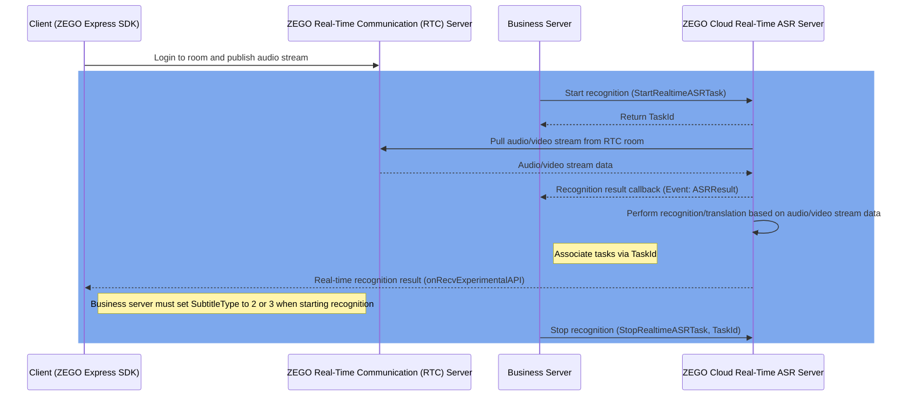

# Quick Start

## Prerequisites

- You have created a project in the [ZEGOCLOUD Console](https://console.zegocloud.com/) and obtained a valid AppID and AppSign. For details, refer to [Console - Project Information](/console/project-info).
- You have contacted ZEGOCLOUD Technical Support to enable the cloud real-time speech recognition service.

## Usage Steps
### Sequence Diagram


The core steps for using the real-time speech recognition service are shown in the blue blocks in the diagram. After your business server calls the [Start Cloud Real-Time ASR](./api-reference/start.mdx) interface, the cloud real-time ASR server will recognize all or specified audio streams in the room and callback the recognition results to your business server through the pre-configured [callback](./callbacks/receiving-callback.mdx) address.

If you need to implement scenarios such as real-time subtitles that require displaying recognition content on the client side, please refer to the [Display Subtitles](./guides/display-subtitles.mdx) document to use the subtitle component or implement custom subtitle display for recognition results.

<Warning title="Note">
Please contact ZEGOCLOUD Technical Support to configure the callback address for receiving recognition results.
</Warning>
<Warning title="Note">
If no real user exists in the RTC room after 120 seconds (default value, configurable), the cloud real-time speech recognition service will automatically stop and trigger a callback with Event as Exception and Data.Code as 1202. For details, refer to [Return Codes](./api-reference/return-codes.mdx).
</Warning>

<Steps titleSize="h3">
<Step title="Integrate ZEGO Express SDK">
<a id="integrate-zego-express-sdk"></a>

Please refer to the client SDK integration and quick start documentation for implementing video or voice calls to complete client SDK integration and stream publishing.

<Steps titleSize="p">
<Step title="Integrate ZEGO Express SDK">
- [Android](/real-time-video-android-java/quick-start/integrating-sdk)
- [iOS](/real-time-video-ios-oc/quick-start/integrating-sdk)
- [Web](/real-time-video-web/quick-start/integrating-sdk)
</Step>
<Step title="Implement Video or Voice Call">
- [Android](/real-time-video-android-java/quick-start/implementing-video-call)
- [iOS](/real-time-video-ios-oc/quick-start/implementing-video-call)
- [Web](/real-time-video-web/quick-start/implementing-video-call)

</Step>
</Steps>


#### Client Best Configuration Practices

For optimal recognition results, we recommend the following configurations when using the ZEGO Express SDK on the client side:

<Tabs>
<Tab title="Android">
- Enable traditional audio 3A processing (echo cancellation AEC, automatic gain control AGC, noise suppression ANS)
- For voice chat room scenarios, we recommend setting the room scenario to high-quality voice chat room. The SDK will adopt different optimization strategies for different scenarios
- Set the audio device mode to default mode
- Enable AI echo cancellation to improve echo cancellation effect (this feature requires contacting ZEGOCLOUD Technical Support to obtain the corresponding version of ZEGOExpress SDK)

```java Android(Java)
ZegoEngineConfig config = new ZegoEngineConfig();
HashMap<String, String> advanceConfig = new HashMap<String, String>();
config.advancedConfig = advanceConfig;
ZegoExpressEngine.setEngineConfig(config);
// Set room scenario to high-quality voice chat room
// !mark
ZegoExpressEngine.getEngine().setRoomScenario(ZegoScenario.HIGH_QUALITY_CHATROOM);
// Set audio device mode to default mode
// !mark
ZegoExpressEngine.getEngine().setAudioDeviceMode(ZegoAudioDeviceMode.GENERAL);
// Enable traditional audio 3A processing
// !mark(1:3)
ZegoExpressEngine.getEngine().enableAEC(true);
ZegoExpressEngine.getEngine().enableAGC(true);
ZegoExpressEngine.getEngine().enableANS(true);
// Enable AI echo cancellation, note: enabling AI echo cancellation requires contacting ZEGOCLOUD Technical Support to obtain the corresponding version of ZEGOExpress SDK
// !mark
ZegoExpressEngine.getEngine().setAECMode(ZegoAECMode.AI_BALANCED);
// Enable AI noise suppression, moderate noise suppression
// !mark
ZegoExpressEngine.getEngine().setANSMode(ZegoANSMode.MEDIUM);

```
</Tab>
<Tab title="iOS">
- Enable traditional audio 3A processing (echo cancellation AEC, automatic gain control AGC, noise suppression ANS)
- For voice chat room scenarios, we recommend setting the room scenario to high-quality voice chat room. The SDK will adopt different optimization strategies for different scenarios
- Enable AI echo cancellation to improve echo cancellation effect (this feature requires contacting ZEGOCLOUD Technical Support to obtain the corresponding version of ZEGOExpress SDK)

```oc iOS(Objective-C)
ZegoEngineProfile* profile = [[ZegoEngineProfile alloc]init];
profile.appID = kZegoAppId;
// High-quality voice chat room scenario, setting this scenario avoids requesting camera permission. Integrators should set specific values according to their business scenarios
profile.scenario = ZegoScenarioHighQualityChatroom;
ZegoEngineConfig* engineConfig = [[ZegoEngineConfig alloc] init];
engineConfig.advancedConfig = @{
};
[ZegoExpressEngine setEngineConfig:engineConfig];
[ZegoExpressEngine createEngineWithProfile:profile eventHandler:self];
// Enable traditional audio 3A processing
// !mark(1:3)
[[ZegoExpressEngine sharedEngine] enableAGC:TRUE];
[[ZegoExpressEngine sharedEngine] enableAEC:TRUE];
[[ZegoExpressEngine sharedEngine] enableANS:TRUE];
// Enable AI echo cancellation, note: enabling AI echo cancellation requires contacting ZEGOCLOUD Technical Support to obtain the corresponding version of ZEGOExpress SDK
// !mark
[[ZegoExpressEngine sharedEngine] setAECMode:ZegoAECModeAIBalanced];
// Enable AI noise suppression, moderate noise suppression
// !mark
[[ZegoExpressEngine sharedEngine] setANSMode:ZegoANSModeMedium];

```
</Tab>
<Tab title="Web">
- Enable traditional audio 3A processing (echo cancellation AEC, automatic gain control AGC, noise suppression ANS)
- For voice chat room scenarios, we recommend setting the room scenario to high-quality voice chat room. The SDK will adopt different optimization strategies for different scenarios
- When publishing stream, set the stream parameter configuration to automatically switch to available `videoCodec`

```javascript Web(JavaScript)
// Import necessary modules
import { ZegoExpressEngine } from "zego-express-engine-webrtc";

// Instantiate ZegoExpressEngine, set room scenario to high-quality voice chat room
// !mark
const zg = new ZegoExpressEngine(appid, server, { scenario: 7 })

// Create local media stream, configure traditional audio 3A processing, SDK enables it by default
// !mark
const localStream = await zg.createZegoStream();

// Publish local media stream, need to set automatic switching to available videoCodec
// !mark
await zg.startPublishingStream(userStreamId, localStream, {
  enableAutoSwitchVideoCodec: true,
});

// Check system requirements
async function checkSystemRequirements() {
  // Check if WebRTC is supported
  const rtcSupport = await zg.checkSystemRequirements("webRTC");
  if (!rtcSupport.result) {
    console.error("Browser does not support WebRTC");
    return false;
  }

  // Check microphone permission
  const micSupport = await zg.checkSystemRequirements("microphone");
  if (!micSupport.result) {
    console.error("Microphone permission not obtained");
    return false;
  }

  return true;
}
```
</Tab>
</Tabs>

<Note title="Note">For configuration on other platforms, please contact ZEGOCLOUD Technical Support for details.</Note>

</Step>
<Step title="Business Server Starts Cloud Speech Recognition">

The following is sample code for the business server to start cloud speech recognition and receive recognition and translation results (using Node.js as an example):
<CodeGroup>

```javascript Start Cloud Real-Time ASR {4-13}
const https = require('https');
const querystring = require('querystring');

const data = JSON.stringify({
  "RoomId": "room_1",
  "ASR": {
    "Params": {
      "engine_model_type": "16k_zh"
    },
    "VADSilenceSegmentation": 500
  },
  "SubtitleType": 1 // Subtitle delivery type. 0: No delivery, 1: Recognition results only, 2: Translation results, 3: Recognition and translation results
});

const params = {
  Action: 'StartRealtimeASRTask',
  AppId: '1234567890',
  SignatureNonce: 'vecj0mc2jcl',
  Timestamp: '1753691152',
  Signature: 'e8032aabe7702091b0bb2ca83cc2f98a',
  SignatureVersion: '2.0'
};

const options = {
  hostname: 'cloud-realtime-asr-api.zegotech.cn',
  path: '/?' + querystring.stringify(params),
  method: 'POST',
  headers: {
    'Content-Type': 'application/json',
    'Accept': 'application/json',
    'Content-Length': Buffer.byteLength(data)
  }
};

const req = https.request(options, (res) => {
  let responseData = '';

  res.on('data', (chunk) => {
    responseData += chunk;
  });

  res.on('end', () => {
    console.log('Response:', JSON.parse(responseData));
  });
});

req.on('error', (error) => {
  console.error('Error:', error);
});

req.write(data);
req.end();

```

```javascript title="Start Cloud Real-Time ASR (with Translation)" {4-24}
const https = require('https');
const querystring = require('querystring');

const data = JSON.stringify({
  "RoomId": "room_1",
  "ASR": {
    "Params": {
      "engine_model_type": "16k_zh"
    }
  },
  "EnableTranslation": true,
  "Translation": {
    "Vendor": "DoubaoSeedTranslation",
    "SourceLanguage": "zh",
    "TargetLanguage": "en",
    "LLM": {
      "//": "Please obtain the API key for the Doubao model yourself",
      "URL": "https://ark.cn-beijing.volces.com/api/v3/responses",
      "APIKey": "",
      "Model": "doubao-seed-translation-250915"
    }
  },
  "SubtitleType": 3 // Deliver recognition and translation results
});

const params = {
  Action: 'StartRealtimeASRTask',
  AppId: '1234567890',
  SignatureNonce: 'vecj0mc2jcl',
  Timestamp: '1753691152',
  Signature: 'e8032aabe7702091b0bb2ca83cc2f98a',
  SignatureVersion: '2.0'
};

const options = {
  hostname: 'cloud-realtime-asr-api.zegotech.cn',
  path: '/?' + querystring.stringify(params),
  method: 'POST',
  headers: {
    'Content-Type': 'application/json',
    'Accept': 'application/json',
    'Content-Length': Buffer.byteLength(data)
  }
};

const req = https.request(options, (res) => {
  let responseData = '';

  res.on('data', (chunk) => {
    responseData += chunk;
  });

  res.on('end', () => {
    console.log('Response:', JSON.parse(responseData));
  });
});

req.on('error', (error) => {
  console.error('Error:', error);
});

req.write(data);
req.end();

```

</CodeGroup>
</Step>
<Step title="Get Recognition or Translation Results">

#### Get Recognition or Translation Results via Server Callback (Non-streaming)


<CodeGroup>

```javascript Callback Interface Usage Example
// Business server ASR callback
function asrCallBack(req, res) {
    const { AppId, RoomId, Event, Data } = req.body;
  // Verify signature parameter callbacksecret obtained from console
  // Signature verification documentation: https://www.zegocloud.com/docs/cloud-realtime-asr/callbacks/receiving-callback#verify-signature
  const calcSign = genCallbackSignature(Nonce, callbacksecret, Timestamp);
  // Signature error
  if (calcSign !== Signature) {
    res.json({
      Code: -1,
      Message: "Signature error",
    });
    return;
  }
    // Return response
  res.json({
    Code: 0,
    Message: "ok",
  });
   switch (Event) {
    // Exception event
    case "ASRResult":
      // Process recognition results according to actual business needs
      handleData(Data);
      break;
    case "TranslationResult":
      // Process translation results according to actual business needs
      handleData(Data);
      break;
    default:
      break;
  }
}

```

</CodeGroup>


#### Get and Display Recognition or Translation Results via RTC Room Signaling (Streaming)

If you need to display recognition or translation results on the client side, please refer to the [Display Subtitles](./guides/display-subtitles.mdx) document to use the subtitle component or implement custom subtitle display for recognition results.

</Step>
<Step title="Stop Cloud Speech Recognition">
<CodeGroup>

```javascript Stop Cloud Real-Time ASR
const https = require('https');
const querystring = require('querystring');

const data = JSON.stringify({
  "TaskId": "1920370518175780864"
});

const params = {
  Action: 'StopRealtimeASRTask',
  AppId: '1234567890',
  SignatureNonce: 'vecj0mc2jcl',
  Timestamp: '1753691152',
  Signature: 'e8032aabe7702091b0bb2ca83cc2f98a',
  SignatureVersion: '2.0'
};

const options = {
  hostname: 'cloud-realtime-asr-api.zegotech.cn',
  path: '/?' + querystring.stringify(params),
  method: 'POST',
  headers: {
    'Content-Type': 'application/json',
    'Accept': 'application/json',
    'Content-Length': Buffer.byteLength(data)
  }
};

const req = https.request(options, (res) => {
  let responseData = '';

  res.on('data', (chunk) => {
    responseData += chunk;
  });

  res.on('end', () => {
    console.log('Response:', JSON.parse(responseData));
  });
});

req.on('error', (error) => {
  console.error('Error:', error);
});

req.write(data);
req.end();

```

</CodeGroup>

</Step>
</Steps>

