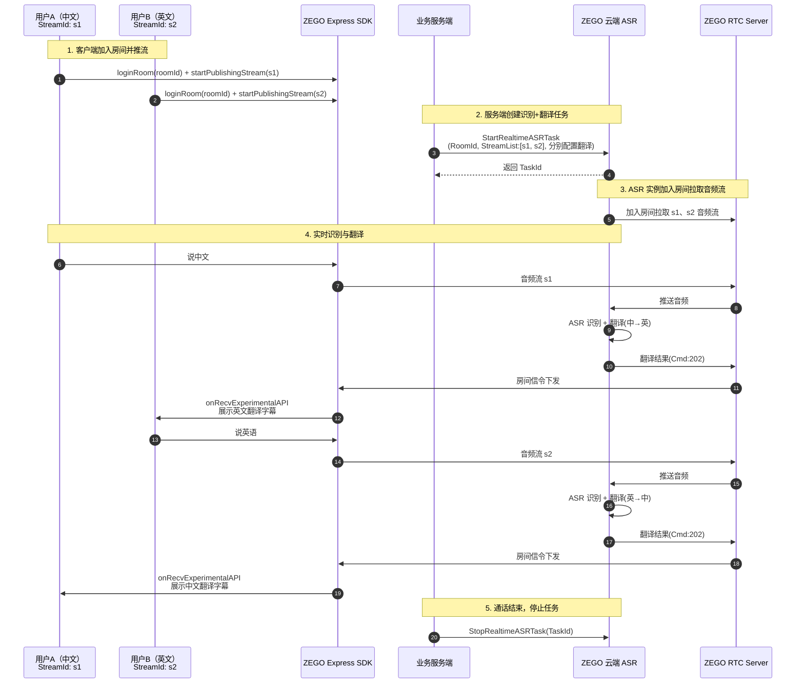

# 1v1 实时翻译字幕

## 场景简介

在跨语种 1v1 语音通话场景中，两位用户使用不同的语言进行交流。为了实现无障碍沟通，需要分别将对方的语音实时翻译为己方语言，并以字幕形式展示。

本文以 **中文普通话** 和 **英语** 的 1v1 语音通话为例，演示如何通过 ZEGO 实时音视频产品，结合云端实时语音识别与翻译功能，实现双向语言互译，并在客户端仅展示对方翻译后的字幕。

<Frame width="150px" height="auto" caption="">
  
</Frame>

## 核心流程

### 时序图

下图展示了 1v1 实时翻译字幕的核心交互流程：



### 流程说明

| 步骤 | 说明 |
| --- | --- |
| 1 | 两位用户使用 ZEGO Express SDK 加入同一实时音视频(RTC)房间，并分别以 `s1`、`s2` 为流 ID 推流。 |
| 2 | 业务服务端调用 [StartRealtimeASRTask](/cloud-realtime-asr/api-reference/start) 创建识别任务，使用 `StreamList` 为两条流分别配置 ASR 和翻译参数。 |
| 3 | ZEGO 云端 ASR 服务加入 RTC 房间，拉取两条音频流。 |
| 4 | 实时识别用户语音并翻译，翻译结果通过房间信令下发到客户端。 |
| 5 | 通话结束后，服务端调用 [StopRealtimeASRTask](/cloud-realtime-asr/api-reference/stop) 停止任务。 |

## 前提条件

1. 已在 [ZEGO 控制台](https://console.zego.im/) 开通云端实时语音识别服务。
2. 已购买并获取翻译厂商（如豆包、通义千问机器翻译）的 API Key。
3. 已下载并集成最新 [ZEGO Express SDK](/cloud-realtime-asr/quick-start#integrate-zego-express-sdk)。
4. 客户端已实现加入房间和推流功能。本例假设：
    - 用户 A（中文用户）：`userId` 为 `u1`，`streamId` 为 `s1`
    - 用户 B（英文用户）：`userId` 为 `u2`，`streamId` 为 `s2`

## 实现步骤

### 步骤一：服务端创建识别及翻译任务

服务端调用 [StartRealtimeASRTask](/cloud-realtime-asr/api-reference/start) 接口，使用 `RecognitionRange: 1` 开启流级别识别，并在 `StreamList` 中为两条流分别配置 ASR 和翻译参数：

- 流 `s1`（中文用户）：中文识别 → 翻译为英文（给英文用户看）
- 流 `s2`（英文用户）：英文识别 → 翻译为中文（给中文用户看）


```json 请求示例
{
    "RoomId": "your_room_id",
    "RecognitionRange": 1,
    "SubtitleType": 2,
    "StreamList": [
        {
            "StreamId": "s1",
            "ASR": {
                "Vendor": "Tencent",
                "Params": {
                    "EngineModelType": "16k_zh"
                }
            },
            "EnableTranslation": true,
            "Translation": {
                "Vendor": "DoubaoSeedTranslation",
                "SourceLanguage": "zh",
                "TargetLanguage": "en",
                "LLM": {
                    "Url": "https://ark.cn-beijing.volces.com/api/v3/responses",
                    "ApiKey": "your_doubao_api_key",
                    "Model": "doubao-seed-translation-250915"
                }
            }
        },
        {
            "StreamId": "s2",
            "ASR": {
                "Vendor": "Tencent",
                "Params": {
                    "EngineModelType": "16k_en"
                }
            },
            "EnableTranslation": true,
            "Translation": {
                "Vendor": "DoubaoSeedTranslation",
                "SourceLanguage": "en",
                "TargetLanguage": "zh",
                "LLM": {
                    "Url": "https://ark.cn-beijing.volces.com/api/v3/responses",
                    "ApiKey": "your_doubao_api_key",
                    "Model": "doubao-seed-translation-250915"
                }
            }
        }
    ]
}
```

#### 参数说明

| 参数 | 说明 |
| --- | --- |
| `RoomId` | 实时音视频(RTC)房间 ID，需与客户端加入的房间 ID 一致。 |
| `RecognitionRange` | 设为 `1` 表示按 `StreamList` 指定流进行识别。 |
| `SubtitleType` | 设为 `2` 表示仅下发翻译结果。 |
| `StreamList` | 流配置列表，每条流可独立配置 ASR 和翻译参数。 |
| `StreamList[].ASR.Params.EngineModelType` | ASR 引擎模型，`16k_zh` 为中文，`16k_en` 为英文。更多语种请参考 [配置 ASR](/cloud-realtime-asr/configuring-asr)。 |
| `StreamList[].Translation.SourceLanguage` | 源语言，即当前流用户说话的语言。 |
| `StreamList[].Translation.TargetLanguage` | 目标语言，即翻译后的语言。 |

<Note title="说明">
- 本例使用豆包翻译模型 `doubao-seed-translation-250915`。您也可以使用通义千问机器翻译（`QwenMT`），详情请参考 [配置翻译](/cloud-realtime-asr/guides/enable-translation)。
- 生产环境中请务必填写正确的 `ApiKey`。
</Note>

### 步骤二：客户端展示对方翻译字幕

客户端通过 ZEGO 字幕组件接收并展示翻译字幕。为实现"仅展示对方的翻译字幕"，需在字幕处理逻辑中过滤掉自己的消息。

#### 集成字幕组件

请参考 [展示字幕](/cloud-realtime-asr/guides/display-subtitles#use-subtitle-component) 文档，下载并集成字幕组件。

#### 过滤仅展示对方字幕

在字幕消息处理逻辑中，将消息中的 `UserId` 字段与本地用户 ID 进行比较，仅展示对方用户的字幕：

<Tabs>
<Tab title="iOS">
```oc ZegoCloudAsrSubtitlesMessageDispatcher.m {7-11,15-19}
- (void)handleMessageContent:(NSString *)msgContent userID:(NSString *)userID userName:(NSString *)userName {
  ......

  if (cmd == ZegoCloudAsrMessageCmdAsrText && messageProtocol.asrTextData) {
    ......

    // 将自定义消息中的 UserId 字段与自己的 UserId 做比较
    if (NO == [userId isEqualToString:[[ZegoCloudAsrServiceAPI sharedInstance] getUserId]]) {
      [ZegoCloudAsrLogUtil write:[NSString stringWithFormat:@"dispatchAsrChatMsg, seqId=%llu, round=%llu, message_id=%@", seqId, round, message_id]];
      [self dispatchAsrChatMsg:cmdMsg];
    }
  } else if (cmd == ZegoCloudAsrMessageCmdLlmText && messageProtocol.llmTextData) {
    ......

    // 将自定义消息中的 UserId 字段与自己的 UserId 做比较
    if (NO == [userId isEqualToString:[[ZegoCloudAsrServiceAPI sharedInstance] getUserId]]) {
        [ZegoCloudAsrLogUtil write:[NSString stringWithFormat:@"dispatchLLMChatMsg, seqId=%llu, round=%llu, message_id=%@", seqId, round, message_id]];
        [self dispatchLLMChatMsg:cmdMsg];
    }
  }
}
```
</Tab>

<Tab title="Android">
在 `AudioChatMessageParser` 类的 `onMessageListUpdated` 回调中，将消息中的 `UserId` 字段与自己的 `UserId` 做比较。

```java
audioChatMessageParser.setAudioChatMessageListListener(new AudioChatMessageListListener() {
    @Override
    public void onMessageListUpdated(List<AudioChatMessage> messagesList) {
      String localUserId = "u1"; // 替换为实际的本地用户 ID
      List<AudioChatMessage> otherUserMessages = new ArrayList<>();
      for (AudioChatMessage message : messagesList) {
          // 将自定义消息中的 UserId 字段与自己的 UserId 做比较
          if (!message.data.userId.equals(localUserId)) {
              otherUserMessages.add(message);
          }
      }
      // 更新 UI 列表
      binding.messageList.onMessageListUpdated(otherUserMessages);
    }
});
```
</Tab>

<Tab title="Web">
```javascript
// 在示例代码 hooks/useChat.ts 文件里的 handleMessage 方法中添加过滤条件
function handleMessage() {
  // 获取本地登录的 userId
  const userId = sessionStorage.getItem('userId');
  // 当收到的消息中的 UserId 和 userId 一致，则不处理这条消息
  if (data.UserId === userId) return;
  // ...其余代码保持不变
}
```
</Tab>
</Tabs>

### 步骤三：（可选）停止识别任务

通话结束后，服务端调用 [StopRealtimeASRTask](/cloud-realtime-asr/api-reference/stop) 接口停止任务：

```json
{
    "TaskId": "your_task_id"
}
```

<Note title="说明">
若未主动调用停止接口，当 RTC 房间内超过 `MaxIdleTime`（默认 120 秒）没有真实用户时，后台会自动停止识别任务。
</Note>

## 注意事项

1. **SDK 版本要求**：必须使用针对 Cloud ASR 优化的 Express SDK 版本，否则无法正常接收字幕信令。
2. **流 ID 一致性**：服务端 `StreamList` 中的 `StreamId` 必须与客户端实际推流时使用的流 ID 完全一致。
3. **翻译方向配置**：请根据实际用户语言配置正确的 `SourceLanguage` 和 `TargetLanguage`，确保翻译结果符合预期。
4. **API Key 安全**：生产环境中，翻译服务的 `ApiKey` 应由服务端安全管理，避免泄露。
5. **消息排序**：通过房间信令收到的翻译文本可能会乱序到达，字幕组件已内置按 `SeqId` 排序的处理逻辑。

## 相关文档

- [快速开始](/cloud-realtime-asr/quick-start)
- [配置 ASR](/cloud-realtime-asr/configuring-asr)
- [配置翻译](/cloud-realtime-asr/guides/enable-translation)
- [展示字幕](/cloud-realtime-asr/guides/display-subtitles)
- [StartRealtimeASRTask API](/cloud-realtime-asr/api-reference/start)