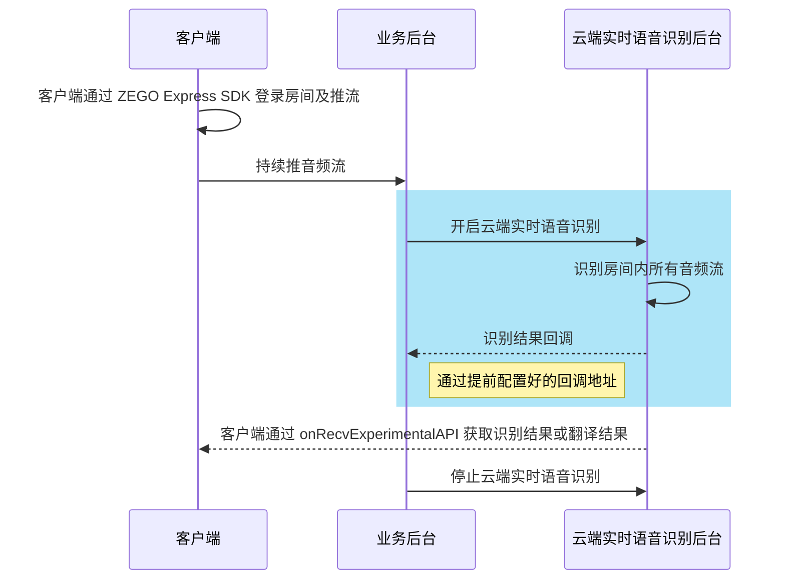

# 快速开始

## 前提条件

- 已在 [ZEGO 控制台](https://console.zego.im/) 创建项目，并申请有效的 AppID 和 AppSign，详情请参考 [控制台 - 项目信息](/console/project-info)。
- 已联系 ZEGO 技术支持开通云端语音识别服务。

## 使用步骤



使用实时语音识别服务的核心步骤如图蓝色块标注步骤所示。在您的业务后台调用[开启云端实时语音识别](./api-reference/start.mdx)接口后，云端实时语音识别后台会识别房间内所有或指定的音频流，通过提前配置好的[回调](./callbacks/receiving-callback.mdx)地址将识别结果回调给您的业务后台。

如果您需要实现实时字幕等需要在客户端显示识别内容的场景，请参考[展示字幕](./guides/display-subtitles.mdx)文档，使用字幕组件或自定义实现字幕展示识别结果。

<Warning title="注意">
请联系 ZEGO 技术支持配置接收识别结果的回调地址。
</Warning>
<Warning title="注意">
如果 RTC 房间 120 秒后没有真实用户存在，则云端实时语音识别服务会自动停止，并触发 Event 为 Exception 的回调，Data.Code 为 1202。
</Warning>

### 客户端集成 SDK 并推流

请参考客户端集成 SDK 并实现视频通话或者语音通话的快速开始文档，完成客户端集成 SDK 并推流。

<Steps titleSize="p">
<Step title="集成 ZEGO Express SDK">
- [Android](/real-time-video-android-java/quick-start/integrating-sdk)
- [iOS](/real-time-video-ios-oc/quick-start/integrating-sdk)
- [Web](/real-time-video-web/quick-start/integrating-sdk)
</Step>
<Step title="实现视频通话或者语音通话">
- [Android](/real-time-video-android-java/quick-start/implementing-video-call)
- [iOS](/real-time-video-ios-oc/quick-start/implementing-video-call)
- [Web](/real-time-video-web/quick-start/implementing-video-call)

</Step>
</Steps>

#### 客户端最佳配置实践

为获得最佳的识别效果，建议您在客户端使用 ZEGO Express SDK 时进行如下配置：

<Tabs>
<Tab title="Android">
- 开启传统音频 3A 处理（回声消除AEC、自动增益控制AGC、噪声抑制ANS）
- 如果是语聊房场景，建议设置房间的使用场景为高品质语聊房场景，SDK 会针对不同的场景采取不同的优化策略
- 设置音频设备模式为默认模式
- 开启 AI 回声消除，提高回声消除效果（该功能需要联系 ZEGO 技术支持获取对应版本的 ZEGOExpress SDK）

```java Android(Java)
ZegoEngineConfig config = new ZegoEngineConfig();
HashMap<String, String> advanceConfig = new HashMap<String, String>();
config.advancedConfig = advanceConfig;
ZegoExpressEngine.setEngineConfig(config);
//设置房间的使用场景为高品质语聊房场景
// !mark
ZegoExpressEngine.getEngine().setRoomScenario(ZegoScenario.HIGH_QUALITY_CHATROOM);
// 设置音频设备模式  默认模式
// !mark
ZegoExpressEngine.getEngine().setAudioDeviceMode(ZegoAudioDeviceMode.GENERAL);
// 开启传统音频 3A 处理
// !mark(1:3)
ZegoExpressEngine.getEngine().enableAEC(true);
ZegoExpressEngine.getEngine().enableAGC(true);
ZegoExpressEngine.getEngine().enableANS(true);
// 开启 AI 回声消除，请注意：开启 AI 回声消除需要联系 ZEGO 技术支持获取对应版本的 ZEGOExpress SDK
// !mark
ZegoExpressEngine.getEngine().setAECMode(ZegoAECMode.AI_BALANCED);
// 开启 AI 降噪，适度的噪声抑制
// !mark
ZegoExpressEngine.getEngine().setANSMode(ZegoANSMode.MEDIUM);

```
</Tab>
<Tab title="iOS">
- 开启传统音频 3A 处理（回声消除AEC、自动增益控制AGC、噪声抑制ANS）
- 如果是语聊房场景，建议设置房间的使用场景为高品质语聊房场景，SDK 会针对不同的场景采取不同的优化策略
- 开启 AI 回声消除，提高回声消除效果（该功能需要联系 ZEGO 技术支持获取对应版本的 ZEGOExpress SDK）

```oc iOS(Objective-C)
ZegoEngineProfile* profile = [[ZegoEngineProfile alloc]init];
profile.appID = kZegoAppId;
//高品质语聊房场景，设置该场景可以避免申请相机权限，接入方应按自己的业务场景设置具体值
profile.scenario = ZegoScenarioHighQualityChatroom;
ZegoEngineConfig* engineConfig = [[ZegoEngineConfig alloc] init];
engineConfig.advancedConfig = @{
};
[ZegoExpressEngine setEngineConfig:engineConfig];
[ZegoExpressEngine createEngineWithProfile:profile eventHandler:self];
// 开启传统音频 3A 处理
// !mark(1:3)
[[ZegoExpressEngine sharedEngine] enableAGC:TRUE];
[[ZegoExpressEngine sharedEngine] enableAEC:TRUE];
[[ZegoExpressEngine sharedEngine] enableANS:TRUE];
// 开启 AI 回声消除，请注意：开启 AI 回声消除需要联系 ZEGO 技术支持获取对应版本的 ZEGOExpress SDK
// !mark
[[ZegoExpressEngine sharedEngine] setAECMode:ZegoAECModeAIBalanced];
// 开启 AI 降噪，适度的噪声抑制
// !mark
[[ZegoExpressEngine sharedEngine] setANSMode:ZegoANSModeMedium];

```
</Tab>
<Tab title="Web">
- 开启传统音频 3A 处理（回声消除AEC、自动增益控制AGC、噪声抑制ANS）
- 如果是语聊房场景，建议设置房间的使用场景为高品质语聊房场景，SDK 会针对不同的场景采取不同的优化策略
- 推流时，设置推流参数配置自动切换为可用的 `videoCodec`

```javascript Web(JavaScript)
// 引入必要的模块
import { ZegoExpressEngine } from "zego-express-engine-webrtc";

// 实例化 ZegoExpressEngine，设置房间的使用场景为高品质语聊房场景
// !mark
const zg = new ZegoExpressEngine(appid, server, { scenario: 7 })

// 创建本地媒体流, 配置传统音频 3A 处理，SDK 默认开启
// !mark
const localStream = await zg.createZegoStream();

// 推送本地媒体流，需要设置自动切换为可用的 videoCodec
// !mark
await zg.startPublishingStream(userStreamId, localStream, {
  enableAutoSwitchVideoCodec: true,
});

// 检查系统要求
async function checkSystemRequirements() {
  // 检测是否支持WebRTC
  const rtcSupport = await zg.checkSystemRequirements("webRTC");
  if (!rtcSupport.result) {
    console.error("浏览器不支持WebRTC");
    return false;
  }

  // 检测麦克风权限
  const micSupport = await zg.checkSystemRequirements("microphone");
  if (!micSupport.result) {
    console.error("未获得麦克风权限");
    return false;
  }

  return true;
}
```
</Tab>
</Tabs>

<Note title="说明">其他端的的配置请联系 ZEGO 技术支持了解详情。</Note>

### 业务后台开启云端语音识别并接收识别及翻译结果

以下是业务后台开启云端语音识别并接收识别及翻译结果的示例代码（Node.js 为例）：
<CodeGroup>
```javascript 开启云端实时语音识别 {4-13}
const https = require('https');
const querystring = require('querystring');

const data = JSON.stringify({
  "RoomId": "room_1",
  "ASR": {
    "HotWord": "三支一扶|10",
    "Params": {
      "engine_model_type": "16k_zh"
    },
    "VADSilenceSegmentation": 500
  }
});

const params = {
  Action: 'StartRealtimeASRTask',
  AppId: '1234567890',
  SignatureNonce: 'vecj0mc2jcl',
  Timestamp: '1753691152',
  Signature: 'e8032aabe7702091b0bb2ca83cc2f98a',
  SignatureVersion: '2.0'
};

const options = {
  hostname: 'cloud-realtime-asr-api.zegotech.cn',
  path: '/?' + querystring.stringify(params),
  method: 'POST',
  headers: {
    'Content-Type': 'application/json',
    'Accept': 'application/json',
    'Content-Length': Buffer.byteLength(data)
  }
};

const req = https.request(options, (res) => {
  let responseData = '';

  res.on('data', (chunk) => {
    responseData += chunk;
  });

  res.on('end', () => {
    console.log('Response:', JSON.parse(responseData));
  });
});

req.on('error', (error) => {
  console.error('Error:', error);
});

req.write(data);
req.end();

```

```javascript title="开启云端实时语音识别（开启翻译）" {4-24}
const https = require('https');
const querystring = require('querystring');

const data = JSON.stringify({
  "RoomId": "room_1",
  "ASR": {
    "HotWord": "三支一扶|10",
    "Params": {
      "engine_model_type": "16k_zh"
    },
    "VADSilenceSegmentation": 500
  },
  "EnableTranslation": true,
  "Translation": {
    "Vendor": "DoubaoSeedTranslation",
    "SourceLanguage": "zh",
    "TargetLanguage": "en",
    "LLM": {
      "URL": "https://ark.cn-beijing.volces.com/api/v3/responses",
      "APIKey": "",
      "Model": "doubao-seed-translation-250915"
    }},
  "SubtitleType": 3
});

const params = {
  Action: 'StartRealtimeASRTask',
  AppId: '1234567890',
  SignatureNonce: 'vecj0mc2jcl',
  Timestamp: '1753691152',
  Signature: 'e8032aabe7702091b0bb2ca83cc2f98a',
  SignatureVersion: '2.0'
};

const options = {
  hostname: 'cloud-realtime-asr-api.zegotech.cn',
  path: '/?' + querystring.stringify(params),
  method: 'POST',
  headers: {
    'Content-Type': 'application/json',
    'Accept': 'application/json',
    'Content-Length': Buffer.byteLength(data)
  }
};

const req = https.request(options, (res) => {
  let responseData = '';

  res.on('data', (chunk) => {
    responseData += chunk;
  });

  res.on('end', () => {
    console.log('Response:', JSON.parse(responseData));
  });
});

req.on('error', (error) => {
  console.error('Error:', error);
});

req.write(data);
req.end();

```


```javascript 停止云端实时语音识别
const https = require('https');
const querystring = require('querystring');

const data = JSON.stringify({
  "TaskId": "1920370518175780864"
});

const params = {
  Action: 'StopRealtimeASRTask',
  AppId: '1234567890',
  SignatureNonce: 'vecj0mc2jcl',
  Timestamp: '1753691152',
  Signature: 'e8032aabe7702091b0bb2ca83cc2f98a',
  SignatureVersion: '2.0'
};

const options = {
  hostname: 'cloud-realtime-asr-api.zegotech.cn',
  path: '/?' + querystring.stringify(params),
  method: 'POST',
  headers: {
    'Content-Type': 'application/json',
    'Accept': 'application/json',
    'Content-Length': Buffer.byteLength(data)
  }
};

const req = https.request(options, (res) => {
  let responseData = '';

  res.on('data', (chunk) => {
    responseData += chunk;
  });

  res.on('end', () => {
    console.log('Response:', JSON.parse(responseData));
  });
});

req.on('error', (error) => {
  console.error('Error:', error);
});

req.write(data);
req.end();

```

```javascript 回调接口
// 业务后台ASR回调
function asrCallBack(req, res) {
    const { AppId, RoomId, Event, Data } = req.body;
  // 验证签名参数callbacksecret在控制台获取
  // 验证签名文档：https://doc-zh.zego.im/cloud-realtime-asr/callbacks/receiving-callback#验证签名
  const calcSign = genCallbackSignature(Nonce, callbacksecret, Timestamp);
  // 签名错误
  if (calcSign !== Signature) {
    res.json({
      Code: -1,
      Message: "Signature error",
    });
    return;
  }
    // 返回响应
  res.json({
    Code: 0,
    Message: "ok",
  });
   switch (Event) {
    // 异常事件
    case "ASRResult":
      // 按实际业务需求处理识别结果
      handleData(Data);
      break;
    case "TranslationResult":
      // 按实际业务需求处理翻译结果
      handleData(Data);
      break;
    default:
      break;
  }
}

```
</CodeGroup>

### 客户端展示识别及翻译结果

如果您需要在客户端展示识别结果或者翻译结果，请参考[显示字幕](./guides/display-subtitles.mdx)文档，使用字幕组件或自定义实现字幕展示识别结果。
