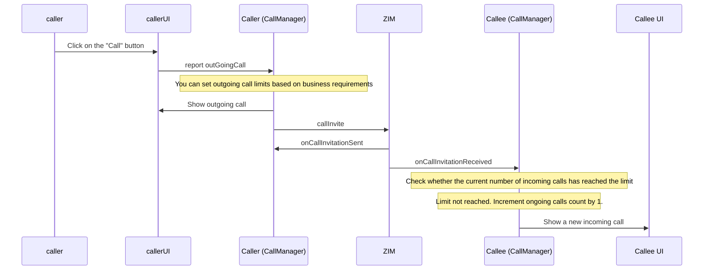
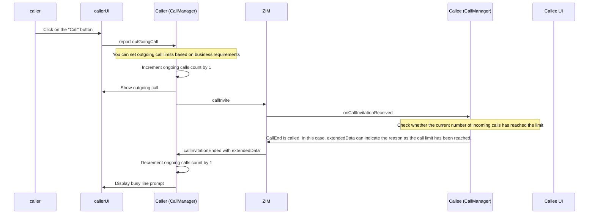

import { Title } from './title';
import ArticleMetadata from './ArticleMetadata';

<Title>How to handle calls when multiple incoming calls exist simultaneously?</Title>

<ArticleMetadata language="en" product="In-app chat" platform="All" />

---
## When the number of incoming calls has not reached the limit

1. The caller clicks the "Call" button, and the callerUI reports outGoingCall to the caller (CallManager).
2. The caller (CallManager) can set outgoing call limits based on business requirements.
3. The caller (CallManager) displays the outgoing call UI to the callerUI.
4. The caller (CallManager) sends a callInvite via ZIM.
5. ZIM calls back the caller (CallManager) with onCallInvitationSent.
6. ZIM forwards the invitation to the callee (CallManager) and calls back onCallInvitationReceived.
7. The callee (CallManager) checks whether the current number of incoming calls has reached the limit — the limit has not been reached.
8. The ongoing calls count increases by 1.
9. The callee (CallManager) displays the new incoming call UI to the Callee UI.

## When the number of incoming calls has reached the limit

1. The caller clicks the "Call" button, and the callerUI reports outGoingCall to the caller (CallManager).
2. The caller (CallManager) can set outgoing call limits based on business requirements.
3. The caller (CallManager) increments the ongoing calls count by 1 and displays the outgoing call UI to the callerUI.
4. The caller (CallManager) sends a callInvite via ZIM.
5. ZIM forwards the invitation to the callee (CallManager) and calls back onCallInvitationReceived.
6. The callee (CallManager) checks whether the current number of incoming calls has reached the limit — the limit has been reached.
7. The callee (CallManager) calls CallEnd, with extendedData indicating the reason as the call limit has been reached.
8. ZIM calls back the caller (CallManager) with callInvitationEnded and extendedData.
9. The caller (CallManager) decrements the ongoing calls count by 1.
10. The caller (CallManager) displays a busy line prompt to the callerUI.

<Warning title="Note"> 
- For 1v1 calls, callEnd can be used instead of callReject to reject a call.
- For scenarios involving multi-party calls, use callReject to reject a call.
</Warning>
