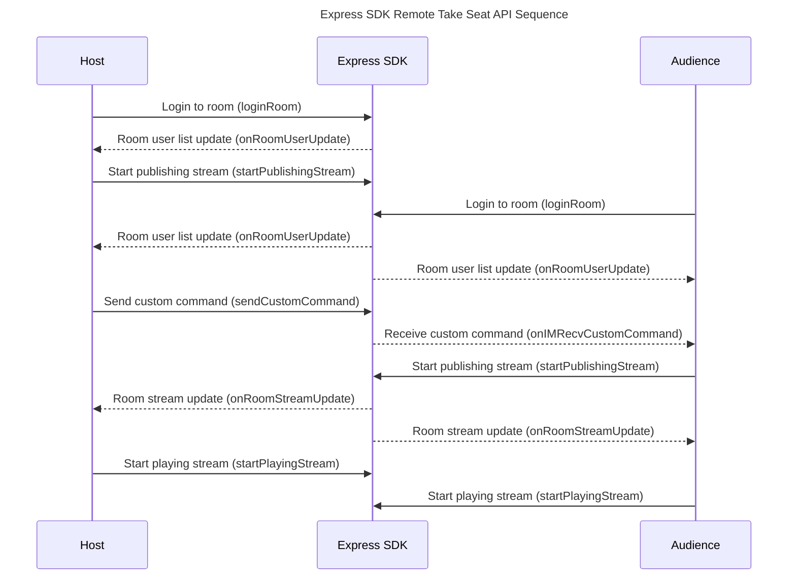
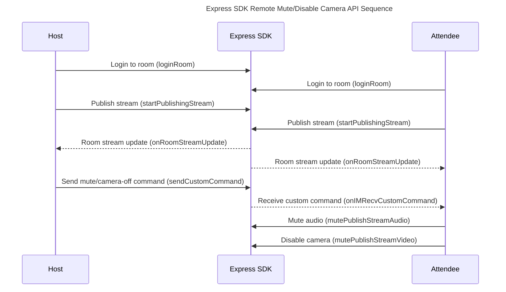

---

date: "2022-09-06"
ce-comparison:
  - "如何:how"
  - "对:to"
  - "远端:remote"
  - "用户:user"
  - "进行:perform"
  - "上下麦:mute/unmute"
  - "禁言:mute"
  - "禁摄像头:disable camera"
  - "操作:operation"
---
import { Title } from './title';
import ArticleMetadata from '../../zh/faq/ArticleMetadata';

<Title>How to perform mute/unmute, mute audio, and disable camera operations on remote users?</Title>

<ArticleMetadata language="en" product="Video Call / Audio Call / Live streaming" platform="iOS / Android / macOS / Windows" />

- - -

## Introduction
In real-time audio and video interaction, there is often a need for local users to perform operations on remote users. For example, in a voice chat room, the host may invite audience members to unmute and interact, and can mute users on the microphone to return them to regular audience members. In video conferences, the host can mute audio and disable cameras for participants.

## Implementation Method
> Before implementing local operations on remote users, please ensure that you have implemented the basic real-time audio and video functionality.

In ZEGO Express SDK, local operations on remote users are generally implemented by sending and receiving custom signals `sendCustomCommand/onIMRecvCustomCommand` combined with a business system designed by developers.

#### Mute/Unmute
Basic API sequence diagram for host inviting audience to unmute

Specific steps:
1. Implement basic audio and video functionality
2. Host sends unmute signal to specified audience member [sendCustomCommand](https://docs.zegocloud.com/article/api?doc=Express_Video_SDK_API~Java~class~im-zego-zegoexpress-zego-express-engine#send-custom-command)
3. Audience member receives the signal [onIMRecvCustomCommand](https://docs.zegocloud.com/article/api?doc=Express_Video_SDK_API~Java~class~im-zego-zegoexpress-callback-i-zego-event-handler#on-im-recv-custom-command)
4. Audience member starts publishing stream to unmute [startPublishingStream](https://docs.zegocloud.com/article/api?doc=Express_Video_SDK_API~Java~class~im-zego-zegoexpress-zego-express-engine#start-publishing-stream)
5. Host receives room stream update [onRoomStreamUpdate](https://docs.zegocloud.com/article/api?doc=Express_Video_SDK_API~Java~class~im-zego-zegoexpress-callback-i-zego-event-handler#on-room-stream-update)
6. Host plays the specified audience member's stream [startPlayingStream](https://docs.zegocloud.com/article/api?doc=Express_Video_SDK_API~Java~class~im-zego-zegoexpress-zego-express-engine#start-playing-stream)

Similarly, to implement the mute function, the audience member calls [stopPublishingStream](https://docs.zegocloud.com/article/api?doc=Express_Video_SDK_API~Java~class~im-zego-zegoexpress-zego-express-engine#stop-publishing-stream) to stop publishing when receiving the mute signal.

#### Mute Audio/Disable Camera
API sequence diagram for local requiring remote to mute audio or disable camera

Similar to mute/unmute operations, the host and participants perform mute audio or disable camera operations by sending and receiving custom signals.
- Mute audio [mutePublishStreamAudio](https://docs.zegocloud.com/article/api?doc=Express_Video_SDK_API~Java~class~im-zego-zegoexpress-zego-express-engine#mute-publish-stream-audio)
- Disable camera [mutePublishStreamVideo](https://docs.zegocloud.com/article/api?doc=Express_Video_SDK_API~Java~class~im-zego-zegoexpress-zego-express-engine#mute-publish-stream-video)

After the remote microphone and camera change, the local end will receive corresponding message callbacks where logic processing can be performed.
- Microphone [onRemoteMicStateUpdate](https://docs.zegocloud.com/article/api?doc=Express_Video_SDK_API~Java~class~im-zego-zegoexpress-callback-i-zego-event-handler#on-remote-mic-state-update)
- Camera [onRemoteCameraStateUpdate](https://docs.zegocloud.com/article/api?doc=Express_Video_SDK_API~Java~class~im-zego-zegoexpress-callback-i-zego-event-handler#on-remote-camera-state-update)

## Precautions

If developers need to use ZEGO room user broadcast notification `onRoomUserUpdate`, please ensure that each user passes `ZegoRoomConfig` with the `isUserStatusNotify` property set to `true` when logging into the room, otherwise the callback notification will not be received.

