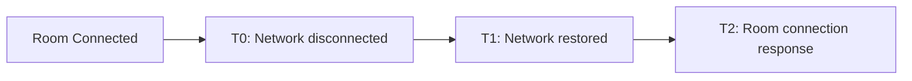

---

date: "2024-02-07"
ce-comparison:
  - "ZIM:ZIM"
  - "SDK:SDK"
  - "是否:whether"
  - "支持:support"
  - "断线:disconnection"
  - "重连:reconnection"
  - "机制:mechanism"
---
import { Title } from './title';
import ArticleMetadata from '../../zh/faq/ArticleMetadata';

<Title>Does ZIM SDK support automatic reconnection mechanism?</Title>

<ArticleMetadata language="en" product="In-app chat" platform="iOS / Android / macOS / Windows / Web / Mini Program / Flutter / ReactNative / uni-app / Unity3D" />

---

ZIM SDK supports automatic reconnection mechanism. This article will introduce the situations in which ZIM SDK may disconnect and how to handle these exceptions.

<Warning title="Note">

It is recommended that developers debug on real devices.

</Warning>

## Abnormal Disconnection Scenarios

### Scenario 1: Network Exception

If the user's machine experiences weak network or network disconnection, the SDK will internally trigger reconnection. At this time, it will callback `RECONNECTING` `state` and `LOGIN_INTERRUPTED` `event` through `onConnectionStateChanged`. When developers listen to the network disconnection status event, they need to give users clear UI reminders to improve user experience.

<Warning title="Note">

Starting from version 2.9.0, the SDK will continuously reconnect internally at an appropriate frequency. Therefore, developers do not need to call the SDK's login interface at the business layer to reconnect.

</Warning>

- If the SDK can reconnect, it will callback `CONNECTED` `state` and `SUCCESS` `event` through `onConnectionStateChanged`.
- If the SDK cannot reconnect due to special events, it will callback `DISCONNECTED` `state` and corresponding `event` through `onConnectionStateChanged`. At this time, calling other interfaces will report errors with error code 6000121, indicating "not logged in". In this case, developers should give users clear reminders based on the `event` and do corresponding exception fallback logic (such as the App exiting to the login page), and do not directly reconnect in the application layer code.

#### Handling Method

In normal cases where disconnection is caused by network reasons, developers do not need to do anything. If the SDK stops retrying due to special events, developers should do good exception fallback logic and do not retry in the application layer code.

### Scenario 2: Account Kicked Out

If ZIM's multi-device login is not enabled and another device logs in with the account (userID) that this device has already logged in, this device will be kicked offline and disconnected. The SDK will not actively trigger reconnection.

At this time, `onConnectionStateChanged` will callback `DISCONNECTED` `state` and `KICKED_OUT` `event`. Calling other interfaces will report errors with error code 6000121, indicating "not logged in". In this case, developers should give users clear reminders and do corresponding exception fallback logic (such as the App exiting to the login page), and do not directly reconnect in the application layer code.

#### Handling Method

Developers should give users clear reminders and do corresponding exception fallback logic (such as the App exiting to the login page), and do not directly reconnect in the application layer code.

### Scenario 3: Token Expiration

If the AppID is configured with Token authentication, when the Token is about to expire, it will callback through `onTokenWillExprie`.
- After the user obtains a new Token, pass the new Token to the SDK through the `renewToken` interface to ensure normal Token usage.
- If the new Token is not passed in time, the SDK will disconnect from the server when the Token expires and callback `DISCONNECTED` `state` through `onConnectionStateChanged`. Calling other interfaces will report errors with error code 6000121, indicating "not logged in". In this case, developers should give users clear reminders and do corresponding exception fallback logic (such as the App exiting to the login page), and do not directly reconnect in the application layer code.

#### Handling Method

Developers should give users clear reminders and do corresponding exception fallback logic (such as the App exiting to the login page), and do not directly reconnect in the application layer code.

### Scenario 4: ZIM Room Network Disconnection
When the room is in a connected state and the network is abnormally disconnected, the SDK will internally attempt to reconnect. The room will go through three periods: T0, T1, and T2 to attempt to restore the room connection.

<Note title="Note">

When the network recovers, the SDK will ask the ZIM backend whether the user is still in the room. The SDK will make corresponding event notifications based on the results returned by the ZIM backend.

</Note>

The specific handling process for room reconnection is as follows:

<table>

<tbody><tr>
<th>Time</th>
<th>onConnectionStateChanged （Network Status Callback）</th>
<th>onRoomStateChanged （Room Status Callback）</th>
<th>Handling Suggestion</th>
</tr>
<tr>
<td>T0</td>
<td>`state` == 3 (Network Reconnecting)</td>
<td>`state` == 1 (Room Attempting Connection)
  `event` == 1 (Room Network Interrupted) </td>
<td>Wait for SDK to automatically reconnect the network. Users do not need to do anything.</td>
</tr>
<tr>
<td>T1</td>
<td>`state` == 2 (Network Recovered)</td>
<td>`state` == 1 (Starting to Actually Attempt Room Connection)
  `event` == 1 (Room Network Interrupted) </td>
<td>Wait for SDK to automatically reconnect the network. Users do not need to do anything.</td>
</tr>
<tr>
<td rowspan="3">T2</td>
<td rowspan="3">`state` == 2 (Network Recovered)</td>
<td>`state` == 2 (Room Connected)
 `event` == 0 (Room Network Recovered) </td>
<td>When the room status is normally restored, users do not need to do anything and can use room functions normally.</td>
</tr>
<tr>
<td>`state` == 0 (Room Disconnected)
 `event` == 9 (Disconnected from Room Due to Heartbeat Timeout) </td>
<td>When the room is disconnected due to heartbeat timeout, if users need to re-enter the room, they can call `joinRoom` or  `enterRoom` interface to rejoin the room, or prompt users on the page that they have exited the room chat page.</td>
</tr>
<tr>
<td>`state` == 0 (Room Disconnected)
 `event` == 3 (Room Does Not Exist) </td>
<td>When the room is disconnected because it does not exist, if users need to recreate the room, they can call
`createRoom` or `enterRoom` interface to recreate the room, or prompt users on the page that they have exited the room chat page.</td>
</tr>
</tbody></table>

