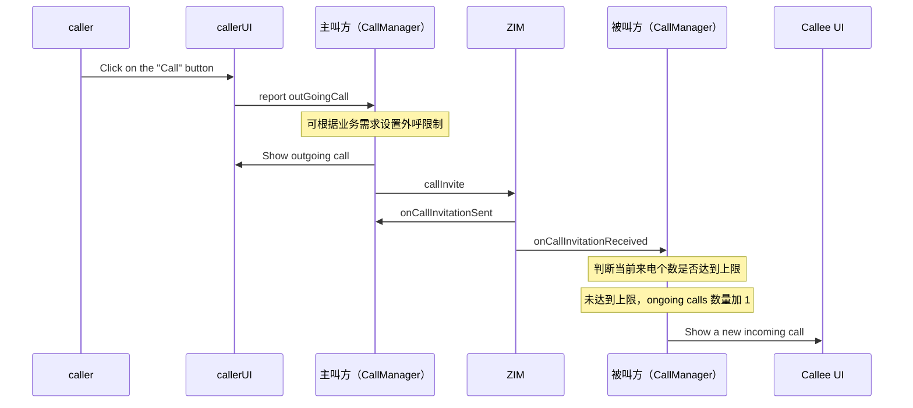
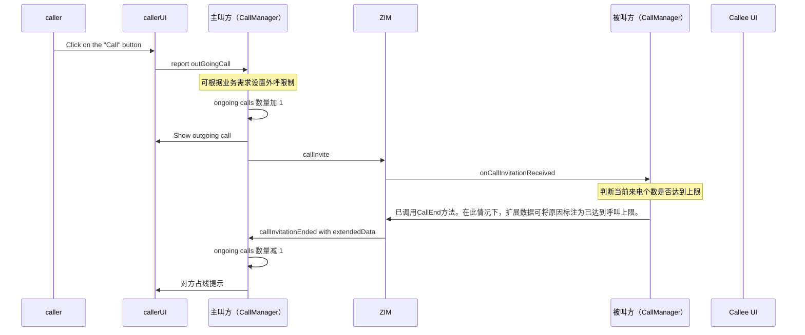

import { Title } from './title';
import ArticleMetadata from './ArticleMetadata';

<Title>同时存在多个来电的情况下如何处理通话？</Title>

<ArticleMetadata language="zh" product="即时通讯" platform="All" />

---
## 被叫来电个数没有超过限制时

1. caller 点击 "Call" 按钮，callerUI 向 主叫方（CallManager）报告 outGoingCall。
2. 主叫方（CallManager）可根据业务需求设置外呼限制。
3. 主叫方（CallManager）向 callerUI 显示 outgoing call 呼叫界面。
4. 主叫方（CallManager）通过 ZIM 发送 callInvite。
5. ZIM 回调 主叫方（CallManager）onCallInvitationSent。
6. ZIM 将邀请转发至 被叫方（CallManager），回调 onCallInvitationReceived。
7. 被叫方（CallManager）判断当前来电个数是否达到上限——未达到上限。
8. ongoing calls 数量加 1。
9. 被叫方（CallManager）向 Callee UI 显示新的来电界面。

## 被叫来电个数超过限制时

1. caller 点击 "Call" 按钮，callerUI 向 主叫方（CallManager）报告 outGoingCall。
2. 主叫方（CallManager）可根据业务需求设置外呼限制。
3. 主叫方（CallManager）将 ongoing calls 数量加 1，并向 callerUI 显示 outgoing call 呼叫界面。
4. 主叫方（CallManager）通过 ZIM 发送 callInvite。
5. ZIM 将邀请转发至 被叫方（CallManager），回调 onCallInvitationReceived。
6. 被叫方（CallManager）判断当前来电个数是否达到上限——已达到上限。
7. 被叫方（CallManager）调用 CallEnd，extendedData 标注原因为已达到呼叫上限。
8. ZIM 回调 主叫方（CallManager）callInvitationEnded with extendedData。
9. 主叫方（CallManager）将 ongoing calls 数量减 1。
10. 主叫方（CallManager）向 callerUI 显示对方占线提示。

<Warning title="注意"> 
- 1v1 通话，拒绝通话可用 callEnd 代替 callReject。
- 可能存在多人的通话场景下，请使用 callReject 拒绝通话。
</Warning>