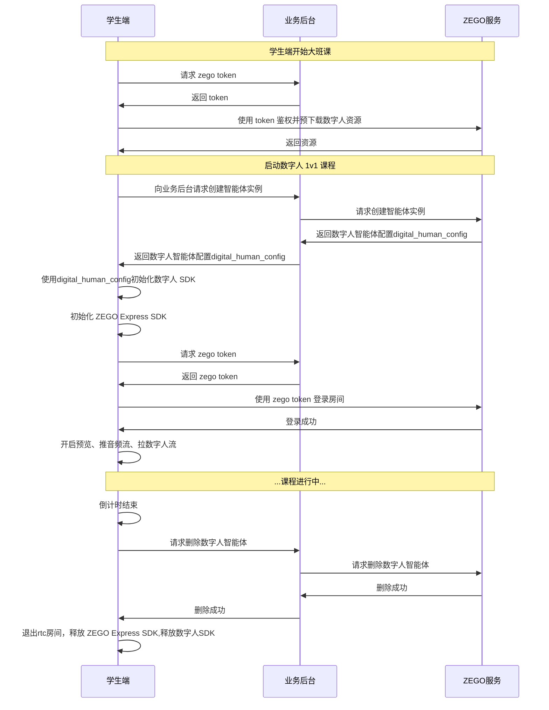

# 方案实现

本文档介绍如何在直播大班课中 **加入 AI 数字人老师**，并实现教学过程中让所有学生同时刻与AI数字人老师进行互动对话。

## 前提提要
在开始之前，请确保完成以下步骤：
- 已联系 ZEGO 技术支持定制 AI数字人老师形象（若使用公模则可以忽略此步骤）
- 在 [ZEGO 控制台](https://console.zego.im/ProjectManage) 中注册并创建项目，并联系技术支持 开通 AI Agent、数字人服务和相关接口权限
- 已在项目中集成 ZEGO Express SDK，详情请参考 [快速开始 - 集成 SDK](/real-time-voice-android/quick-start/integrating-sdk)。

## 实现方案

实现方案核心流程如下：


## 实现过程

<Steps titleSize="h3">
<Step title="构建大班课">
请您按照 [大班课解决方案](/large-class/overview) 指引先实现基础大班课场景。
</Step>
<Step title="在大班课中实现AI数字人教师和学生之间 1V1 对话">

要实现大班课中AI数字人教师和学生之间 1V1 对话，您必须实现服务端相关逻辑和集成客户端 SDK（ZEGO Express SDK和数字人 SDK）并调用相关后台接口。请您按照 [AI Agent - 实现数字人视频通话](/aiagent-server/quick-start-with-digital-human) 指引实现。

<Note title="说明">该指引文档中同时提供了服务端跟客户端的示例代码</Note>

</Step>
<Step title="根据大班课场景做最佳实践配置">

#### 业务后台最佳配置
在 AI 数字人伴学互动场景中，智能体实例需要绑定一个房间 roomId，以及智能体自身的 agent_user_id、agent_stream_id 和用户的 user_id、user_stream_id。
数字人会根据绑定的配置，在指定的 roomId 下，以 agent_user_id 作为 userId 推流（streamId 为 agent_stream_id），同时根据绑定的配置拉取 user_id 的流（streamId 为 user_stream_id）。如果这些 ID 配置不一致，将无法正常启动数字人 1v1 通话。

<Warning title="警告">每个智能体实例都需要与上述各类 ID 唯一绑定，已被某个实例占用的 ID 不能被其他实例复用，否则会导致智能体通话异常。</Warning>

```javascript 后台创建智能体实例接口最佳配置
async createDigitalHumanAgentInstance(agentId: string, userId: string, rtcInfo: RtcInfo, digitalHuman: DigitalHumanInfo, messages?: any[]) {
    // 请求接口：https://aigc-aiagent-api.zegotech.cn?Action=CreateDigitalHumanAgentInstance
    // !mark(1:18)
    // 相关 ID 规则及示例。
    // 💡请保证 相关 ID 与客户端一致。

    // const prefixes = "v-" //v-表示数字人视频房，a-表示降级的语音房
    // const suffix = "_课程id_studentId_随机数"

    // const agentId = "agent_课程id"; // 注册智能体时定义的 agent_id
    // const roomId = prefixes + "room" + suffix;
    // const agentUserId = prefixes + "agent_user" + suffix;
    // const agentStreamId = prefixes + "agent_stream" + suffix;
    // const userId = prefixes + "user" + suffix;
    // const userStreamId = prefixes + "user_stream" + suffix
    // const rtcInfo = {
    //   RoomId: roomId,
    //   AgentStreamId: agentStreamId,
    //   AgentUserId: agentUserId,
    //   UserStreamId: userStreamId,
    // };
    const action = 'CreateDigitalHumanAgentInstance';
    const body = {
        AgentId: agentId,
        UserId: userId, // 与该 AIAgent 实例交互的真实用户 ID
        RTC: rtcInfo,
        DigitalHuman: digitalHuman, // 测试时可使用公共 ID ：c4b56d5c-db98-4d91-86d4-5a97b507da97
        MessageHistory: {
            SyncMode: 1, // Change to 0 to use history messages from ZIM
            Messages: messages && messages.length > 0 ? messages : [],
            WindowSize: 10
        }
    };
    // sendRequest 方法封装了请求的 URL 和公共参数。详情参考：https://doc-zh.zego.im/aiagent-server/api-reference/accessing-server-apis
    const result = await this.sendRequest<any>(action, body);
    console.log("create agent instance result", result);
    // 返回的 DigitalHumanConfig 是数字人配置，客户端根据数字人配置初始化数字人 SDK ，然后即可与数字人进行实时互动。
    return result.AgentInstanceId, result.DigitalHumanConfig;
}
```

#### 客户端最佳配置

在大班课 AI 数字人伴学互动场景中，由真人老师控制系统开启 1V1 互动弹窗时，业务后台为每一个学生创建一个智能体实例，并且分发到各个学生端，学生端根据返回配置信息执行进房、推拉流、自定义渲染驱动数字人，与数字人通话。


核心步骤如下：

<Steps titleSize="p">
<Step title="向业务后台请求 Token 并预加载数字人资源">
向业务后台请求的 Token。可用于登录 RTC （ZEGO Express SDK）房间和用于下载数字人资源。

在成功获取 Token 后，可以预下载数字人资源，减少数字人首次启动耗时。
<Note title="说明">推荐在启动数字人1v1页面之前，每次都触发预下载数字人资源。(备注：预下载时，SDK内部会判断是否需要下载或更新数字人资源)</Note>

- 向后台请求 Token
<CodeGroup>
```java Android(Java)
var userToken = ""
private fun requestToken() {
    Log.i(TAG, "requestZegoToken")
    // 注意使用的 user id 与服务端创建数字人智能体实例时填写的一致
    // !mark
    val request: Request = Request.Builder().url("${BASE_URL}/api/zego-token?userId=$userId").get().build()
    client.newCall(request)
        .enqueue(object : Callback {
            override fun onFailure(call: Call, e: IOException) {
                Log.e(TAG, "http failed: " + e.message)
            }

            @Throws(IOException::class)
            override fun onResponse(call: Call, response: Response) {
                if (response.isSuccessful) {
                    val responseBody = response.body!!.string()
                    println(responseBody)
                    try {
                        val json = JSONObject(responseBody)
                        val token = json["token"] as String
                        if (!TextUtils.isEmpty(token)) {
                            Log.d(TAG, "get token : $token")
                            runOnUiThread {
                                // !mark
                               userToken = token
                            }
                        } else {
                            Log.e(TAG, "get token failed")
                        }
                    } catch (e: JSONException) {
                        throw RuntimeException(e)
                    }
                } else {
                    Log.e(TAG, "get token failed: " + response.code)
                }
            }
        })
}

//预下载数字人资源，减少数字人首次启动耗时；
// !mark
preloadDigitalmobileRes(userToken, digitalHumanID)
```

```swift iOS(Swift)
var userToken = ""
private func requestToken() {
    print("TAG: requestZegoToken")
    // 注意使用的 user id 与服务端创建数字人智能体实例时填写的一致
    // !mark
    let request = URLRequest(url: URL(string: "\(BASE_URL)/api/zego-token?userId=\(userId)")!)
    URLSession.shared.dataTask(with: request) { data, response, error in
        if let error = error {
            print("TAG: http failed: \(error.localizedDescription)")
            return
        }

        if let httpResponse = response as? HTTPURLResponse, httpResponse.statusCode == 200,
           let data = data {
            let responseBody = String(data: data, encoding: .utf8)
            print(responseBody ?? "")
            do {
                let json = try JSONSerialization.jsonObject(with: data) as? [String: Any]
                let token = json?["token"] as? String
                if !token?.isEmpty ?? false {
                    print("TAG: get token : \(token ?? "")")
                    DispatchQueue.main.async {
                        // !mark
                        userToken = token ?? ""
                    }
                } else {
                    print("TAG: get token failed")
                }
            } catch {
                print("TAG: JSON error: \(error.localizedDescription)")
            }
        } else {
            print("TAG: get token failed: \((response as? HTTPURLResponse)?.statusCode ?? 0)")
        }
    }.resume()
}

//预下载数字人资源，减少数字人首次启动耗时；
// !mark
preloadDigitalmobileRes(userToken: userToken, digitalHumanID: digitalHumanID)
```
</CodeGroup>

- 预下载数字人资源
<CodeGroup>
```java Android(Java)
private fun preloadDigitalmobileRes(token: String, digitalHumanID: String) {
    // !mark
    var auth = ZegoDigitalMobileAuth(APP_ID, userId, token)
    val context = this
    // !mark
    ZegoDigitalHumanResource.INSTANCE.preload(this, auth, digitalHumanID,
        object : PreloadCallback {
            override fun onSuccess() {
                Log.d(TAG, "preloadDigitalmobileRes, onSuccess")
                ZegoDigitalHumanResource.INSTANCE.isLoaded(context, auth, digitalHumanID,
                    object : ZegoDigitalHumanResource.IsLoadedCallback {
                        override fun onError(p0: Int, p1: String?) {
                            Log.d(TAG, "isLoaded onError errCode=$p0 errMsg=$p1")
                        }

                        override fun onResult(p0: Boolean) {
                            Log.d(TAG, "isLoaded onResult=$p0")
                        }
                    })
            }

            override fun onProgress(p0: Int) {
                Log.d(TAG, "preloadDigitalmobileRes, onProgress $p0")
            }

            override fun onError(p0: Int, p1: String?) {
                Log.d(TAG, "preloadDigitalmobileRes, onError errCode=$p0 errMsg=$p1")
            }
        })
}
```

```swift iOS(Swift)
private func preloadDigitalmobileRes(token: String, digitalHumanID: String) {
    // !mark
    let auth = ZegoDigitalMobileAuth(appID: APP_ID, userId: userId, token: token)
    let context = self
    // !mark
    ZegoDigitalHumanResource.shared.preload(
        with: auth,
        digitalHumanID: digitalHumanID,
        callback: PreloadCallback(
            onSuccess: {
                print("TAG: preloadDigitalmobileRes, onSuccess")
                ZegoDigitalHumanResource.shared.isLoaded(
                    with: auth,
                    digitalHumanID: digitalHumanID,
                    callback: IsLoadedCallback(
                        onError: { errorCode, errorMessage in
                            print("TAG: isLoaded onError errCode=\(errorCode) errMsg=\(errorMessage ?? "")")
                        },
                        onResult: { isLoaded in
                            print("TAG: isLoaded onResult=\(isLoaded)")
                        }
                    )
                )
            },
            onProgress: { progress in
                print("TAG: preloadDigitalmobileRes, onProgress \(progress)")
            },
            onError: { errorCode, errorMessage in
                print("TAG: preloadDigitalmobileRes, onError errCode=\(errorCode) errMsg=\(errorMessage ?? "")")
            }
        )
    )
}
```
</CodeGroup>

</Step>

<Step title="向业务后台请求创建智能体实例">
创建智能体实例后，智能体实例就会登录房间并推流，同时也会拉真实用户的流。同时业务后台会返回数字人配置用于初始化数字人 SDK，学生端根据返回配置信息执行进房、推拉流、自定义渲染驱动数字人，与数字人通话。

<CodeGroup>
```java Android(Java)
private fun startDiagitalAgentRoom() {
    Log.i(TAG, "startDigitalHumanChat")

    val jsonContent = try {
        val jsonObject = JSONObject()
        //【【请求创建智能体关键参数】】
        //移动端配置(需要端上数字人SDK合成视频)
        // !mark
        jsonObject.put("config_id", "mobile");
        //web端配置(直接拉数字人流，不需要端上处理)
        //jsonObject.put("config_id", "web");
        jsonObject.toString()
    } catch (e: JSONException) {
        Log.e(TAG, "startDigitalHumanChat json error: " + e.message)
        return
    }

    //向业务后台请求创建智能体实例，获取数字人智能体实例Id、数字人配置
    val body = RequestBody.create("application/json; charset=utf-8".toMediaTypeOrNull(), jsonContent)
    // !mark(1:2)
    // 该接口实际会调用 AI Agent 的 CreateDigitalHumanAgentInstance 接口（https://doc-zh.zego.im/aiagent-server/api-reference/agent-instance-management/create-digital-human-agent-instance）。
    val request = Request.Builder().url("$BASE_URL/api/start-digital-human").post(body).build()
    OkHttpClient.Builder().build().newCall(request).enqueue(object : Callback {
        override fun onFailure(call: Call, e: IOException) {
            Log.e(TAG, "startDigitalHumanChat http failed: " + e.message)
        }

        @Throws(IOException::class)
        override fun onResponse(call: Call, response: Response) {
            if (response.isSuccessful) {
                val responseBody = response.body!!.string()
                Log.e(TAG, "startDigitalHumanChat response: $responseBody")
                try {
                    val json = JSONObject(responseBody)
                    val errorCode = json["code"] as Int
                    // 后台返回的数字人配置
                    // !mark
                    val digitalHumanConfig = json["digital_human_config"] as String
                    if (errorCode == 0) {
                        //数字人智能体实例
                        agentInstanceId = json["agent_instance_id"] as String
                        var config = DigitalMobileConfigDecoder.decode(digitalHumanConfig)
                        runOnUiThread {
                            //下一步：进RTC房间、初始化数字人SDK.
                            // 注意所有相关 ID 与服务端创建智能体实例时填写的一致
                            // !mark(1:2)
                            initDigitalMobileSDK(digitalHumanConfig)
                            loginRoom(roomId, userId, userStreamId)
                        }
                    } else {
                        runOnUiThread { stopDiagitalAgentRoom() }
                        Log.e(TAG, "startDigitalHumanChat start failed: $errorCode")
                    }
                } catch (e: JSONException) {
                    Log.e(TAG, "startDigitalHumanChat parse json failed: " + e.message)
                }
            } else {
                Log.e(TAG, "startDigitalHumanChat http failed: " + response.code)
            }
        }
    })
}
```

```swift iOS(Swift)
private func startDiagitalAgentRoom() {
    print("TAG: startDigitalHumanChat")

    let jsonContent: String
    do {
        let jsonObject: [String: Any] = [
            //【【请求创建智能体关键参数】】
            //移动端配置(需要端上数字人SDK合成视频)
            // !mark
            "config_id": "mobile"
        ]
        let jsonData = try JSONSerialization.data(withJSONObject: jsonObject)
        jsonContent = String(data: jsonData, encoding: .utf8) ?? ""
    } catch {
        print("TAG: startDigitalHumanChat json error: \(error.localizedDescription)")
        return
    }

    //向业务后台请求创建智能体实例，获取数字人智能体实例Id、数字人配置
    let body = jsonContent.data(using: .utf8)
    // !mark(1:2)
    // 该接口实际会调用 AI Agent 的 CreateDigitalHumanAgentInstance 接口（https://doc-zh.zego.im/aiagent-server/api-reference/agent-instance-management/create-digital-human-agent-instance）。
    var request = URLRequest(url: URL(string: "\(BASE_URL)/api/start-digital-human")!)
    request.httpMethod = "POST"
    request.setValue("application/json; charset=utf-8", forHTTPHeaderField: "Content-Type")
    request.httpBody = body

    URLSession.shared.dataTask(with: request) { data, response, error in
        if let error = error {
            print("TAG: startDigitalHumanChat http failed: \(error.localizedDescription)")
            return
        }

        if let httpResponse = response as? HTTPURLResponse, httpResponse.statusCode == 200,
           let data = data {
            let responseBody = String(data: data, encoding: .utf8)
            print("TAG: startDigitalHumanChat response: \(responseBody ?? "")")
            do {
                let json = try JSONSerialization.jsonObject(with: data) as? [String: Any]
                let errorCode = json?["code"] as? Int ?? 0
                // 后台返回的数字人配置
                // !mark
                let digitalHumanConfig = json?["digital_human_config"] as? String ?? ""
                if errorCode == 0 {
                    //数字人智能体实例
                    agentInstanceId = json?["agent_instance_id"] as? String ?? ""
                    let config = DigitalMobileConfigDecoder.decode(digitalHumanConfig)
                    DispatchQueue.main.async {
                        //下一步：进RTC房间、初始化数字人SDK.
                        // 注意所有相关 ID 与服务端创建智能体实例时填写的一致
                        // !mark(1:2)
                        initDigitalMobileSDK(digitalHumanConfig: digitalHumanConfig)
                        loginRoom(roomId: roomId, userId: userId, userStreamId: userStreamId)
                    }
                } else {
                    DispatchQueue.main.async {
                        stopDiagitalAgentRoom()
                    }
                    print("TAG: startDigitalHumanChat start failed: \(errorCode)")
                }
            } catch {
                print("TAG: startDigitalHumanChat parse json failed: \(error.localizedDescription)")
            }
        } else {
            print("TAG: startDigitalHumanChat http failed: \((response as? HTTPURLResponse)?.statusCode ?? 0)")
        }
    }.resume()
}
```
</CodeGroup>

</Step>
<Step title="初始化数字人 SDK">
<CodeGroup>
```java title="Android(Java)"
private fun initDigitalMobileSDK(digitalHumanConfig: String) {
    Log.i(TAG, "initDigitalMobileSDK: $digitalHumanConfig")
    runOnUiThread(Runnable {
        // !mark(1:2)
        digitalMobileSDK = ZegoDigitalMobileFactory.create(this)
        digitalMobileSDK?.start(digitalHumanConfig, object : ZegoDigitalMobileListener {
            override fun onDigitalMobileStartSuccess() {
                Log.i(TAG, "onDigitalMobileStartSuccess")
            }

            override fun onError(errCode: Int, errMsg: String) {
                Log.i(TAG, "initDigitalMobileSDK, errCode=$errCode, errMsg=$errMsg")
            }

            override fun onSurfaceFirstFrameDraw() {
                Log.i(TAG, "onSurfaceFirstFrameDraw")
            }
        })
        digitalMobileSDK?.attach(playView)
    })
}
```

```swift title="iOS(Swift)"
private func initDigitalMobileSDK(digitalHumanConfig: String) {
    print("TAG: initDigitalMobileSDK: \(digitalHumanConfig)")
    DispatchQueue.main.async {
        // !mark(1:2)
        digitalMobileSDK = ZegoDigitalMobileFactory.create()
        digitalMobileSDK?.start(
            withConfig: digitalHumanConfig,
            listener: DigitalMobileListener(
                onStartSuccess: {
                    print("TAG: onDigitalMobileStartSuccess")
                },
                onError: { errCode, errMsg in
                    print("TAG: initDigitalMobileSDK, errCode=\(errCode), errMsg=\(errMsg ?? "")")
                },
                onSurfaceFirstFrameDraw: {
                    print("TAG: onSurfaceFirstFrameDraw")
                }
            )
        )
        digitalMobileSDK?.attach(to: playView)
    }
}
```
</CodeGroup>

</Step>

<Step title="初始化 ZEGO Express SDK">

在登录 RTC （ZEGO Express SDK）房间前，需要初始化 ZEGO Express SDK。以下示例代码包含了适配 AI 数字人伴学互动场景中初始化 ZEGO Express SDK 的最佳实践配置：

<CodeGroup>
```java title="Android(Java)"
//1.创建引擎前，设置相关参数配置
var config = ZegoEngineConfig().apply {
    //设置音量闪避模式，提升asr对用户声音识别成功率。仅iOS配置，Android端不设置避免低端机性能不足导致推流异常
    //advancedConfig = hashMapOf("set_audio_volume_ducking_mode" to "1")
    //设置拉流音量自适应调节，减少干扰用户声音，提升asr对用户声音识别成功率。
    advancedConfig["enable_rnd_volume_adaptive"] = "true"
    advancedConfig["sideinfo_callback_version"] = "3"
    advancedConfig["sideinfo_bound_to_video_decoder"] = "true"
    //避免因网络差导致声音快慢放问题
    advancedConfig["jitter_level_compensation"] = "true"
}
ZegoExpressEngine.setEngineConfig(config)

//2.创建引擎，场景模式设置为HIGH_QUALITY_CHATROOM(推荐最优配置)
var profile = ZegoEngineProfile().apply {
    appID = APP_ID
    application = application
    scenario = ZegoScenario.HIGH_QUALITY_CHATROOM
}
ZegoExpressEngine.createEngine(profile, null)

//3、创建引擎后，开启相关设置
ZegoExpressEngine.getEngine().setAudioDeviceMode(ZegoAudioDeviceMode.GENERAL)
ZegoExpressEngine.getEngine().enableAEC(true)
ZegoExpressEngine.getEngine().enableAGC(true)
ZegoExpressEngine.getEngine().enableANS(true)
ZegoExpressEngine.getEngine().setAECMode(ZegoAECMode.AI_BALANCED) //设置AI回声消除模式
ZegoExpressEngine.getEngine().setANSMode(ZegoANSMode.MEDIUM) //设置降噪模式
ZegoExpressEngine.getEngine().enableCamera(true) //允许开启摄像头
ZegoExpressEngine.getEngine().muteMicrophone(false) //允许开启麦克风
ZegoExpressEngine.getEngine().mutePublishStreamVideo(true) //用户端仅推音频流
```

```swift title="iOS(Swift)"
//1.创建引擎前，设置相关参数配置
let config = ZegoEngineConfig()
//设置音量闪避模式，提升asr对用户声音识别成功率。仅iOS配置，Android端不设置避免低端机性能不足导致推流异常
config.advancedConfig["set_audio_volume_ducking_mode"] = "1"
//设置拉流音量自适应调节，减少干扰用户声音，提升asr对用户声音识别成功率。
config.advancedConfig["enable_rnd_volume_adaptive"] = "true"
config.advancedConfig["sideinfo_callback_version"] = "3"
config.advancedConfig["sideinfo_bound_to_video_decoder"] = "true"
//避免因网络差导致声音快慢放问题
config.advancedConfig["jitter_level_compensation"] = "true"
ZegoExpressEngine.setEngineConfig(config)

//2.创建引擎，场景模式设置为HIGH_QUALITY_CHATROOM(推荐最优配置)
let profile = ZegoEngineProfile()
profile.appID = APP_ID
profile.scenario = .highQualityChatroom
ZegoExpressEngine.createEngine(with: profile)

//3、创建引擎后，开启相关设置
ZegoExpressEngine.shared?.setAudioDeviceMode(.general)
ZegoExpressEngine.shared?.enableAEC(true)
ZegoExpressEngine.shared?.enableAGC(true)
ZegoExpressEngine.shared?.enableANS(true)
ZegoExpressEngine.shared?.setAECMode(.aiBalanced) //设置AI回声消除模式
ZegoExpressEngine.shared?.setANSMode(.medium) //设置降噪模式
ZegoExpressEngine.shared?.enableCamera(true) //允许开启摄像头
ZegoExpressEngine.shared?.muteMicrophone(false) //允许开启麦克风
ZegoExpressEngine.shared?.mutePublishStreamVideo(true) //用户端仅推音频流
```
</CodeGroup>

</Step>

<Step title="登录房间并进房、推流、拉流后实现通话。">

在做好必要准备后，真实用户（学生）可以登录房间。登录房间后推流，数字人就可以通过拉取真实用户的音频流并识别后进行回答；用户也可以拉流听到数字人的回答。

<Warning title="警告">请务必参考步骤 1 再次向业务后台请求 Token 后再登录房间，防止 Token 过期导致登录房间失败。</Warning>
<CodeGroup>
```java title="Android(Java)"
//登录房间
ZegoRoomConfig roomConfig = new ZegoRoomConfig();
//能使得数字人实时得到该用户进房通知.
//AIAgent服务端会依赖用户进房onUserUpdate回调进行超时管理，
//当没有收到指定用户的userUpdate事件，超过120s将会异常结束通话，删除数字人智能体实例.
// !mark
roomConfig.isUserStatusNotify = true;
// 注意应该在进房前再调用一次防止 token 过期导致登录房间失败。
// !mark
roomConfig.token = userToken;
// !mark
ZegoExpressEngine.getEngine().loginRoom(Constant.room_id, new ZegoUser(userId, userName), roomConfig, (errorCode, extendedData) -> {
    ZegoCanvas zegoCanvas = new ZegoCanvas(renderView);
    zegoCanvas.viewMode = ZegoViewMode.ASPECT_FILL;
    //开启预览
    ZegoExpressEngine.getEngine().startPreview(zegoCanvas);
    // 开启推流，智能体实例就可以通过拉取真实用户的音频流并识别后进行回答。
    // 注意这里的userStreamId要与服务端创建智能体实例时填写的一致
    // !mark
    ZegoExpressEngine.getEngine().startPublishingStream(userStreamId);

    //拉数字人流。显示数字人画面。
    ZegoCanvas zegoCanvas = new ZegoCanvas(renderView);
    zegoCanvas.viewMode = ZegoViewMode.ASPECT_FILL;
    // !mark
    ZegoExpressEngine.getEngine().startPlayingStream(agentStreamID, zegoCanvas);
});

//开启自定义渲染：数字人画面交给数字人SDK渲染.
ZegoCustomVideoRenderConfig renderConfig = new ZegoCustomVideoRenderConfig();
renderConfig.bufferType = ZegoVideoBufferType.RAW_DATA;
renderConfig.frameFormatSeries = ZegoVideoFrameFormatSeries.RGB;
//该配置的作用：预览画面跳过自定义渲染.
renderConfig.enableEngineRender = true;
ZegoExpressEngine.getEngine().enableCustomVideoRender(true, renderConfig);
//自定义渲染处理：数字人本地渲染驱动
// !mark
ZegoExpressEngine.getEngine().setCustomVideoRenderHandler(new IZegoCustomVideoRenderHandler() {
    @Override
    public void onRemoteVideoFrameRawData(ByteBuffer[] data, int[] dataLength, ZegoVideoFrameParam param, String streamID) {
        IZegoDigitalMobile.ZegoVideoFrameParam digitalParam = new IZegoDigitalMobile.ZegoVideoFrameParam();
        digitalParam.format = IZegoDigitalMobile.ZegoVideoFrameFormat.getZegoVideoFrameFormat(param.format.value());
        digitalParam.height = param.height;
        digitalParam.width = param.width;
        digitalParam.rotation = param.rotation;
        for (int i = 0; i < 4; i++) {
            digitalParam.strides[i] = param.strides[i];
        }
        // 把 Express 视频帧数据传给数字人 SDK
        synchronized (IZegoDigitalMobile.class) {
            if (digitalMobileSDK != null) {
                // !mark
                digitalMobileSDK.onRemoteVideoFrameRawData(data, dataLength, digitalParam, streamID);
            }
        }
    }
});
```

```swift title="iOS(Swift)"
//登录房间
let roomConfig = ZegoRoomConfig()
//能使得数字人实时得到该用户进房通知.
//AIAgent服务端会依赖用户进房onUserUpdate回调进行超时管理，
//当没有收到指定用户的userUpdate事件，超过120s将会异常结束通话，删除数字人智能体实例.
// !mark
roomConfig.isUserStatusNotify = true
// 注意应该在进房前再调用一次防止 token 过期导致登录房间失败。
// !mark
roomConfig.token = userToken
// !mark
ZegoExpressEngine.shared?.loginRoom(
    roomId,
    user: ZegoUser(userID: userId, userName: userName),
    config: roomConfig
) { errorCode, _ in
    ZegoExpressEngine.shared?.enableCamera(false)
    let zegoCanvas = ZegoCanvas(view: renderView)
    zegoCanvas.viewMode = .aspectFill
    //开启预览
    ZegoExpressEngine.shared?.startPreview(zegoCanvas)
    // 开启推流，智能体实例就可以通过拉取真实用户的音频流并识别后进行回答。
    // 注意这里的userStreamId要与服务端创建智能体实例时填写的一致
    // !mark
    ZegoExpressEngine.shared?.startPublishingStream(userStreamId)

    //拉数字人流。显示数字人画面。
    let zegoCanvas2 = ZegoCanvas(view: renderView)
    zegoCanvas2.viewMode = .aspectFill
    ZegoExpressEngine.shared?.startPlayingStream(agentStreamID, canvas: zegoCanvas2)
}

//开启自定义渲染：数字人画面交给数字人SDK渲染.
let renderConfig = ZegoCustomVideoRenderConfig()
renderConfig.bufferType = .rawData
renderConfig.frameFormatSeries = .rgb
//该配置的作用：预览画面跳过自定义渲染.
renderConfig.enableEngineRender = true
ZegoExpressEngine.shared?.enableCustomVideoRender(true, config: renderConfig)
//自定义渲染处理：数字人本地渲染驱动
// !mark
ZegoExpressEngine.shared?.setCustomVideoRenderHandler(CustomVideoRenderHandler())

class CustomVideoRenderHandler: IZegoCustomVideoRenderHandler {
    func onRemoteVideoFrameRawData(_ data: [UnsafeMutableRawPointer], dataLength: [Int], param: ZegoVideoFrameParam, streamID: String) {
        let digitalParam = IZegoDigitalMobile.ZegoVideoFrameParam()
        digitalParam.format = IZegoDigitalMobile.ZegoVideoFrameFormat(rawValue: param.format.rawValue)
        digitalParam.height = param.height
        digitalParam.width = param.width
        digitalParam.rotation = param.rotation
        for i in 0..<4 {
            digitalParam.strides[i] = param.strides[i]
        }
        // 把 Express 视频帧数据传给数字人 SDK
        objc_sync_enter(IZegoDigitalMobile.self)
        defer { objc_sync_exit(IZegoDigitalMobile.self) }
        if digitalMobileSDK != nil {
            // !mark
            digitalMobileSDK?.onRemoteVideoFrameRawData(data, dataLength: dataLength, param: digitalParam, streamID: streamID)
        }
    }
}
```
</CodeGroup>


恭喜你🎉，在完成上述步骤后，你已经成功实现了大班课中 AI 数字人教师和学生之间 1V1 对话。

</Step>

</Steps>
</Step>

<Step title="结束通话">

在学生与 AI 数字人教师对话结束后，需要结束通话。向业务后台请求删除智能体实例、销毁 RTC （ZEGO Express SDK）引擎、销毁数字人SDK。

<CodeGroup>
```java title="Android(Java)"
private fun stopDiagitalAgentRoom() {
    Log.i(TAG, "stopDigitalHumanChat, agentInstanceId=${agentInstanceId}")
    val jsonContent = try {
        val jsonObject = JSONObject()
        jsonObject.put("agent_instance_id", agentInstanceId) //智能体实例
        jsonObject.toString()
    } catch (e: JSONException) {
        Log.e(TAG, "startDigitalHumanChat json error: " + e.message)
        return
    }
    val body: RequestBody = RequestBody.create("application/json; charset=utf-8".toMediaTypeOrNull(), jsonContent)
    // !mark(1:2)
    // 该接口实际会调用 AI Agent 的 DeleteAgentInstance 接口（https://doc-zh.zego.im/aiagent-server/api-reference/agent-instance-management/delete-agent-instance）。
    val request: Request = Request.Builder().url("$BASE_URL/api/stop").post(body).build()
    client.newCall(request)
        .enqueue(object : Callback {
            override fun onFailure(call: Call, e: IOException) {
                Log.e(TAG, "stopDiagitalAgentRoom, e: ${e.printStackTrace()}")
            }

            @Throws(IOException::class)
            override fun onResponse(call: Call, response: Response) {
                Log.i(TAG, "stopDiagitalAgentRoom, onResponse code=${response.code}")
            }
        })

    // !mark
    destroyEngine()
    // !mark
    unInitDigitalMobileSDK()
}

private fun destroyEngine() {
    if (null != ZegoExpressEngine.getEngine()) {
        ZegoExpressEngine.getEngine().stopDumpData()
        ZegoExpressEngine.getEngine().logoutRoom()
        ZegoExpressEngine.destroyEngine(null)
    }
}

private fun unInitDigitalMobileSDK() {
    digitalMobileSDK?.stop()
}
```

```swift title="iOS(Swift)"
private func stopDiagitalAgentRoom() {
    print("TAG: stopDigitalHumanChat, agentInstanceId=\(agentInstanceId)")
    let jsonContent: String
    do {
        let jsonObject: [String: Any] = ["agent_instance_id": agentInstanceId] //智能体实例
        let jsonData = try JSONSerialization.data(withJSONObject: jsonObject)
        jsonContent = String(data: jsonData, encoding: .utf8) ?? ""
    } catch {
        print("TAG: startDigitalHumanChat json error: \(error.localizedDescription)")
        return
    }
    let body = jsonContent.data(using: .utf8)
    // !mark(1:2)
    // 该接口实际会调用 AI Agent 的 DeleteAgentInstance 接口（https://doc-zh.zego.im/aiagent-server/api-reference/agent-instance-management/delete-agent-instance）。
    var request = URLRequest(url: URL(string: "\(BASE_URL)/api/stop")!)
    request.httpMethod = "POST"
    request.setValue("application/json; charset=utf-8", forHTTPHeaderField: "Content-Type")
    request.httpBody = body

    URLSession.shared.dataTask(with: request) { data, response, error in
        if let error = error {
            print("TAG: stopDiagitalAgentRoom, e: \(error.localizedDescription)")
            return
        }

        if let httpResponse = response as? HTTPURLResponse {
            print("TAG: stopDiagitalAgentRoom, onResponse code=\(httpResponse.statusCode)")
        }
    }.resume()

    // !mark
    destroyEngine()
    // !mark
    unInitDigitalMobileSDK()
}

private func destroyEngine() {
    if let engine = ZegoExpressEngine.shared {
        engine.stopDumpData()
        engine.logoutRoom()
        ZegoExpressEngine.destroyEngine()
    }
}

private func unInitDigitalMobileSDK() {
    digitalMobileSDK?.stop()
}
```
</CodeGroup>


</Step>


</Steps>

## 常见问题解答

<Accordion title="是否支持通过注册智能体携带自定义参数，并向自定义LLM请求时透传该参数？" defaultOpen="true">

虽然 param 支持自定义参数，如 param\:\{"max_tokens"\:xx, "trace_id"\:xxx\}，向 LLM 请求时取出 param 内所有字段内容透传给 LLM。但需谨慎透传，LLM 如果强校验传入参数失败，可能导致请求失败而 LLM 无法回复。

**推荐方案：把自定义参数拼接到 room_id、agent_user_id、agent_streamId 等，透传到自定义LLM。**
</Accordion>

<Accordion title="LLM回复带 emoji 表情，是否会导致TTS翻译报错、断句等问题？" defaultOpen="true">

TTS 对于 emoji 表情当做无效字符，不会断句，但会导致音频停顿一会；如果 LLM 的回复只有表情，那么 TTS 生成会报错，生成失败；TTS 可能对部分表情识别文字，比如 😊 转成语音“微笑”。

**推荐方案：对于 AI Agent 的语音或视频场景，LLM 回复带表情无意义，通过提示词提示 LLM 回复不要带 emoji 表情。**
</Accordion>

<Accordion title="LLM 回复内容格式是否有要求？" defaultOpen="true">
对于使用自定义 LLM 的场景，LLM 回复的内容格式不对会造成解析失败导致流程中断，必须按照严格的规范格式回复。详情请参考[AI Agent - 使用自定义 LLM](/aiagent-server/guides/configuring-llm#%E4%BD%BF%E7%94%A8%E8%87%AA%E5%AE%9A%E4%B9%89-llm)。

</Accordion>

<Accordion title="主动调用 TTS 失败率高" defaultOpen="true">
失败原因：数字人智能体推流后，话没说完，被用户说话打断。

**推荐方案：在 AI Agent 服务端设置中断模式为不打断（InterruptMode 设置为 1），在用户说话时，AI 不会被影响直到内容说完。详情请参考[AI Agent - 主动调用 TTS](/aiagent-server/api-reference/agent-instance-control/send-agent-instance-tts)。**

</Accordion>
